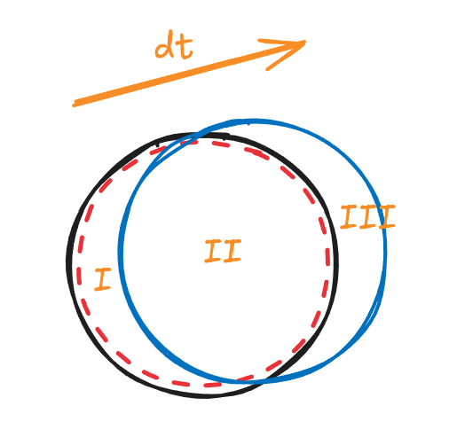

## 0. 前言

在正式讨论计算流体力学的基本理论之前，我们需要先讨论一些基本概念。这些概念的引入对于新读者来说可能有点陌生。没有关系，笔者鼓励读者在后续学习中，不断回到这里进行回顾，反复揣摩理解概念和理论。相信读者在不同的学习阶段会有不同的感悟。

本文主要讨论

- [ ] 理解拉格朗日和欧拉两种描述
- [ ] 理解速度散度的物理含义
- [ ] 理解物质导数的物理含义
- [ ] 理解雷诺输运定理及其物理含义

## 1. 欧拉和拉格朗日

1755 年，莱昂哈德·欧拉 (Leonhard Euler) 在其著作《流体运动的原理》(Principia motus fluidorum) 中首次系统写出了控制流体运动的偏微分方程，即我们现在所说的 欧拉方程。

所谓欧拉描述（场描述）就是，不跟踪单个流体质点，而固定空间坐标系，研究此空间坐标系内任意点上的速度、压力随时间变化。

1788 年，约瑟夫·拉格朗日 (Joseph-Louis Lagrange) 在其著作《分析力学》(Mécanique Analytique) 以及之后的论文中，提出了用质点坐标跟踪法来描述连续介质。

所谓拉格朗日描述（质点描述）就是，每个流体微元（流体质点）有一个初始描述，研究它随时间的轨迹、速度和状态。

> [!tip]
> 上面提到的流体质点是流体力学的基本假设，即流体质点足够小到可以当成一个点来分析处理，又足够大到包含大量分子，满足连续介质假设。简单来说，流体质点就是连续化、可跟踪的最小流体单元。

用一个简单的比喻来区分就是，如果我们站在桥边，看着桥墩处的水流随着时间如何变化，这就是欧拉描述。如果我们跟着一片漂流在河流中落叶，记录落叶的运动，这就是拉格朗日描述。

> [!tip]
> 如果历史学家关注某个区域在某段历史上的整体变化，就非常类似于欧拉描述。如果这个历史学家挑出该区域某个具体的历史人物，研究他随着时间发展，发育成长、工作生活、生离死别、悲伤欢喜的一生，就非常类似于拉格朗日描述。
> 
> 欧拉和拉格朗日两种描述让我们想到个体论和整体论，二元对立与统一等等问题的讨论。如何认识这个世界的哲学问题不仅仅是哲学学科的问题，也是社会科学和自然科学共同的问题。

基于欧拉描法，被研究的固定区域称为“控制体”（control volume, CV）

- 控制体空间固定，即控制体的体积是固定的，形状是固定的
- 控制体物质不固定，即控制体内流体质点不固定，质量不固定

基于拉格朗日法，选取的跟踪研究的流体微团的集合体被称为“物质体”（material volume, MV）

- 物质体物质固定，即物质体内流体质点固定，质量固定
- 物质体空间不固定，即物质体的体积不固定，形状不固定

对于欧拉描述的控制体来说，它的速度描述为 $U(x, y, z, t)$ 。其空间参数是控制体空间中的任意位置的坐标。当我们给定一组空间坐标和时间坐标，确定是控制体中**该时间点该空间位置**的流体质点的速度。即使给定同一个空间坐标，在‘下一时间点，这个位置上可能就是其他流体质点了。

对于拉格朗日描述的物质体来说，物质体中有某个流体质点 $a$，它的速度描述为 $U(x_a, y_a, z_a, t)$ 。其空间参数就是跟踪的流体质点 $a$ 在某个时间点的空间坐标。物质体中每个流体质点都需要各自变化着的空间和时间坐标来追踪它们。

为了后续讨论方便，我们最好提前说明几个常见术语。

我们使用列表的层级来表示包含关系。

- 某流体系统（控制体或者物质体）
	- 流体微团（随流动的某个小体积）
		- 流体微元（数学分析角度的无穷小体积单元）
			- 流体质点（最小的流体力学研究对象）

> [!caution]
> 物质体和控制体的定义对于初始的讨论和理解非常重要。
> 
> 区别这两种描述的不同，能够更加深刻理解后续基本方程的推导，以及各种推导形式之间的联系。当读者在后文遇到“物质体”和“控制体”的概念而感觉模糊时，可以反复回到这里，理解描述方式的差异。

## 2. 速度散度

对于一个流体微团来说，其体积可能会发生变化。

我们从该流体微团上取一个无穷小的面积单元，该面积单元位置变化后产生的体积变化为

$$
d V = \vec{U} \cdot d t \cdot d \vec{S}
$$

整个流体微团的体积变化需要在所有面上作积分，即

$$
dV = \iint_{\partial{V}}(\vec{U} d t) \cdot d\vec{S}
$$

约定使用 $\partial V$ 表示体积 $V$ 的全部表面。

体积变化对时间的变化率为

$$
\frac{dV}{dt} = \frac{1}{d t}\iint_{\partial{V}}(\vec{U} d t) \cdot d\vec{S} = \iint_{\partial{V}} \vec{U} \cdot d \vec{S}
$$

由散度定理，物理量的面积分等于其散度的体积分。上式的面积分转化为体积分，

$$
\frac{dV}{dt} = \iiint_V(\nabla \cdot \vec{U}) dV
$$

当该流体微团的体积足够小时，物理量的体积分近似等于物理量和该小体积的乘积，即

$$
\frac{dV}{dt} = \iiint_V(\nabla \cdot \vec{U}) dV = (\nabla\cdot\vec{U})V
$$

整理可得

【**速度散度**】

$$
\nabla\cdot\vec{U} = \frac{1}{V} \frac{dV}{dt}
$$

速度矢量的散度计算将得到一个标量，即

$$
\nabla\cdot\vec{U} = \frac{\partial{u}}{\partial{x}}+\frac{\partial{v}}{\partial{y}}+\frac{\partial{w}}{\partial{z}}  = \frac{1}{V} \frac{dV}{dt}
$$

可以看到，速度的散度就是**单位时间单位体积**的流体微团的体积变化。

当速度的散度大于零时，即体积变化为正，即体积膨胀。小于零时，即体积收缩。

> [!tip]
> 体积的变化本质上是所谓的“体积通量”。以后还会讨论质量通量等概念。

## 3. 物质导数

我们描述一个非稳态流动。

拉格朗日描述下，取一个物质体，某个时刻，物质体中某个流体微团的速度和密度如下（分量形式），

$$\begin{cases}
u = u(x, y , z, t) \\
v = v(x, y, z, t)  \\
w = w(x, y, z, t) \\
\rho = \rho(x, y, z, t)
\end{cases}$$

在时间 $t_1$ 时刻，某个流体微团的位置是 $(x_1, y_1, z_1)$

$$\rho_1 = \rho(x_1, y_1, z_1, t_1)$$

在时间 $t_2$ 时刻，该流体微团运动到位置 $(x_2, y_2, z_2)$

$$\rho_2 = \rho(x_2, y_2, z_2, t_2)$$

注意这个过程，流体微团本身因为时间推进，自身属性会变化，这部分称为本地变化（local change）。另一方面，流体单元移动到了不同的位置，位置的变化当然也会对最终呈现出的属性有影响，我们称为对流变化（convective change）。

泰勒展开

$$
\begin{align*}
\rho_2 = \rho_1 &+ (\frac{\partial \rho}{\partial x})_1(x_2 - x_1) + (\frac{\partial \rho}{\partial y})_1(y_2 - y_1) + (\frac{\partial \rho}{\partial z})_1(z_2 - z_1) \\
&+ (\frac{\partial \rho}{\partial t})_1(t_2 - t_1)  + (higherOrderTerms)
\end{align*}
$$

两边都除以 $(t_2 - t_1)$， 忽略高阶项的影响

$$\frac{\rho_2 - \rho_1}{t_2 - t_1} \approx (\frac{\partial \rho}{\partial x})_1\frac{x_2 - x_1}{t_2 - t_1} + (\frac{\partial \rho}{\partial y})_1\frac{y_2 - y_1}{t_2 - t_1} + (\frac{\partial \rho}{\partial z})_1\frac{z_2 - z_1}{t_2 - t_1} + (\frac{\partial \rho}{\partial t})_1$$

这个等式就描述了一个流体微团在某个**时间步长内空间运动**后，密度随时间的变化。

当这个时间步长非常小的时候，有极限

$$\lim_{t_2 \rightarrow t_1} \frac{\rho_2 -\rho_1}{t_2 - t_1} = \frac{D\rho}{Dt}$$

得到密度对时间的全导数。

其他项同样取极限有

$$\begin{aligned}
\lim_{t_2 \rightarrow t_1} \frac{x_2 -x_1}{t_2 - t_1} &= u \\
\lim_{t_2 \rightarrow t_1} \frac{y_2 -x_1}{y_2 - t_1} &= v \\
\lim_{t_2 \rightarrow t_1} \frac{z_2 -x_1}{z_2 - t_1} &= w
\end{aligned}$$

上面的泰勒展开式可以写成

$$\frac{D\rho}{Dt} = u\frac{\partial \rho}{\partial x} + v\frac{\partial \rho}{\partial y} + w\frac{\partial \rho}{\partial z} + \frac{\partial \rho}{\partial t}$$

这个式子推广开对其他物理量也成立，得到**物质导数**（material substatial）的通用形式

$$\frac{D}{Dt} = u\frac{\partial}{\partial x} + v\frac{\partial }{\partial y} + w\frac{\partial }{\partial z} + \frac{\partial }{\partial t}$$

通过右侧的展开可以看到，物理量对空间变量和时间变量都有变化。

引入微分算子

$$\nabla = \frac{\partial }{\partial x} \vec i + \frac{\partial }{\partial y} \vec j + \frac{\partial }{\partial y} \vec k$$

最终整理为

【**物质导数**】

$$\frac{D}{Dt} = \frac{\partial }{\partial t} + U \cdot \nabla$$

为了书写方便，约定使用大写的 $U$ 表示速度矢量

- 左侧是拉格朗日描述的数学表达，全导数也被称为拉格朗日导数
- 右侧展开的两部分是欧拉描述的数学表达，右侧的偏导部分也被称为欧拉导数

对于流体微团在空间上从 $P_1$ 移动到 $P_2$ ，时间上 $t_1$ 到 $t_2$，有

$$\frac{DT}{Dt} = \frac{\partial T}{\partial t} + U \cdot \nabla T= \frac{\partial T}{\partial t} + u\frac{\partial T}{\partial x} + v\frac{\partial T}{\partial y} + w\frac{\partial T}{\partial z}$$

- $\partial T/ \partial t$ 无论流体单元怎么移动，它都会因为时间变化而发生自身温度的变化
- $U\cdot\nabla T$ 因为流体单元在空间移动（“移动”其实不准确，更应该是一种“对流”，“交换”，可以结合下文雷诺输运定理理解），温度发生变化

实际上，物质导数就是数学上全导数应用链式法则的完全展开。

> [!tip]
> 物质导数某种程度上将欧拉描述和拉格朗日描述联系了起来。

## 4. 雷诺输运定理

> [!tip]
> 雷诺输运定理是欧拉描述和拉格朗日描述互相联系的另一个表现。

我们假设某个物质体有任意物理量 $B$ ，它的单位质量强度为 $b$ ，也就是有

$$
b = dB/dm
$$

在 $t$ 时刻，物质体（黑色线条）和控制体（红色虚线）重合，经过 $d t$ 之后，物质体移动到新的位置（蓝色线条）

在 $t$ 时刻有

$$B(t) = B_I(t) + B_{II}(t)$$

在 $t + d t$ 时刻有

$$B(t+ d t) = B_{II}(t+d t) + B_{III}(t+d t)$$

物理量 $B$ 的变化整理为

$$\begin{aligned}
(\frac{dB}{dt})_{MV} &=\lim_{d t \rightarrow 0}\frac{B(t+dt) - B(t)}{dt} \\
&= \lim_{dt \rightarrow 0}\frac{B_{II}(t+dt) +B_{III}(t+dt)  - B_I(t) - B_{II}(t)}{dt} \\
&= \lim_{dt \rightarrow 0}\frac{B_{I}(t+dt) + B_{II}(t+dt) - B_I(t) - B_{II}(t)}{dt} \\
&+ \lim_{dt \rightarrow 0}\frac{B_{III}(t+dt)}{dt} - \lim_{dt \rightarrow 0}\frac{B_{I}(t+dt)}{dt}
\end{aligned}$$

整理上式，分开合并，其中的

$$\begin{aligned}
\lim_{dt \rightarrow 0}\frac{B_{I}(t+dt) + B_{II}(t+dt) - B_I(t) - B_{II}(t)}{dt} &= \lim_{dt \rightarrow 0}\frac{B_{CV}(t+dt) - B_{CV}(t)}{dt} \\
&= (\frac{dB}{dt})_{CV}
\end{aligned}$$

余下还有两项，其差值反映了通过边界面的净流量

$$
\lim_{dt \rightarrow 0}\frac{B_{III}(t+dt)}{dt} - \lim_{dt \rightarrow 0}\frac{B_{I}(t+dt)}{dt} = Flux
$$

即

$$
(\frac{dB}{dt})_{MV} = (\frac{dB}{dt})_{CV} + Flux
$$

下标 $MV$ 表示物质体，下标 $CV$ 表示控制体。

总结来说就是：

**物理量 $B$ 在物质体内的总变化 = 物理量 $B$ 在控制体内的变化 + 物理量 $B$ 在控制体表面上的净流量**

我们约定，为了书写方便，无论是体积分还是面积分，后文大多使用单积分符，即 $\iint_{\partial V} \rightarrow\int_{\partial V}$ ，$\iiint_V \rightarrow \int_V$ 。

假设流体的流动速度为 $U(t, \vec x)$ ，控制体表面变形的速度为 $U_{\partial V}(t, \vec x)$ , 流体离开或者进入控制体表面时候的相对速度为 $U_r(t, \vec x) = U(t, \vec x) - U_{\partial V}(t, \vec x)$。

对于一个位置固定的控制体，没有表面变形，即 $U_{\partial V} = 0$ ，所以 $U_r(t, \vec x) = U(t, \vec x)$

写成数学表达式为

$$\bigg(\frac{dB}{dt} \bigg)_{MV} = \frac{d}{dt}\bigg(\int_{V(t)}b\rho dV \bigg) + \int_{\partial V(t)}b\rho U_r \cdot \vec n dS$$

虽然体积和面积分别写成 $V(t),\partial V(t)$ ，但欧拉描述下控制体的体积和面积不随时间变化。

控制体的几何和时间无关，所以有

$$
\frac{d}{dt}\bigg(\int_V b\rho dV \bigg) = \int_V \frac{\partial}{\partial t}(b\rho) dV
$$

代入后有

$$
\bigg(\frac{dB}{dt} \bigg)_{MV} = \int_V \frac{\partial}{\partial t}(b\rho) dV + \int_{\partial V}b\rho U \cdot \vec n dS
$$

利用散度定理（面积分等于散度的体积分）

$$
\bigg(\frac{dB}{dt} \bigg)_{MV} = \int_V \frac{\partial}{\partial t}(b\rho) dV + \int_{\partial V}b\rho U \cdot \vec n dS =\int_V \frac{\partial}{\partial t}(b\rho) dV + \int_V \nabla \cdot (b\rho U) dV
$$

整理为

$$
\bigg(\frac{dB}{dt}\bigg)_{MV} = \int_V\bigg[\frac{\partial}{\partial t}(\rho b) + \nabla \cdot (\rho Ub) \bigg]dV
$$

散度展开

$$
\begin{aligned} 
\bigg(\frac{dB}{dt} \bigg)_{MV} &= \int_V\bigg[\frac{\partial}{\partial t}(\rho b) + (\rho b \nabla \cdot U + U \cdot\nabla \rho b) \bigg]dV \\
&= \int_V\bigg[\bigg(\frac{\partial}{\partial t}(\rho b ) + U\cdot\nabla \rho b\bigg) + \rho b \nabla \cdot U \bigg]dV \end{aligned}
$$

利用物质导数，进一步改写为

$$
\int_{V}\bigg[\bigg(\frac{\partial}{\partial t}(\rho b) + U\cdot\nabla \rho b\bigg) + \rho b \nabla \cdot U \bigg]dV = \int_V\bigg[\frac{D}{D t}(\rho b) + \rho b \nabla \cdot U \bigg]dV
$$

最终得到

【**雷诺输运定理**】

$$
\bigg(\frac{dB}{dt}\bigg)_{MV} = \int_V\bigg[\frac{\partial}{\partial t}(\rho b) + \nabla \cdot (\rho U b)\bigg]dV = \int_V\bigg[\frac{D}{D t}(\rho b) + \rho b \nabla \cdot U\bigg]dV
$$

也能得到换算关系 ，姑且称为

【**雷诺输运换算**】

$$
\frac{D}{D t}(\rho b) + \rho b \nabla \cdot U = \frac{\partial}{\partial t}(\rho b) + \nabla \cdot (\rho U b)
$$

通过换算讨论，我们再次可以感受到，全导 D/Dt 是拉格朗日描述，展开后是欧拉描述。

## 5. 符号约定

为了书写方便，约定除非特别说明，大写字母根据物理意义优先表示物理量的矢量

- 速度矢量 $U=(U_{x},U_{y},U_{z})$
- 压力标量 $p$
- 任一物理量 $\phi$
- 扩散系数 $\Gamma^{\phi}$，和物理量 $\phi$ 有关，如非特别说明默认简单写成 $\Gamma$
- 源项 $Q^{\phi}$ ，和物理量 $\phi$ 有关，如非特别说明默认简单写成 $Q$
- 面矢量 $S=(S_{x},S_{y},S_{z})$

上下标符号有

- 上标 $t$ 表示当前时间步（已知量），等同于上标 $o$，即旧时间步（old）
- 上标 $t+1$ 表示新时间步（待求量），等同于上标 $n$ ，即新时间步（new）
- 上标 $t+n$ 表示依次类推的之后时间步
- 上标 $*$ 表示基于算法迭代的中间预测值
- 下标 $P$ 表示当前单元体心（取 Owner 的 O 实在很容易混淆）
- 下标 $N$ 表示相邻单元体心（Neighbor）
- 下标 $f$ 表示当前单元和相邻单元之间的界面的面心（face），也模糊表示单元面

网格符号

- 体积 $V$，如单元的总体积 $V_P$  
- 面积 $\partial{V}$ ，如单元的总面积 $\partial{V_{P}}$
- 单元界面矢量 $S_{f}$，其面积大小为 $|S_{f}|$

## 6. 小结

手推公式非常重要！包括本文开始的理论公式，建议新学习的读者手推两遍以上。
手推公式非常重要！包括本文开始的理论公式，建议新学习的读者手推两遍以上。
手推公式非常重要！包括本文开始的理论公式，建议新学习的读者手推两遍以上。

本文完成讨论

- [x] 理解拉格朗日和欧拉两种描述
- [x] 理解速度散度的物理含义
- [x] 理解物质导数的物理含义
- [x] 理解雷诺输运定理及其物理含义

## References

[1] The Finite Volume Method in Computational Fluid Dynamics, https://link.springer.com/book/10.1007/978-3-319-16874-6

[2] Computational fluid dynamics : the basics with applications, https://searchworks.stanford.edu/view/2989631

[3] Mathematics, Numerics, Derivations and OpenFOAM®, https://holzmann-cfd.com/community/publications/mathematics-numerics-derivations-and-openfoam-free

[4] Notes on Computational Fluid Dynamics: General Principles, https://doc.cfd.direct/notes/cfd-general-principles/

