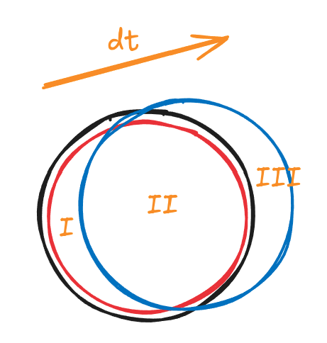

> [!important]
> Visit [https://aerosand.cc](https://aerosand.cc/) for the latest updates.

## 0. Preface

Before formally discussing the fundamental theories of computational fluid dynamics, we need to first discuss some basic concepts. The introduction of these concepts may be somewhat unfamiliar to new readers. That's okay; the author encourages readers to continually return here for review during subsequent learning, repeatedly contemplating and understanding the concepts and theories. It is believed that readers will have different insights at different stages of learning.

This article mainly discusses:

- [ ] Understanding Lagrangian and Eulerian descriptions
- [ ] Understanding the physical meaning of velocity divergence
- [ ] Understanding the physical meaning of material derivative
- [ ] Understanding Reynolds transport theorem and its physical meaning

## 1. Eulerian and Lagrangian

In 1755, Leonhard Euler first systematically wrote the partial differential equations governing fluid motion in his work *Principia motus fluidorum*, which we now call the Euler equations.

The so-called Eulerian description (field description) means not tracking individual fluid particles, but fixing a spatial coordinate system and studying the velocity and pressure at any point within this spatial coordinate system as they change over time.

In 1788, Joseph-Louis Lagrange proposed using particle coordinate tracking to describe continuous media in his work *Mécanique Analytique* and subsequent papers.

The so-called Lagrangian description (particle description) means that each fluid element (fluid particle) has an initial description, and we study its trajectory, velocity, and state over time.

> [!tip]
> The fluid particles mentioned above are a fundamental assumption in fluid mechanics: fluid particles are small enough to be treated as points for analysis, yet large enough to contain a large number of molecules, satisfying the continuum assumption. Simply put, fluid particles are the smallest fluid units that are continuous and trackable.

A simple analogy to distinguish them: if we stand by a bridge and observe how the water flow at the bridge pier changes over time, this is an Eulerian description. If we follow a leaf drifting in the river and record its motion, this is a Lagrangian description.

> [!tip]
> If a historian focuses on the overall changes of a region during a certain historical period, it is very similar to an Eulerian description. If this historian selects a specific historical figure from that region and studies their life development—growth, work, life, separations, reunions, sorrows, and joys—over time, it is very similar to a Lagrangian description.
>
> The Eulerian and Lagrangian descriptions remind us of discussions on individualism and holism, binary opposition and unity, and other philosophical issues. How to understand the world is not only a question for philosophy but also a common issue for social sciences and natural sciences.

Based on the Eulerian description, the fixed region being studied is called a "control volume" (CV):

- The control volume is spatially fixed, meaning its volume is fixed and its shape is fixed
- The control volume's material is not fixed, meaning the fluid particles within the control volume are not fixed, and the mass is not fixed

Based on the Lagrangian description, the collection of fluid elements selected for tracking and study is called a "material volume" (MV):

- The material volume's material is fixed, meaning the fluid particles within the material volume are fixed, and the mass is fixed
- The material volume's space is not fixed, meaning its volume is not fixed and its shape is not fixed

For a control volume in Eulerian description, its velocity is described as $U(x, y, z, t)$. Its spatial parameters are the coordinates of any position in the control volume space. When we give a set of spatial coordinates and time coordinates, we determine the velocity of the fluid particle at **that time point and spatial position** in the control volume. Even given the same spatial coordinates, at the next time point, this position may be occupied by other fluid particles.

For a material volume in Lagrangian description, there is a fluid particle $a$ in the material volume, and its velocity is described as $U(x_a, y_a, z_a, t)$. Its spatial parameters are the spatial coordinates of the tracked fluid particle $a$ at a certain time point. Each fluid particle in the material volume requires its own changing spatial and time coordinates to track them.

For convenience in subsequent discussions, it's best to explain several common terms in advance.

We use list hierarchy to represent inclusion relationships:

- A fluid system (control volume or material volume)
	- Fluid parcel (a small volume moving with the flow)
		- Fluid element (an infinitesimal volume unit from a mathematical analysis perspective)
			- Fluid particle (the smallest research object in fluid mechanics)

> [!caution]
> The definitions of material volume and control volume are very important for initial discussion and understanding.
>
> Distinguishing between these two descriptions allows for a deeper understanding of the derivation of subsequent fundamental equations and the connections between various derived forms. When readers encounter the concepts of "material volume" and "control volume" later and feel unclear, they can repeatedly return here to understand the differences in description methods.

## 2. Velocity Divergence

For a fluid parcel, its volume may change.

We take an infinitesimal area element from this fluid parcel. The volume change produced by the position change of this area element is:

$$
d V = \vec{U} \cdot d t \cdot d \vec{S}
$$

The volume change of the entire fluid parcel requires integration over all surfaces, i.e.:

$$
dV = \iint_{\partial{V}}(\vec{U} d t) \cdot d\vec{S}
$$

We use $\partial V$ to denote all surfaces of volume $V$.

The rate of volume change with respect to time is:

$$
\frac{dV}{dt} = \frac{1}{d t}\iint_{\partial{V}}(\vec{U} d t) \cdot d\vec{S} = \iint_{\partial{V}} \vec{U} \cdot d \vec{S}
$$

By the divergence theorem, the surface integral of a physical quantity equals the volume integral of its divergence. The surface integral above transforms into a volume integral:

$$
\frac{dV}{dt} = \iiint_V(\nabla \cdot \vec{U}) dV
$$

When the volume of this fluid parcel is sufficiently small, the volume integral of a physical quantity approximately equals the product of the physical quantity and this small volume, i.e.:

$$
\frac{dV}{dt} = \iiint_V(\nabla \cdot \vec{U}) dV = (\nabla\cdot\vec{U})V
$$

Rearranging gives:

**【Velocity Divergence】**

$$
\nabla\cdot\vec{U} = \frac{1}{V} \frac{dV}{dt}
$$

The divergence calculation of the velocity vector yields a scalar, i.e.:

$$
\nabla\cdot\vec{U} = \frac{\partial{u}}{\partial{x}}+\frac{\partial{v}}{\partial{y}}+\frac{\partial{w}}{\partial{z}}  = \frac{1}{V} \frac{dV}{dt}
$$

It can be seen that the divergence of velocity is the **volume change per unit time per unit volume** of the fluid parcel.

When the divergence of velocity is greater than zero, the volume change is positive, meaning volume expansion. When less than zero, it means volume contraction.

> [!tip]
> Volume change is essentially the so-called "volume flux." We will discuss concepts like mass flux later.

## 3. Material Derivative

We describe an unsteady flow.

In Lagrangian description, take a material volume. At a certain moment, the velocity and density of a fluid parcel within the material volume are as follows (in component form):

$$\begin{cases}
u = u(x, y , z, t) \\
v = v(x, y, z, t)  \\
w = w(x, y, z, t) \\
\rho = \rho(x, y, z, t)
\end{cases}$$

At time $t_1$, the position of a certain fluid parcel is $(x_1, y_1, z_1)$:

$$\rho_1 = \rho(x_1, y_1, z_1, t_1)$$

At time $t_2$, this fluid parcel moves to position $(x_2, y_2, z_2)$:

$$\rho_2 = \rho(x_2, y_2, z_2, t_2)$$

Note in this process: the fluid parcel itself changes its properties due to time advancement; this part is called local change. On the other hand, the fluid element moves to different positions, and the change in position naturally affects the final displayed properties; we call this convective change.

Taylor expansion:

$$
\begin{align*}
\rho_2 = \rho_1 &+ (\frac{\partial \rho}{\partial x})_1(x_2 - x_1) + (\frac{\partial \rho}{\partial y})_1(y_2 - y_1) + (\frac{\partial \rho}{\partial z})_1(z_2 - z_1) \\
&+ (\frac{\partial \rho}{\partial t})_1(t_2 - t_1)  + (higherOrderTerms)
\end{align*}
$$

Divide both sides by $(t_2 - t_1)$, ignoring the influence of higher-order terms:

$$\frac{\rho_2 - \rho_1}{t_2 - t_1} \approx (\frac{\partial \rho}{\partial x})_1\frac{x_2 - x_1}{t_2 - t_1} + (\frac{\partial \rho}{\partial y})_1\frac{y_2 - y_1}{t_2 - t_1} + (\frac{\partial \rho}{\partial z})_1\frac{z_2 - z_1}{t_2 - t_1} + (\frac{\partial \rho}{\partial t})_1$$

This equation describes how the density of a fluid parcel changes over time after moving in space within a **certain time step**.

When this time step is very small, we have the limit:

$$\lim_{t_2 \rightarrow t_1} \frac{\rho_2 -\rho_1}{t_2 - t_1} = \frac{D\rho}{Dt}$$

Obtaining the total derivative of density with respect to time.

Taking limits for other terms similarly:

$$\begin{aligned}
\lim_{t_2 \rightarrow t_1} \frac{x_2 -x_1}{t_2 - t_1} &= u \\
\lim_{t_2 \rightarrow t_1} \frac{y_2 -x_1}{y_2 - t_1} &= v \\
\lim_{t_2 \rightarrow t_1} \frac{z_2 -x_1}{z_2 - t_1} &= w
\end{aligned}$$

The Taylor expansion above can be written as:

$$\frac{D\rho}{Dt} = u\frac{\partial \rho}{\partial x} + v\frac{\partial \rho}{\partial y} + w\frac{\partial \rho}{\partial z} + \frac{\partial \rho}{\partial t}$$

This formula extends to other physical quantities as well, giving the general form of the **material derivative**:

$$\frac{D}{Dt} = u\frac{\partial}{\partial x} + v\frac{\partial }{\partial y} + w\frac{\partial }{\partial z} + \frac{\partial }{\partial t}$$

From the expansion on the right side, we can see that the physical quantity changes with respect to both spatial variables and time variables.

Introducing the differential operator:

$$\nabla = \frac{\partial }{\partial x} \vec i + \frac{\partial }{\partial y} \vec j + \frac{\partial }{\partial y} \vec k$$

Finally rearranged as:

**【Material Derivative】**

$$\frac{D}{Dt} = \frac{\partial }{\partial t} + U \cdot \nabla$$

For convenience in writing, we agree to use uppercase $U$ to represent the velocity vector:

- The left side is the mathematical expression of Lagrangian description; the total derivative is also called the Lagrangian derivative
- The two expanded parts on the right side are the mathematical expression of Eulerian description; the partial derivative part on the right is also called the Eulerian derivative

For a fluid element moving in space from $P_1$ to $P_2$, and in time from $t_1$ to $t_2$, we have:

$$\frac{DT}{Dt} = \frac{\partial T}{\partial t} + U \cdot \nabla T= \frac{\partial T}{\partial t} + u\frac{\partial T}{\partial x} + v\frac{\partial T}{\partial y} + w\frac{\partial T}{\partial z}$$

- $\partial T/ \partial t$: Regardless of how the fluid element moves, its temperature changes due to time variation
- $U\cdot\nabla T$: Because the fluid element moves in space ("move" is not accurate; it's more like "convection," "exchange"—can be understood in conjunction with the Reynolds transport theorem below), temperature changes

Actually, the material derivative is the complete expansion of the total derivative using the chain rule in mathematics.

> [!tip]
> The material derivative somehow connects Eulerian and Lagrangian descriptions.

## 4. Reynolds Transport Theorem

> [!tip]
> The Reynolds transport theorem is another manifestation of the connection between Eulerian and Lagrangian descriptions.

We assume a material volume has an arbitrary physical quantity $B$, with its unit mass intensity being $b$, meaning:

$$
b = dB/dm
$$

At time $t$, the material volume (black line) and control volume (red dashed line) coincide. After $d t$, the material volume moves to a new position (blue line):

At time $t$, we have:

$$B(t) = B_I(t) + B_{II}(t)$$

At time $t + d t$, we have:

$$B(t+ d t) = B_{II}(t+d t) + B_{III}(t+d t)$$

The change in physical quantity $B$ is arranged as:

$$\begin{aligned}
(\frac{dB}{dt})_{MV} &=\lim_{d t \rightarrow 0}\frac{B(t+dt) - B(t)}{dt} \\
&= \lim_{dt \rightarrow 0}\frac{B_{II}(t+dt) +B_{III}(t+dt)  - B_I(t) - B_{II}(t)}{dt} \\
&= \lim_{dt \rightarrow 0}\frac{B_{I}(t+dt) + B_{II}(t+dt) - B_I(t) - B_{II}(t)}{dt} \\
&+ \lim_{dt \rightarrow 0}\frac{B_{III}(t+dt)}{dt} - \lim_{dt \rightarrow 0}\frac{B_{I}(t+dt)}{dt}
\end{aligned}$$

Rearranging the above equation, combining separately, where:

$$\begin{aligned}
\lim_{dt \rightarrow 0}\frac{B_{I}(t+dt) + B_{II}(t+dt) - B_I(t) - B_{II}(t)}{dt} &= \lim_{dt \rightarrow 0}\frac{B_{CV}(t+dt) - B_{CV}(t)}{dt} \\
&= (\frac{dB}{dt})_{CV}
\end{aligned}$$

The remaining two terms, their difference reflects the net flux through the boundary:

$$
\lim_{dt \rightarrow 0}\frac{B_{III}(t+dt)}{dt} - \lim_{dt \rightarrow 0}\frac{B_{I}(t+dt)}{dt} = Flux
$$

That is:

$$
(\frac{dB}{dt})_{MV} = (\frac{dB}{dt})_{CV} + Flux
$$

Subscript $MV$ denotes material volume, subscript $CV$ denotes control volume.

In summary:

**Total change of physical quantity $B$ in material volume = Change of physical quantity $B$ in control volume + Net flux of physical quantity $B$ on control volume surface**

We agree that for convenience in writing, whether volume integrals or surface integrals, most of the following text uses single integral symbols, i.e., $\iint_{\partial V} \rightarrow\int_{\partial V}$, $\iiint_V \rightarrow \int_V$.

Assume the fluid flow velocity is $U(t, \vec x)$, the deformation velocity of the control volume surface is $U_{\partial V}(t, \vec x)$, and the relative velocity when fluid leaves or enters the control volume surface is $U_r(t, \vec x) = U(t, \vec x) - U_{\partial V}(t, \vec x)$.

For a position-fixed control volume, there is no surface deformation, i.e., $U_{\partial V} = 0$, so $U_r(t, \vec x) = U(t, \vec x)$.

Written as a mathematical expression:

$$\bigg(\frac{dB}{dt} \bigg)_{MV} = \frac{d}{dt}\bigg(\int_{V(t)}b\rho dV \bigg) + \int_{\partial V(t)}b\rho U_r \cdot \vec n dS$$

Although volume and area are written as $V(t),\partial V(t)$ respectively, in Eulerian description, the control volume's volume and area do not change with time.

The control volume's geometry is independent of time, so:

$$
\frac{d}{dt}\bigg(\int_V b\rho dV \bigg) = \int_V \frac{\partial}{\partial t}(b\rho) dV
$$

Substituting gives:

$$
\bigg(\frac{dB}{dt} \bigg)_{MV} = \int_V \frac{\partial}{\partial t}(b\rho) dV + \int_{\partial V}b\rho U \cdot \vec n dS
$$

Using the divergence theorem (surface integral equals volume integral of divergence):

$$
\bigg(\frac{dB}{dt} \bigg)_{MV} = \int_V \frac{\partial}{\partial t}(b\rho) dV + \int_{\partial V}b\rho U \cdot \vec n dS =\int_V \frac{\partial}{\partial t}(b\rho) dV + \int_V \nabla \cdot (b\rho U) dV
$$

Rearranged as:

$$
\bigg(\frac{dB}{dt}\bigg)_{MV} = \int_V\bigg[\frac{\partial}{\partial t}(\rho b) + \nabla \cdot (\rho Ub) \bigg]dV
$$

Expanding the divergence:

$$
\begin{aligned}
\bigg(\frac{dB}{dt} \bigg)_{MV} &= \int_V\bigg[\frac{\partial}{\partial t}(\rho b) + (\rho b \nabla \cdot U + U \cdot\nabla \rho b) \bigg]dV \\
&= \int_V\bigg[\bigg(\frac{\partial}{\partial t}(\rho b ) + U\cdot\nabla \rho b\bigg) + \rho b \nabla \cdot U \bigg]dV \end{aligned}
$$

Using the material derivative, further rewritten as:

$$
\int_{V}\bigg[\bigg(\frac{\partial}{\partial t}(\rho b) + U\cdot\nabla \rho b\bigg) + \rho b \nabla \cdot U \bigg]dV = \int_V\bigg[\frac{D}{D t}(\rho b) + \rho b \nabla \cdot U \bigg]dV
$$

Finally obtaining:

**【Reynolds Transport Theorem】**

$$
\bigg(\frac{dB}{dt}\bigg)_{MV} = \int_V\bigg[\frac{\partial}{\partial t}(\rho b) + \nabla \cdot (\rho U b)\bigg]dV = \int_V\bigg[\frac{D}{D t}(\rho b) + \rho b \nabla \cdot U\bigg]dV
$$

We can also obtain the conversion relationship, tentatively called:

**【Reynolds Transport Conversion】**

$$
\frac{D}{D t}(\rho b) + \rho b \nabla \cdot U = \frac{\partial}{\partial t}(\rho b) + \nabla \cdot (\rho U b)
$$

Through conversion discussion, we can again feel that the total derivative D/Dt is Lagrangian description, and its expansion is Eulerian description.

## 5. Symbol Conventions

For convenience in writing, unless otherwise specified, uppercase letters preferentially represent physical quantity vectors according to physical meaning:

- Velocity vector $U=(U_{x},U_{y},U_{z})$
- Pressure scalar $p$
- Any physical quantity $\phi$
- Diffusion coefficient $\Gamma^{\phi}$, related to physical quantity $\phi$, unless otherwise specified, simply written as $\Gamma$
- Source term $Q^{\phi}$, related to physical quantity $\phi$, unless otherwise specified, simply written as $Q$
- Surface vector $S=(S_{x},S_{y},S_{z})$

Superscript and subscript symbols:

- Superscript $t$ represents current time step (known quantity), equivalent to superscript $o$, i.e., old time step
- Superscript $t+1$ represents new time step (quantity to be solved), equivalent to superscript $n$, i.e., new time step
- Superscript $t+n$ represents subsequent time steps by analogy
- Superscript $*$ represents first intermediate predicted value based on algorithm iteration
- Superscript $**$ represents second intermediate predicted value based on algorithm iteration
- Subscript $P$ represents current cell center (taking Owner's O is easily confusing)
- Subscript $N$ represents adjacent cell center (Neighbor)
- Subscript $f$ represents face center between current cell and adjacent cell (face), also vaguely represents cell face

Grid symbols:

- Volume $V$, e.g., total volume of cell $V_P$
- Area $\partial{V}$, e.g., total area of cell $\partial{V_{P}}$
- Cell face vector $S_{f}$, with area magnitude $|S_{f}|$

## 6. Summary

Hand-deriving formulas is very important! Including the theoretical formulas at the beginning of this article, it is recommended that new learners hand-derive them at least twice.
Hand-deriving formulas is very important! Including the theoretical formulas at the beginning of this article, it is recommended that new learners hand-derive them at least twice.
Hand-deriving formulas is very important! Including the theoretical formulas at the beginning of this article, it is recommended that new learners hand-derive them at least twice.

This article completes discussion of:

- [x] Understanding Lagrangian and Eulerian descriptions
- [x] Understanding the physical meaning of velocity divergence
- [x] Understanding the physical meaning of material derivative
- [x] Understanding Reynolds transport theorem and its physical meaning

## References

[1] The Finite Volume Method in Computational Fluid Dynamics, https://link.springer.com/book/10.1007/978-3-319-16874-6

[2] Computational fluid dynamics : the basics with applications, https://searchworks.stanford.edu/view/2989631

[3] Mathematics, Numerics, Derivations and OpenFOAM®, https://holzmann-cfd.com/community/publications/mathematics-numerics-derivations-and-openfoam-free

[4] Notes on Computational Fluid Dynamics: General Principles, https://doc.cfd.direct/notes/cfd-general-principles/

## Support us

>[!tip]
>Hopefully, the sharing here can be helpful to you.
>
>If you find this content helpful, your comments or donations would be greatly appreciated. Your support helps ensure the ongoing updates, corrections, refinements, and improvements to this and future series, ultimately benefiting new readers as well.
>
>The information and message provided during donation will be displayed as an acknowledgment of your support.


  


> Copyright @ 2026 Aerosand
>
> - Course (text, images, etc.): [CC BY-NC-SA 4.0](https://creativecommons.org/licenses/by-nc-sa/4.0/)
> - Code derived from OpenFOAM: [GPL v3](https://www.gnu.org/licenses/gpl-3.0.html)
> - Other code: [MIT License](https://opensource.org/licenses/MIT)