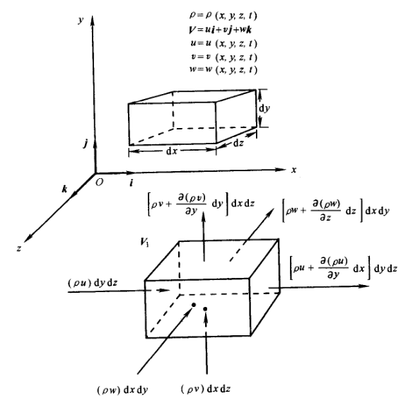

## 0. 前言

质量守恒方程，也称为连续性方程，本质是质量守恒。

我们参考Computational fluid dynamics : the basics with applications 一书，用不同方式从不同角度进行讨论。

本文主要讨论

- [ ] 连续性方程的推导
- [ ] 不同形式的转化
- [ ] 理解数学表达的物理意义

## 1. 控制体模型

假设我们取一个固定的控制体，体积为 $V$。使用欧拉描述，我们可以建立控制体系统的**守恒**。

**单位时间内通过控制体表面的质量流出 B = 单位时间内控制体内流体的质量减少 C**

### 1.1. 质量流出

对于质量流出 B 来说，考虑该控制体系统的面积微元（单位面积）

**单位时间的质量流出 = 单位时间流经该面积微元的流体质量**

单位时间单位面积的质量流量就是**质量通量**

**质量通量 = 单位时间 × 流经该面积微元的流体速度 × 单位面积 × 密度**

写成数学形式

$$
Flux =\rho U\cdot dS
$$

> [!tip]
> 无论从数学积分角度还是物理角度，我们都约定 $dS$ 的正方向是从控制体向外
> - 如果速度向外，Flux 就是正的，在物理上说明流体离开控制体
> - 如果速度向内，Flux 就是负的，在物理上说明流体进入控制体

对该控制体进行面积分，有

$$
B = \int_{\partial V}\rho U\cdot dS
$$

### 1.2. 质量减少

对于质量减少 C 来说，考虑控制体的总质量为

$$
m = \int_{V} \rho dV
$$

因为控制体没有发生位置变化，也就没有对流变化，所以基于欧拉描述对控制体进行欧拉导数的计算。

考虑控制体的总质量变化是“减小”，而数学求导只是得到变化率，所以还要考虑正负号

有

$$
C = - \frac{\partial}{\partial{t}}\int_{V}\rho dV
$$

因为控制体的体积分和时间无关，且积分限是常数，所以

$$
C = - \int_{V}\frac{\partial}{\partial{t}}\rho dV
$$

### 1.3. 质量守恒

根据守恒关系，有

$$
\begin{align*}
B &= C\\
\int_{\partial V}\rho U\cdot dS &= - \int_{V}\frac{\partial}{\partial{t}}\rho dV\\
\int_{\partial V}\rho U\cdot dS + \int_{V}\frac{\partial}{\partial{t}}\rho dV &= 0
\end{align*}
$$

应用散度定理，有

$$
\int_{V}\nabla\cdot(\rho U) dV + \int_{V}\frac{\partial}{\partial{t}}\rho dV = 0
$$

整理，得到

【**守恒型积分形式的连续性方程**】

$$
\int_{V}\bigg[\frac{\partial}{\partial{t}}\rho + \nabla\cdot(\rho U)\bigg] dV = 0
$$

## 2. 物质体模型

假设我们取一个随着流体流动的物质体，体积为 $V$。基于拉格朗日描述，我们可以考虑物质体的**变化**。

物质体的质量为

$$
m = \int_{V}\rho dV
$$

> [!caution]
> 物质体质量的计算和控制体质量的计算，虽然数学表达上类似，但是物理角度却不同。

基于拉格朗日描述对物质体进行拉格朗日导数的计算，而我们知道物质体的质量不发生变化

得到

【**非守恒型积分形式的连续性方程**】

$$
\frac{D}{Dt}\int_{V}\rho dV = 0
$$

注意，下面套用物质导数的方式是错误的，后面将讨论，读者可以先行思考原因。

$$\cancel{\frac{D}{Dt}\int_V \rho dV = \int_V \bigg[\frac{\partial \rho}{\partial t} + U \cdot \nabla  \rho \bigg]dV= 0}$$

## 3. 控制体微元模型

假设我们取一个无穷小的控制体微元模型。基于欧拉描述，我们考虑控制体微元系统的**守恒**。

在这个无穷小控制体微元上，速度等物理量作为连续函数，可以进行泰勒展开。

以 $x$ 方向为例，控制体微元左面的质量通量为

$$
(\rho u)dydz
$$

根据连续物理量的泰勒展开，右边有

$$
\rho u + \frac{\partial (\rho u)}{\partial x}dx + \frac{\partial ^2 (\rho u)}{2! \partial x^2}{dx^2} + (higherOrder)
$$

基于该控制体微元的无穷小假定，省去二阶及以上的高阶项，整理为

$$
\bigg[\rho u + \frac{\partial (\rho u)}{\partial x}dx\bigg]dydz
$$

微元在 $x$ 方向左右两面之间的质量通量之差为

$$
\bigg[\rho u + \frac{\partial (\rho u)}{\partial x}dx\bigg]dydz - (\rho u)dydz = \frac{\partial (\rho u)}{\partial x}dxdydz
$$

同样，在 $y$ 和 $z$ 方向的净质量通量为

$$
\bigg[\rho v + \frac{\partial (\rho v)}{\partial y}dy\bigg]dxdz - (\rho v)dxdz = \frac{\partial (\rho v)}{\partial y}dxdydz
$$

$$
\bigg[\rho w + \frac{\partial (\rho w)}{\partial z}dz\bigg]dxdy - (\rho w)dxdy = \frac{\partial (\rho w)}{\partial z}dxdydz
$$

该控制体微元的质量通量总和为

$$
\bigg[\frac{\partial (\rho u)}{\partial x} + \frac{\partial (\rho v)}{\partial y} + \frac{\partial (\rho w)}{\partial z}\bigg]dxdydz
$$

控制体微元的质量为

$$
\rho dxdydz
$$

该微元质量增加的时间变化率为（控制体的欧拉导数）

$$
\frac{\partial}{\partial t}(\rho dxdydz)
$$

控制体微元的总质量通量总是等于其质量的减少，所以有

$$
\bigg[\frac{\partial (\rho u)}{\partial x} + \frac{\partial (\rho v)}{\partial y} + \frac{\partial (\rho w)}{\partial z}\bigg]dxdydz = -\frac{\partial \rho}{\partial t}(dxdydz)
$$

整理有

$$
\frac{\partial \rho}{\partial t} + \bigg[\frac{\partial (\rho u)}{\partial x} + \frac{\partial (\rho v)}{\partial y} + \frac{\partial (\rho w)}{\partial z}\bigg] = 0
$$

【**守恒型微分形式的连续性方程**】

$$
\frac{\partial \rho}{\partial t} + \nabla \cdot (\rho U) = 0
$$

## 4. 物质体微元模型

假设我们取一个无穷小的物质体微元模型。基于拉格朗日描述，我们考虑此系统的变化。

对于这个无穷小物质体微元，它的质量为

$$
dm = \rho dV
$$

基于拉格朗日描述对物质体进行拉格朗日导数的计算，而我们知道物质体的质量不发生变化

$$
\frac{D}{Dt}dm = \frac{D}{Dt}\rho dV = 0
$$

整理后有

$$
\frac{D}{Dt}\rho dV = dV \frac{D\rho}{Dt} + \rho \frac{D(dV)}{Dt} = 0
$$

整理为

$$
\frac{D\rho}{Dt} + \rho \bigg[ \frac{1}{dV} \frac{D(dV)}{Dt} \bigg] = 0
$$

基于前文对速度散度的讨论，有

【**非守恒型微分形式的连续性方程**】

$$
\frac{D\rho}{Dt} + \rho \nabla \cdot U = 0
$$

## 5. 换算关系

雷诺输运定理如下：

$$
\bigg(\frac{dB}{dt}\bigg)_{MV} = \int_V\bigg[\frac{\partial}{\partial t}(\rho b) + \nabla \cdot (\rho U b)\bigg]dV = \int_V\bigg[\frac{D}{D t}(\rho b) + \rho b \nabla \cdot U\bigg]dV
$$

质量方程只考虑质量的输运，所以

$$
\begin{align*}
B &= m = \int_{V}\rho dV  \\
b &= 1
\end{align*}
$$

​​​整理为

$$
\frac{D}{Dt}\int_{V} \rho dV = \int_{V}\bigg[\frac{\partial}{\partial t}\rho + \nabla \cdot (\rho U)\bigg]dV = \int_{V}\bigg[\frac{D}{D t}\rho + \rho \nabla \cdot U\bigg]dV = 0
$$

可以看到，上面包含了【**守恒型积分形式的连续性方程**】

因为物质体和控制体是任意选取的，所以上式的被积部分也处处为零。被积分部分也就是【**守恒型微分形式的连续性方程**】和【**非守恒型微分形式的连续性方程**】。

对于物质体模型

$$
\frac{D}{Dt}\int_{V}\rho dV = 0
$$

注意到物质体的体积可能随着时间变化。只有当我们假设体积也不随时间变化的时候，也就是（见速度散度的讨论）的情况下，有

$$
\nabla \cdot U = 0
$$

> [!note]
> 我们有
> $$m=\rho V$$
> 对于物质体有
> $$ \frac{1}{V} \frac{Dm}{Dt} = \frac{D\rho}{Dt} + \rho \frac{1}{V} \frac{DV}{Dt} = 0$$
> 当体积不变的时候，可以看到密度也不变，即是不可压缩流体。
> 
> 但是需要注意，这里讨论的是物质体。如果一个容器即使保持体积不变，其中的加热气体依然会有压缩膨胀的物理性质，并不是可不压缩流体。

此时展开有

$$\begin{aligned}
\frac{D}{Dt}\int_{V} \rho dV &= \int_{V} \bigg[\frac{\partial \rho}{\partial t} + U \cdot \nabla  \rho \bigg]dV \\
&= \int_{V} \bigg[\frac{\partial \rho}{\partial t} + \nabla\cdot(\rho U) - \rho\nabla\cdot U \bigg]dV \\
&= \int_{V} \bigg[\frac{\partial \rho}{\partial t} + \nabla\cdot(\rho U) \bigg]dV
\end{aligned}$$

可见，整理后的结果和雷诺输运定理一致。

从数学上来看，积分形式的被积函数可以出现间断，微分形式的方程则要求必须是可微的，也就必须是连续的。散度定理要求数学上的连续性。当流动包含间断的时候，如激波，连续方程形式的选择就非常重要。

总的来说，基于物质导数和散度展开，始终有非守恒型和守恒型之间的换算关系

也就是之前提到的【**雷诺输运换算**】

$$
\frac{D}{D t}(\rho b) + \rho b \nabla \cdot U = \frac{\partial}{\partial t}(\rho b) + \nabla \cdot (\rho U b)
$$

这个换算关系进一步的

雷诺输运换算的右边第一项展开

$$
\frac{\partial (\rho b)}{\partial t} = \rho\frac{\partial b}{\partial t} + b \frac{\partial\rho}{\partial t}
$$

移项得

$$\rho\frac{\partial b}{\partial t}=\frac{\partial (\rho b)}{\partial t} - b \frac{\partial\rho}{\partial t}$$

雷诺输运换算的右边第二项展开（这里不明白的要去补散度计算）

$$\nabla \cdot (\rho U b) = b \nabla \cdot (\rho U) + (\rho U) \cdot \nabla b$$

整理有

$$\rho U \cdot \nabla b = \nabla \cdot (\rho Ub) - b \nabla \cdot (\rho U)$$

我们有物质导数

$$\rho\frac{Db}{Dt} = \rho\frac{\partial b}{\partial t} + \rho U\cdot \nabla b$$

整理有

$$\rho\frac{Db}{Dt} =\bigg[ \frac{\partial (\rho b)}{\partial t} - b \frac{\partial\rho}{\partial t}\bigg] + [\nabla \cdot (\rho Ub)-b \nabla \cdot (\rho U)]$$

继续整理

$$\rho\frac{Db}{Dt} = \frac{\partial (\rho b)}{\partial t} - b\underbrace{\bigg[ \frac{\partial\rho}{\partial t} + \nabla \cdot (\rho U)\bigg]}_{=0}  + \nabla \cdot (\rho Ub)$$

右侧中间项为质量方程的守恒微分形式，等于零

所以有

【**物质导数换算**】

$$\rho\frac{Db}{Dt} = \rho\frac{\partial b}{\partial t} + \rho U\cdot \nabla b = \frac{\partial (\rho b)}{\partial t} + \nabla \cdot (\rho Ub)$$

代入雷诺输运换算

$$\frac{D}{D t}(\rho b) + \rho b \nabla \cdot U = \frac{\partial}{\partial t}(\rho b) + \nabla \cdot (\rho U b)$$

整理有

$$\rho\frac{Db}{Dt} = \frac{D}{D t}(\rho b) + \rho b \nabla \cdot U$$

如果流动是不可压的（$\nabla\cdot U = 0$），则有

$$\rho\frac{Db}{Dt} = \frac{D}{D t}(\rho b)$$

我们姑且称之为【**雷诺输运第二换算**】。

关于质量方程的积分形式和微分形式、守恒形式和非守恒形式，相信读者已经完全了解其中的关系和换算。

> [!tip]
> 各种形式的换算乍看起来有点乱糟糟的。为了让读者摆脱这种乱糟糟的感觉，又正是换算讨论的目的。请读者亲自手推各种表达式。

## 6. 补充讨论

1. OpenFOAM 中使用有限体积法，即使用守恒型积分形式连续性方程

$$\int_{V}\bigg[\frac{\partial}{\partial t}\rho dV + \nabla\cdot(\rho U)\bigg]dV = 0$$

2. 对于不可压缩流动，密度是恒定的（拉格朗日描述下不随时间和空间变化）

注意此处“密度恒定”不是说密度在流动中处处恒定，而是说密度在特定的流线上恒定（如果困惑的话，回忆前文的讨论，即对时间的全微分计算某种程度上来说是拉格朗日法的，即 $D\rho/Dt = 0$）

对于

$$\frac{D\rho}{Dt} + \rho \nabla \cdot U = 0$$

可以得到

$$\nabla \cdot U = 0$$

速度的散度是单位时间单位体积的体积变化，不可压缩流体的速度散度为零，也正说明了它的体积不会变化，也就是不可压缩。这也和前文的讨论一致。

3. 定常流动

对于定常流动有

$$
\frac{\partial\phi}{\partial t} = 0
$$

考虑守恒型积分形式连续性方程

$$\int_{V}\bigg[\frac{\partial}{\partial t}\rho dV + \nabla\cdot(\rho U)\bigg]dV = 0$$

可以得到

$$\nabla \cdot (\rho U) = 0$$

展开得到

$$
\nabla \cdot (\rho U) = \rho\nabla\cdot U + U\cdot \nabla \rho = 0
$$

如果流体是不可压缩的，进一步得到

$$
U\cdot \nabla \rho = 0
$$

意味着流体速度矢量和密度梯度方向垂直。也就是，流体沿着流线（速度方向）移动时，密度不发生变化。

即，对于定常不可压缩流体，密度沿着流线恒定。

## 7. 小结

作者依然啰嗦推荐读者亲自动手推导公式。相信读者手推公式后，能领会到其在数学和物理上，来来回回都能圆满自洽的快乐。

本文完成讨论

- [x] 质量守恒方程的推导
- [x] 不同形式的转化
- [x] 理解数学表达的物理意义

## References

[1] The Finite Volume Method in Computational Fluid Dynamics, https://link.springer.com/book/10.1007/978-3-319-16874-6

[2] Computational fluid dynamics : the basics with applications, https://searchworks.stanford.edu/view/2989631

[3] Mathematics, Numerics, Derivations and OpenFOAM®, https://holzmann-cfd.com/community/publications/mathematics-numerics-derivations-and-openfoam-free

[4] Notes on Computational Fluid Dynamics: General Principles, https://doc.cfd.direct/notes/cfd-general-principles/
