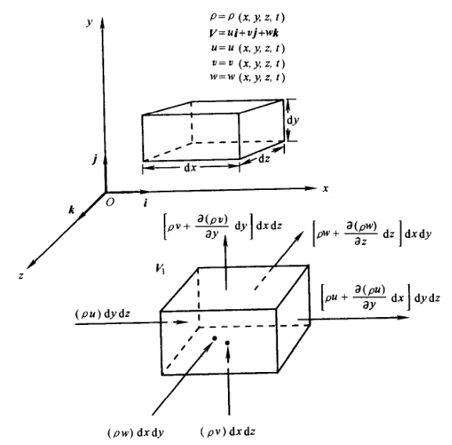

## 0. Preface

The mass conservation equation, also known as the continuity equation, essentially represents mass conservation.

We refer to the book *Computational fluid dynamics: the basics with applications* and discuss it from different perspectives using various approaches.

This article mainly discusses:

- [ ] Derivation of the continuity equation
- [ ] Transformation between different forms
- [ ] Understanding the physical meaning of mathematical expressions

## 1. Control Volume Model

Assume we take a fixed control volume with volume $V$. Using Eulerian description, we can establish **conservation** for the control volume system.

**Mass outflow through control volume surface per unit time B = Decrease in fluid mass within control volume per unit time C**

### 1.1. Mass Outflow

For mass outflow B, consider the area element (unit area) of this control volume system:

**Mass outflow per unit time = Fluid mass flowing through this area element per unit time**

The mass flow rate per unit time per unit area is the **mass flux**:

**Mass flux = Unit time × Fluid velocity through this area element × Unit area × Density**

Written in mathematical form:

$$
Flux =\rho U\cdot dS
$$

> [!tip]
> Whether from the perspective of mathematical integration or physics, we agree that the positive direction of $dS$ is outward from the control volume:
> - If velocity is outward, Flux is positive, physically indicating fluid leaving the control volume
> - If velocity is inward, Flux is negative, physically indicating fluid entering the control volume

Integrating over the surface of this control volume:

$$
B = \int_{\partial V}\rho U\cdot dS
$$

### 1.2. Mass Decrease

For mass decrease C, consider the total mass of the control volume:

$$
m = \int_{V} \rho dV
$$

Since the control volume does not change position, there is no convective change, so we calculate the Eulerian derivative for the control volume based on Eulerian description.

Considering the total mass change of the control volume is "decrease," while mathematical differentiation only gives the rate of change, we also need to consider the sign:

$$
C = - \frac{\partial}{\partial{t}}\int_{V}\rho dV
$$

Since the volume integral of the control volume is independent of time, and the integration limits are constant:

$$
C = - \int_{V}\frac{\partial}{\partial{t}}\rho dV
$$

### 1.3. Mass Conservation

According to the conservation relationship:

$$
\begin{align*}
B &= C\\
\int_{\partial V}\rho U\cdot dS &= - \int_{V}\frac{\partial}{\partial{t}}\rho dV\\
\int_{\partial V}\rho U\cdot dS + \int_{V}\frac{\partial}{\partial{t}}\rho dV &= 0
\end{align*}
$$

Applying the divergence theorem:

$$
\int_{V}\nabla\cdot(\rho U) dV + \int_{V}\frac{\partial}{\partial{t}}\rho dV = 0
$$

Rearranging, we obtain:

**【Conservative Integral Form of Continuity Equation】**

$$
\int_{V}\bigg[\frac{\partial}{\partial{t}}\rho + \nabla\cdot(\rho U)\bigg] dV = 0
$$

## 2. Material Volume Model

Assume we take a material volume that moves with the fluid flow, with volume $V$. Based on Lagrangian description, we can consider the **change** of the material volume.

The mass of the material volume is:

$$
m = \int_{V}\rho dV
$$

> [!caution]
> Although the mathematical expressions for calculating material volume mass and control volume mass are similar, they are different from a physical perspective.

Based on Lagrangian description, we calculate the Lagrangian derivative for the material volume, and we know the mass of the material volume does not change:

**【Non-conservative Integral Form of Continuity Equation】**

$$
\frac{D}{Dt}\int_{V}\rho dV = 0
$$

Note: The following approach of applying the material derivative is incorrect; we will discuss this later. Readers can think about the reason first:

$$\cancel{\frac{D}{Dt}\int_V \rho dV = \int_V \bigg[\frac{\partial \rho}{\partial t} + U \cdot \nabla  \rho \bigg]dV= 0}$$

## 3. Control Volume Element Model

Assume we take an infinitesimal control volume element model. Based on Eulerian description, we consider the **conservation** of the control volume element system.

On this infinitesimal control volume element, physical quantities like velocity are continuous functions and can be Taylor expanded.

Taking the $x$ direction as an example, the mass flux on the left face of the control volume element is:

$$
(\rho u)dydz
$$

According to Taylor expansion of continuous physical quantities, on the right side we have:

$$
\rho u + \frac{\partial (\rho u)}{\partial x}dx + \frac{\partial ^2 (\rho u)}{2! \partial x^2}{dx^2} + (higherOrder)
$$

Based on the infinitesimal assumption of this control volume element, omitting second-order and higher terms, rearranged as:

$$
\bigg[\rho u + \frac{\partial (\rho u)}{\partial x}dx\bigg]dydz
$$

The difference in mass flux between the left and right faces of the element in the $x$ direction is:

$$
\bigg[\rho u + \frac{\partial (\rho u)}{\partial x}dx\bigg]dydz - (\rho u)dydz = \frac{\partial (\rho u)}{\partial x}dxdydz
$$

Similarly, the net mass flux in the $y$ and $z$ directions is:

$$
\bigg[\rho v + \frac{\partial (\rho v)}{\partial y}dy\bigg]dxdz - (\rho v)dxdz = \frac{\partial (\rho v)}{\partial y}dxdydz
$$

$$
\bigg[\rho w + \frac{\partial (\rho w)}{\partial z}dz\bigg]dxdy - (\rho w)dxdy = \frac{\partial (\rho w)}{\partial z}dxdydz
$$

The total mass flux of this control volume element is:

$$
\bigg[\frac{\partial (\rho u)}{\partial x} + \frac{\partial (\rho v)}{\partial y} + \frac{\partial (\rho w)}{\partial z}\bigg]dxdydz
$$

The mass of the control volume element is:

$$
\rho dxdydz
$$

The time rate of increase of this element's mass (Eulerian derivative of control volume) is:

$$
\frac{\partial}{\partial t}(\rho dxdydz)
$$

The total mass flux of the control volume element always equals the decrease in its mass, so:

$$
\bigg[\frac{\partial (\rho u)}{\partial x} + \frac{\partial (\rho v)}{\partial y} + \frac{\partial (\rho w)}{\partial z}\bigg]dxdydz = -\frac{\partial \rho}{\partial t}(dxdydz)
$$

Rearranging:

$$
\frac{\partial \rho}{\partial t} + \bigg[\frac{\partial (\rho u)}{\partial x} + \frac{\partial (\rho v)}{\partial y} + \frac{\partial (\rho w)}{\partial z}\bigg] = 0
$$

**【Conservative Differential Form of Continuity Equation】**

$$
\frac{\partial \rho}{\partial t} + \nabla \cdot (\rho U) = 0
$$

## 4. Material Volume Element Model

Assume we take an infinitesimal material volume element model. Based on Lagrangian description, we consider the change of this system.

For this infinitesimal material volume element, its mass is:

$$
dm = \rho dV
$$

Based on Lagrangian description, we calculate the Lagrangian derivative for the material volume, and we know the mass of the material volume does not change:

$$
\frac{D}{Dt}dm = \frac{D}{Dt}\rho dV = 0
$$

After rearranging:

$$
\frac{D}{Dt}\rho dV = dV \frac{D\rho}{Dt} + \rho \frac{D(dV)}{Dt} = 0
$$

Rearranged as:

$$
\frac{D\rho}{Dt} + \rho \bigg[ \frac{1}{dV} \frac{D(dV)}{Dt} \bigg] = 0
$$

Based on previous discussion of velocity divergence:

**【Non-conservative Differential Form of Continuity Equation】**

$$
\frac{D\rho}{Dt} + \rho \nabla \cdot U = 0
$$

## 5. Conversion Relationships

The Reynolds transport theorem is as follows:

$$
\bigg(\frac{dB}{dt}\bigg)_{MV} = \int_V\bigg[\frac{\partial}{\partial t}(\rho b) + \nabla \cdot (\rho U b)\bigg]dV = \int_V\bigg[\frac{D}{D t}(\rho b) + \rho b \nabla \cdot U\bigg]dV
$$

The mass equation only considers mass transport, so:

$$
\begin{align*}
B &= m = \int_{V}\rho dV  \\
b &= 1
\end{align*}
$$

Rearranged as:

$$
\frac{D}{Dt}\int_{V} \rho dV = \int_{V}\bigg[\frac{\partial}{\partial t}\rho + \nabla \cdot (\rho U)\bigg]dV = \int_{V}\bigg[\frac{D}{D t}\rho + \rho \nabla \cdot U\bigg]dV = 0
$$

We can see that this includes the **【Conservative Integral Form of Continuity Equation】**.

Since the material volume and control volume are arbitrarily chosen, the integrand of the above equation is also zero everywhere. The integrated part is exactly the **【Conservative Differential Form of Continuity Equation】** and **【Non-conservative Differential Form of Continuity Equation】**.

For the material volume model:

$$
\frac{D}{Dt}\int_{V}\rho dV = 0
$$

Note that the volume of the material volume may change over time. Only when we assume the volume also does not change with time, i.e., (see discussion on velocity divergence):

$$
\nabla \cdot U = 0
$$

> [!note]
> We have:
> $$m=\rho V$$
> For material volume:
> $$ \frac{1}{V} \frac{Dm}{Dt} = \frac{D\rho}{Dt} + \rho \frac{1}{V} \frac{DV}{Dt} = 0$$
> When volume is constant, we can see that density is also constant, meaning incompressible fluid.
>
> But note: here we are discussing material volume. Even if a container maintains constant volume, the heated gas inside still has physical properties of compression and expansion; it is not an incompressible fluid.

At this point, expanding:

$$\begin{aligned}
\frac{D}{Dt}\int_{V} \rho dV &= \int_{V} \bigg[\frac{\partial \rho}{\partial t} + U \cdot \nabla  \rho \bigg]dV \\
&= \int_{V} \bigg[\frac{\partial \rho}{\partial t} + \nabla\cdot(\rho U) - \rho\nabla\cdot U \bigg]dV \\
&= \int_{V} \bigg[\frac{\partial \rho}{\partial t} + \nabla\cdot(\rho U) \bigg]dV
\end{aligned}$$

It can be seen that the rearranged result is consistent with the Reynolds transport theorem.

From a mathematical perspective, the integrand in integral form can have discontinuities, while differential form equations require differentiability, hence continuity. The divergence theorem requires mathematical continuity. When flow contains discontinuities, such as shock waves, the choice of continuity equation form becomes very important.

Overall, based on material derivative and divergence expansion, there is always a conversion relationship between non-conservative and conservative forms:

That is, the previously mentioned **【Reynolds Transport Conversion】**:

$$
\frac{D}{D t}(\rho b) + \rho b \nabla \cdot U = \frac{\partial}{\partial t}(\rho b) + \nabla \cdot (\rho U b)
$$

This conversion relationship further:

Expanding the first term on the right side of Reynolds transport conversion:

$$
\frac{\partial (\rho b)}{\partial t} = \rho\frac{\partial b}{\partial t} + b \frac{\partial\rho}{\partial t}
$$

Rearranging:

$$\rho\frac{\partial b}{\partial t}=\frac{\partial (\rho b)}{\partial t} - b \frac{\partial\rho}{\partial t}$$

Expanding the second term on the right side of Reynolds transport conversion (those who don't understand should review divergence calculation):

$$\nabla \cdot (\rho U b) = b \nabla \cdot (\rho U) + (\rho U) \cdot \nabla b$$

Rearranging:

$$\rho U \cdot \nabla b = \nabla \cdot (\rho Ub) - b \nabla \cdot (\rho U)$$

We have the material derivative:

$$\rho\frac{Db}{Dt} = \rho\frac{\partial b}{\partial t} + \rho U\cdot \nabla b$$

Rearranging:

$$\rho\frac{Db}{Dt} =\bigg[ \frac{\partial (\rho b)}{\partial t} - b \frac{\partial\rho}{\partial t}\bigg] + [\nabla \cdot (\rho Ub)-b \nabla \cdot (\rho U)]$$

Continuing to rearrange:

$$\rho\frac{Db}{Dt} = \frac{\partial (\rho b)}{\partial t} - b\underbrace{\bigg[ \frac{\partial\rho}{\partial t} + \nabla \cdot (\rho U)\bigg]}_{=0}  + \nabla \cdot (\rho Ub)$$

The middle term on the right side is the conservative differential form of the mass equation, equal to zero.

So we have:

**【Material Derivative Conversion】**

$$\rho\frac{Db}{Dt} = \rho\frac{\partial b}{\partial t} + \rho U\cdot \nabla b = \frac{\partial (\rho b)}{\partial t} + \nabla \cdot (\rho Ub)$$

Substituting into Reynolds transport conversion:

$$\frac{D}{D t}(\rho b) + \rho b \nabla \cdot U = \frac{\partial}{\partial t}(\rho b) + \nabla \cdot (\rho U b)$$

Rearranging:

$$\rho\frac{Db}{Dt} = \frac{D}{D t}(\rho b) + \rho b \nabla \cdot U$$

If the flow is incompressible ($\nabla\cdot U = 0$), then:

$$\rho\frac{Db}{Dt} = \frac{D}{D t}(\rho b)$$

We tentatively call this **【Reynolds Transport Second Conversion】**.

Regarding the integral and differential forms, conservative and non-conservative forms of the mass equation, it is believed that readers now fully understand their relationships and conversions.

> [!tip]
> Various forms of conversion may seem messy at first glance. Precisely to help readers摆脱 this messy feeling is the purpose of conversion discussion. Readers are encouraged to personally derive various expressions by hand.

## 6. Supplementary Discussion

1. OpenFOAM uses the finite volume method, i.e., uses the conservative integral form continuity equation:

$$\int_{V}\bigg[\frac{\partial}{\partial t}\rho dV + \nabla\cdot(\rho U)\bigg]dV = 0$$

2. For incompressible flow, density is constant (does not change with time and space in Lagrangian description):

Note: "density constant" here does not mean density is constant everywhere in the flow, but that density is constant along specific streamlines (if confused, recall previous discussion: the total differential with respect to time is somewhat Lagrangian, i.e., $D\rho/Dt = 0$).

For:

$$\frac{D\rho}{Dt} + \rho \nabla \cdot U = 0$$

We can obtain:

$$\nabla \cdot U = 0$$

The divergence of velocity is the volume change per unit time per unit volume. For incompressible fluid, velocity divergence is zero, which also indicates its volume does not change, i.e., incompressible. This is consistent with previous discussion.

3. Steady flow:

For steady flow:

$$
\frac{\partial\phi}{\partial t} = 0
$$

Considering the conservative integral form continuity equation:

$$\int_{V}\bigg[\frac{\partial}{\partial t}\rho dV + \nabla\cdot(\rho U)\bigg]dV = 0$$

We can obtain:

$$\nabla \cdot (\rho U) = 0$$

Expanding:

$$
\nabla \cdot (\rho U) = \rho\nabla\cdot U + U\cdot \nabla \rho = 0
$$

If the fluid is incompressible, further obtaining:

$$
U\cdot \nabla \rho = 0
$$

Meaning the fluid velocity vector is perpendicular to the density gradient direction. That is, when fluid moves along streamlines (velocity direction), density does not change.

In other words, for steady incompressible fluid, density is constant along streamlines.

## 7. Summary

The author still啰嗦 recommends readers personally derive formulas by hand. It is believed that after hand-deriving formulas, readers can appreciate the joy of their mathematical and physical self-consistency, coming and going圆满.

This article completes discussion of:

- [x] Derivation of mass conservation equation
- [x] Transformation between different forms
- [x] Understanding the physical meaning of mathematical expressions

## References

[1] The Finite Volume Method in Computational Fluid Dynamics, https://link.springer.com/book/10.1007/978-3-319-16874-6

[2] Computational fluid dynamics : the basics with applications, https://searchworks.stanford.edu/view/2989631

[3] Mathematics, Numerics, Derivations and OpenFOAM®, https://holzmann-cfd.com/community/publications/mathematics-numerics-derivations-and-openfoam-free

[4] Notes on Computational Fluid Dynamics: General Principles, https://doc.cfd.direct/notes/cfd-general-principles/

## Support us

>[!tip]
>Hopefully, the sharing here can be helpful to you.
>
>If you find this content helpful, your comments or donations would be greatly appreciated. Your support helps ensure the ongoing updates, corrections, refinements, and improvements to this and future series, ultimately benefiting new readers as well.
>
>The information and message provided during donation will be displayed as an acknowledgment of your support.


  


> Copyright @ 2026 Aerosand
>
> - Course (text, images, etc.): [CC BY-NC-SA 4.0](https://creativecommons.org/licenses/by-nc-sa/4.0/)
> - Code derived from OpenFOAM: [GPL v3](https://www.gnu.org/licenses/gpl-3.0.html)
> - Other code: [MIT License](https://opensource.org/licenses/MIT)