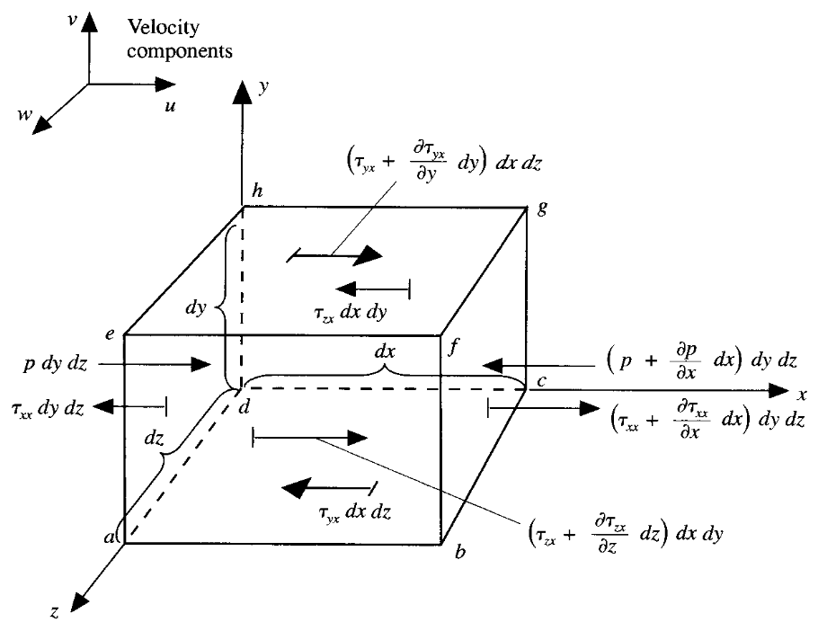

## 0. 前言

虽然现在人们把问题所对应的质量、动量和能量方程组的求解统称为求解 Navier-Stokes 方程，但是狭义上的 NS 方程特指动量方程。

1822 年，法国工程师、物理学家 Claude-Louis Navier 在研究黏性流体时首次写出带有黏性项的流体方程。

1845 年，英国数学家、物理学家 George Gabriel Stokes 采用了连续介质力学方法更系统地推导出流体运动方程，并特别明确了粘性应力张量与速度梯度的线性关系（即“牛顿流体”模型）。

通过之后的讨论，我们会了解 NS 动量方程的求解困难，其含有非线性对流项，涉及物理量具有强耦合性，且具有偏微分方程的复杂数学性质。方程涉及的湍流研究更是人类的世纪问题。

至于动量方程，物理上本质是基于动量方程的守恒，即

$$
F = m \vec{a}
$$

本文主要讨论

- [ ] 动量方程的推导
- [ ] 不同角度的推导
- [ ] 理解数学表达的物理意义

> [!warning]
> 本文的讨论遵循之前的符号约定。

## 1. 分量形式

假设我们取一个无穷小物质体微元模型。

对该物质体微元进行受理分析

考虑 $x$ 方向，有

$$
F_{x} = m a_{x}
$$

物质体微元的受力可以分成 2 部分

- 体积力，直接作用在整个物质体微元的体积上，与体积（质量）有紧密关系的超距离作用力，比如重力、电磁力等
- 表面力，直接作用在物质体微元的表面，与面积有紧密关系的接触作用力，只有两个来源即：外部流体包围产生的压力，外部流体推拉摩擦产生的粘性力（正应力切应力）

正应力和切应力都依赖于流体的速度梯度，和形变的速率成正比。应力越大，形变的速度越快。大多数粘性流动中，正应力都比切应力小的多，乃至可以忽略不计，当法向速度梯度很大时 (例如激波内部)，正应力就变得重要。我们约定用 $\tau_{ij}$ 表示 **作用在垂直于 $i$ 轴的平面沿着 $j$ 方向的应力**上。

在 $x$ 方向上的表面力有

$$
\begin{aligned}
pdydz - (p+\frac{\partial p}{\partial x}dx)dydz \\
+(\tau_{xx}+\frac{\partial\tau_{xx}}{\partial x}dx)dydz - \tau_{xx}dydz \\
+(\tau_{yx} + \frac{\partial\tau_{yx}}{\partial y}dy)dxdz- \tau_{yx}dxdz \\
+(\tau_{zx} + \frac{\partial\tau_{zx}}{\partial z}dz)dxdy - \tau_{zx}dxdy
\end{aligned}
$$

简化整理有

$$
-\frac{\partial p}{\partial x}dxdydz + \frac{\partial\tau_{xx}}{\partial x}dxdydz +\frac{\partial\tau_{yx}}{\partial y}dydxdz + \frac{\partial\tau_{zx}}{\partial z}dzdxdy
$$

考虑上微元受到的体积力

$$
\rho f_{x}dxdydz
$$

我们分析出图中 $x$ 方向的所有力，有

$$
\begin{align*}
F_{x} &= \bigg(- \frac{\partial p}{\partial x}+\frac{\partial\tau_{xx}}{\partial x}+\frac{\partial\tau_{yx}}{\partial y}+\frac{\partial\tau_{zx}}{\partial z} + f_{x} \bigg)dxdydz
\end{align*}
$$

该无穷小物质体微元的质量为

$$
m = \rho dxdydz
$$

在 $x$ 方向上的加速度为

$$
a_{x} = \frac{Du}{Dt}
$$

可以得到 $x$ 方向上的动量方程为

$$
\rho\frac{Du}{Dt} = -\frac{\partial p}{\partial x} + \frac{\partial\tau_{xx}}{\partial x} + \frac{\partial\tau_{yx}}{\partial y} + \frac{\partial\tau_{zx}}{\partial z} + \rho f_{x}
$$

同样在 $y$ 和 $z$ 方向上有

$$
\rho\frac{Dv}{Dt} = -\frac{\partial p}{\partial y} + \frac{\partial\tau_{xy}}{\partial x} + \frac{\partial\tau_{yy}}{\partial y} + \frac{\partial\tau_{zy}}{\partial z} + \rho f_{y}
$$

$$
\rho\frac{Dw}{Dt} = -\frac{\partial p}{\partial z} + \frac{\partial\tau_{xz}}{\partial x} + \frac{\partial\tau_{yz}}{\partial y} + \frac{\partial\tau_{zz}}{\partial z} + \rho f_{z}
$$

根据上一节的推导有【物质导数】

$$\rho\frac{Db}{Dt} = \rho\frac{\partial b}{\partial t} + \rho U\cdot \nabla b = \frac{\partial (\rho b)}{\partial t} + \nabla \cdot (\rho Ub)$$

处理动量方程，有

$$
\rho\frac{Du}{Dt} = \rho\frac{\partial u}{\partial t} + \rho U \cdot \nabla u = \frac{\partial (\rho u)}{\partial t} + \nabla \cdot (\rho u U)
$$

### 1.1. NS 方程

最终有 NS 方程

$$
\frac{\partial (\rho u)}{\partial t} + \nabla \cdot (\rho u U) = -\frac{\partial p}{\partial x} + \frac{\partial\tau_{xx}}{\partial x} + \frac{\partial\tau_{yx}}{\partial y} + \frac{\partial\tau_{zx}}{\partial z} + \rho f_{x}
$$

$$
\frac{\partial (\rho v)}{\partial t} + \nabla \cdot (\rho v U) = -\frac{\partial p}{\partial y} + \frac{\partial\tau_{xy}}{\partial x} + \frac{\partial\tau_{yy}}{\partial y} + \frac{\partial\tau_{zy}}{\partial z} + \rho f_{y}
$$

$$
\frac{\partial (\rho w)}{\partial t} + \nabla \cdot (\rho w U) = -\frac{\partial p}{\partial z} + \frac{\partial\tau_{xz}}{\partial x} + \frac{\partial\tau_{yz}}{\partial y} + \frac{\partial\tau_{zz}}{\partial z} + \rho f_{z}
$$

上面的分量形式仍然有很多和流体相关的项需要讨论。

以 $x$ 方向为例，展开左侧第一项的微分，第二项的算子，有

$$(\rho\frac{\partial u}{\partial t} + u\frac{\partial \rho}{\partial t}) + u\nabla\cdot \rho U + \rho U \cdot \nabla u $$

根据之前讨论的守恒型微分形式的连续性方程，有

$$
\rho \frac{\partial u}{\partial t} + u\underbrace{\bigg( \frac{\partial\rho}{\partial t}+\nabla\cdot\rho U \bigg)}_{=0} + \rho U\cdot\nabla u
$$

所以 NS 方程也可以写成

$$
\rho \frac{\partial u}{\partial t} + \rho U\cdot\nabla u = -\frac{\partial p}{\partial x} + \frac{\partial\tau_{xx}}{\partial x} + \frac{\partial\tau_{yx}}{\partial y} + \frac{\partial\tau_{zx}}{\partial z} + \rho f_{x}
$$

$$
\rho \frac{\partial v}{\partial t} + \rho U\cdot\nabla v = -\frac{\partial p}{\partial y} + \frac{\partial\tau_{xy}}{\partial x} + \frac{\partial\tau_{yy}}{\partial y} + \frac{\partial\tau_{zy}}{\partial z} + \rho f_{y}
$$

$$
\rho \frac{\partial w}{\partial t} + \rho U\cdot\nabla w = -\frac{\partial p}{\partial z} + \frac{\partial\tau_{xz}}{\partial x} + \frac{\partial\tau_{yz}}{\partial y} + \frac{\partial\tau_{zz}}{\partial z} + \rho f_{z}
$$

### 1.2. 流体切应力

到了 17 世纪末，牛顿指出，流体的切应力与应变的时间变化率（也就是速度梯度）成正比，这样的流体也被称为牛顿流体 。

对于牛顿流体，斯托克斯得到有

$$\tau_{xx} = \lambda(\nabla\cdot U) + 2\mu\frac{\partial u}{\partial x}$$
$$\tau_{yy} = \lambda(\nabla\cdot U) + 2\mu\frac{\partial v}{\partial y}$$
$$\tau_{zz} = \lambda(\nabla\cdot U) + 2\mu\frac{\partial w}{\partial z}$$
$$\tau_{xy} = \tau_{yx} = \mu(\frac{\partial v}{\partial x} + \frac{\partial u}{\partial y})$$
$$\tau_{xz} = \tau_{zx} = \mu(\frac{\partial u}{\partial z} + \frac{\partial w}{\partial x})$$
$$\tau_{yz} = \tau_{zy} = \mu(\frac{\partial w}{\partial y} + \frac{\partial v}{\partial z})$$

其中，$\mu$ 是分子粘性系数，$\lambda$ 是第二粘性系数，斯托克斯进一步**假设**有

$$\lambda = -\frac{2}{3}\mu$$

将此物性关系的假设代入可以获得完整动量方程。这里不再展开书写。

## 2. 张量形式

方程的分量形式非常繁琐，不利于理论表达和分析，我们采用张量形式，再次进行分析推导和表达。

根据牛顿第二定理，动量变化率等于作用力，即

$$\bigg(\frac{d(mU)}{dt}\bigg)_{MV}  = \bigg(\int_V \vec{f} dV\bigg)_{MV}$$

此处的作用力 $\vec{f}$ 包含体积力和表面力。

根据【雷诺输运定理】

$$
\bigg(\frac{dB}{dt}\bigg)_{MV} = \int_V\bigg[\frac{\partial}{\partial t}(\rho b) + \nabla \cdot (\rho U b)\bigg]dV = \int_V\bigg[\frac{D}{D t}(\rho b) + \rho b \nabla \cdot U\bigg]dV
$$

左侧可以改写为守恒型和非守恒型的方程

### 2.1. 非守恒型

对于非守恒型方程，有

$$\int_V\bigg[\frac{D}{D t}(\rho U) + \rho U \nabla \cdot U\bigg]dV - \int_V \vec{f} dV = 0$$

整理可得

$$\int_V\bigg[\frac{D}{D t}(\rho U) + \rho U \nabla \cdot U - \vec{f}\bigg]dV = 0$$

进一步整理有

$$\frac{D}{D t}(\rho U) + \rho U \nabla \cdot U = \vec{f}$$

展开第一项的全微分，有

$$(\rho\frac{DU}{Dt} + U\frac{D\rho}{Dt}) + \rho U \nabla \cdot U = \vec{f}$$

整理为

$$\rho\frac{DU}{Dt} + U\underbrace{(\frac{D\rho}{Dt} + \rho \nabla \cdot U)}_{=0} = \vec{f}$$

注意左侧第二项括号内是非守恒型微分形式的连续性方程，应该等于零

所以最后有

$$\rho\frac{DU}{Dt}= \vec{f}$$

根据物质导数，展开有

【**非守恒型微分形式动量方程**】

$$\rho\frac{\partial U}{\partial t} + \rho U\cdot \nabla U= \vec{f}$$

可以看到，该方程和前文的分量形式讨论是一致的。

### 2.2. 守恒型

对于守恒型方程，有

$$\int_{V}\bigg[\frac{\partial}{\partial t}(\rho U) + \nabla \cdot (\rho U U)\bigg]dV - \int_{V} \vec{f} dV = 0$$

整理可得

$$\frac{\partial}{\partial t}(\rho U) + \nabla \cdot (\rho UU) = \vec{f}$$

可以看到，该式和前文的分量形式的讨论是一致的。

### 2.3. 受力构成

受力可以分成表面力和体积力

$$\vec{f} = \vec{f_{s}} + \vec{f_{b}}$$

#### 表面力

表面力等于总应力张量和面矢量的乘积

$$d\vec{f_{s}} = \Sigma \cdot d\vec S = \Sigma\cdot \vec{n} dS$$

使用 $\Sigma$ 表示总应力张量（total stress tensor)（完整包含单位面积的压力和单位面积的粘性力）

$$\Sigma =
\begin{bmatrix}
\Sigma_{xx} & \Sigma_{xy} & \Sigma_{xz} \\
\Sigma_{yx} & \Sigma_{xx} & \Sigma_{yz} \\
\Sigma_{zx} & \Sigma_{zy} & \Sigma_{zz}
\end{bmatrix}$$

- 相同下标 $\Sigma_{ii}$ 表示法向应力，大于零为受拉（tension），小于零为受压（compression）。导致法向应力的主要物理原因是压力，很小一部分原因才是粘性
- 不同下标 $\Sigma_{ij}$ 表示切向应力，表示 $i$ 面上 $j$ 方向（$i$ 面为垂直 $i$ 方向的面，与分量形式的约定一样），约定如果面的外法向为正，则 $i$ 为正。导致切向应力的物理原因是粘性

$$
\Sigma = -
\begin{bmatrix}
p & 0 & 0 \\
0 & p & 0 \\
0 & 0 & p
\end{bmatrix} + 
\begin{Bmatrix}
\tau_{xx} & \tau_{xy} & \tau_{xz} \\
\tau_{yx} & \tau_{yy} & \tau_{yz} \\
\tau_{zx} & \tau_{zy} & \tau_{zz}
\end{Bmatrix}$$

整理为

$$\Sigma =\begin{Bmatrix}
\tau_{xx} - p & \tau_{xy} & \tau_{xz} \\
\tau_{yx} & \tau_{yy}-p & \tau_{yz} \\
\tau_{zx} & \tau_{zy} & \tau_{zz} - p
\end{Bmatrix} = -p\vec I + \vec{\tau}$$

也就是前面说的压力和粘性力。

回忆前文的讨论，矩阵可以分解成体部分和偏部分，有

$$
\Sigma = \Sigma^{hyd} + \Sigma^{dev} 
$$

很显然，体部分就是压力矩阵，即

$$
-p\vec{I} = |\Sigma^{hyd}|\vec{I} = \frac{1}{3}tr(\Sigma)\vec{I}
$$

进一步的，有

$$
\Sigma = -p\vec{I} + \underbrace{ \bigg[\Sigma- \frac{1}{3}tr(\Sigma)\vec{I} \bigg]}_{viscous-sress}
$$

也有

$$
\Sigma = \frac{1}{3}tr(\Sigma) + dev(\Sigma)
$$

分析可知，总应力张量的偏部分就是粘性力张量。

所以表面力有

$$\int_{V}\vec f_sdV = \int_{\partial V} \Sigma\cdot \vec n dS$$

利用散度定理

$$\int_{\partial V} \Sigma\cdot \vec n dS = \int_V\nabla\cdot\Sigma dV$$

整理可得

$$\vec f_S = [\nabla\cdot\Sigma] = -\nabla p + [\nabla\cdot \tau]$$

继续讨论其中的粘性力部分

对于牛顿流体来说，根据前文的讨论，我们知道有本构关系

$$\vec{\tau} = \mu [\nabla U + (\nabla U)^T] + \lambda(\nabla\cdot U)\vec I$$

斯托克斯假设有

$$\lambda = - \frac{2}{3} \mu $$

代入后的粘性力为

$$
\vec{\tau} = \mu [\nabla U + (\nabla U)^{T}] - \frac{2}{3}\mu (\nabla\cdot U)\vec I
$$

如果是不可压缩流体，根据之前的讨论，有

$$\nabla\cdot U = 0$$

粘性力简化为

$$\vec{\tau} = \mu [\nabla U + (\nabla U)^T]$$

结合这些讨论，也就可以理解为什么 $\lambda(\nabla\cdot U)$ 这一项也被为体积膨胀率。

引入应变率（strain rate），也被称为**形变率**，可以表示成速度的函数

$$
\begin{align*}
S &= 
\begin{bmatrix}
S_{xx} &S_{xy} &S_{xz}\\
S_{yx} &S_{yy} &S_{yz}\\
S_{zx} &S_{zy} &S_{zz}
\end{bmatrix}\\
&= 
\begin{bmatrix}
\frac{1}{2}\left(\frac{\partial u}{\partial x} + \frac{\partial u}{\partial x}\right)& \frac{1}{2}\left(\frac{\partial u}{\partial y} + \frac{\partial v}{\partial x}\right)&
\frac{1}{2}\left(\frac{\partial u}{\partial z} + \frac{\partial w}{\partial x}\right)\\
\frac{1}{2}\left(\frac{\partial v}{\partial x} + \frac{\partial u}{\partial y}\right)& \frac{1}{2}\left(\frac{\partial v}{\partial y} + \frac{\partial v}{\partial y}\right)&
\frac{1}{2}\left(\frac{\partial v}{\partial z} + \frac{\partial w}{\partial y}\right)\\
\frac{1}{2}\left(\frac{\partial w}{\partial x} + \frac{\partial u}{\partial z}\right)& \frac{1}{2}\left(\frac{\partial w}{\partial y} + \frac{\partial v}{\partial z}\right)&
\frac{1}{2}\left(\frac{\partial w}{\partial z} + \frac{\partial w}{\partial z}\right)\\
\end{bmatrix}
\end{align*}
$$

写成矢量形式

$$
S = \frac{1}{2} (\nabla U + \nabla U^{T})
$$

粘性力表达为

$$
\vec{\tau} = 2\mu S
$$

注意 $\mu$ 仍然是流体粘度，是流体的物理属性。

#### 体积力

主要是重力

$$\vec f_b = \rho \vec g$$

对于旋转系统来说，体力还来自于科里奥利力 和向心力

$$\vec f_b = -2\rho[\omega \times U] - \rho [\omega\times[\omega\times\vec r]] $$

一般来说，重力和向心力都和位置有关，和速度无关，所以会归在压力修正项中。科里奥利力会单独处理。体积力像是还有电磁力电场力等多种类型，针对具体问题需要增加不同的体积力。下面方程中的体积力只考虑重力。

> [!caution]
> 当考虑相对压强的时候，上述重力项被约去，由新的重力项代替，详见 interFoam 的讨论，这里暂不深入展开讨论。

### 2.4. NS 方程

考虑最一般情况，动量方程守恒型微分形式为

$$\frac{\partial}{\partial t}(\rho U) + \nabla \cdot (\rho UU) = -\nabla p + \nabla\cdot\vec{\tau} + \rho\vec{g}$$

在 OpenFOAM 中，一般表示为

$$\frac{\partial}{\partial t}(\rho U) + \nabla \cdot (\rho UU) = -\nabla p + (\nabla\cdot rhoR^{eff}) + \rho\vec{g}$$

流体粘性应力的张量形式

$$rhoR^{eff} = \mu [\nabla U + (\nabla U)^{T}] + \lambda(\nabla\cdot U)\vec I$$

展开成矩阵形式更加清楚

$$rhoR^{eff} = 
\begin{bmatrix}
2\mu\frac{\partial u}{\partial x} + \lambda\nabla\cdot  U & \mu(\frac{\partial v}{\partial x} + \frac{\partial u}{\partial y}) & \mu(\frac{\partial u}{\partial z} + \frac{\partial w}{\partial x}) \\
\mu(\frac{\partial v}{\partial x} + \frac{\partial u}{\partial y}) & 2\mu\frac{\partial v}{\partial y} + \lambda(\nabla\cdot U)  & \mu(\frac{\partial w}{\partial y} + \frac{\partial v}{\partial z}) \\
\mu(\frac{\partial u}{\partial z} + \frac{\partial w}{\partial x}) & \mu(\frac{\partial w}{\partial y} + \frac{\partial v}{\partial z}) & 2\mu\frac{\partial w}{\partial z} + \lambda(\nabla\cdot U)
\end{bmatrix}$$

代入动量方程守恒型微分形式，得到

$$
\frac{\partial}{\partial t}(\rho U) + \nabla \cdot (\rho UU) = -\nabla p + \nabla\cdot[\mu (\nabla      U + (\nabla U)^T)] + \nabla(\lambda\nabla\cdot U) + \rho\vec{g}
$$

其中

$$
\nabla\cdot[\mu (\nabla U + (\nabla U)^{T})] = \nabla\cdot(\mu\nabla U) + \nabla\cdot[\mu (\nabla U)^{T}]
$$

整理为

$$
\frac{\partial}{\partial t}(\rho U) + \nabla \cdot (\rho UU) = \nabla\cdot(\mu\nabla U)-\nabla p + \nabla\cdot[\mu (\nabla U)^T] + \nabla(\lambda\nabla\cdot U) + \rho\vec{g}
$$

对于更一般的情况，将右边后四项统一为广义源项，整理为

$$
\frac{\partial}{\partial t}(\rho U) + \nabla \cdot (\rho UU) - \nabla\cdot(\mu\nabla U) = Q
$$

## 3. 补充讨论

### 3.1. 无粘流动

对于无粘性流动，粘性系数 $\mu=0$ ，动量方程最终简化为

$$\frac{\partial}{\partial t}(\rho U) + \nabla \cdot (\rho UU) = -\nabla p + \rho\vec{g}$$

即没有粘性扩散。

### 3.2. 不可压缩流动

对于不可压缩流体

$$\nabla\cdot U = 0$$

动量方程简化为

$$\frac{\partial}{\partial t}(\rho U) + \nabla \cdot (\rho UU) = -\nabla p + \nabla\cdot[\mu (\nabla      U + (\nabla U)^T)] + \cancel{\nabla(\lambda\nabla\cdot U)} + \rho\vec{g} $$

对于牛顿流体，有剪切应力 $\vec{\tau}$ 线性相关于形变率 $S$ （矢量）为线性，即

$$
\vec{\tau} = 2\mu S = \mu(\nabla U + (\nabla U)^{T})
$$

结合 Boussnesq 假设，密度变化仅仅对浮力起作用，其他项中的密度变化可以忽略，甚至如果这里就是不可压缩流体，则有

$$\begin{align*}
\frac{\partial}{\partial t}(\rho U) + \nabla \cdot (\rho UU) &=  -\nabla p + \nabla\cdot[\mu (\nabla      U + (\nabla U)^T)] + \cancel{\nabla(\lambda\nabla\cdot U)} + \rho\vec{g} \\
\frac{\partial U}{\partial t} + \nabla \cdot (UU) - \nabla \cdot[\nu(\nabla U + (\nabla U)^{T}]  &= - \frac{1}{\rho} \nabla p + \rho\vec{g} \\
\frac{\partial U}{\partial t} + \nabla \cdot (UU) - \nabla \cdot (2\nu S)  &= - \frac{1}{\rho} \nabla p + \rho\vec{g} \\
\frac{\partial U}{\partial t} + \nabla \cdot (UU) + \nabla \cdot R^{eff}  &= - \frac{1}{\rho} \nabla p + \rho\vec{g}
\end{align*}$$

如果此时粘性系数 $\mu$ 为常数，动量方程可以进一步简化

**粘性应力张量的散度**为

$$\begin{aligned}
\nabla\cdot \vec{\tau} &= \nabla\cdot[\mu (\nabla U + (\nabla U)^T)] + \nabla(\lambda\nabla\cdot U) \\
&= 
\begin{Bmatrix}
\frac{\partial}{\partial x}[2\mu\frac{\partial u}{\partial x} + \lambda\nabla\cdot  U] + \frac{\partial}{\partial y}[\mu(\frac{\partial v}{\partial x} + \frac{\partial u}{\partial y})] +\frac{\partial}{\partial z}[\mu(\frac{\partial u}{\partial z} + \frac{\partial w}{\partial x})] \\
\frac{\partial}{\partial x}[\mu(\frac{\partial v}{\partial x} + \frac{\partial u}{\partial y})] + \frac{\partial}{\partial y}[2\mu\frac{\partial v}{\partial y} + \lambda(\nabla\cdot U)] + \frac{\partial}{\partial z}[\mu(\frac{\partial w}{\partial y} + \frac{\partial v}{\partial z})] \\
\frac{\partial}{\partial x}[\mu(\frac{\partial u}{\partial z} + \frac{\partial w}{\partial x})] + \frac{\partial}{\partial y}[\mu(\frac{\partial w}{\partial y} + \frac{\partial v}{\partial z})] +\frac{\partial}{\partial z}[2\mu\frac{\partial w}{\partial z} + \lambda(\nabla\cdot U)] 
\end{Bmatrix}
\end{aligned}$$

以 **应力张量散度** 的第一行为例，此时

$$\begin{align*}
(\nabla\cdot\tau)_{col1} &= \frac{\partial}{\partial x}[2\mu\frac{\partial u}{\partial x} + \cancel{\lambda\nabla\cdot  U}] + \frac{\partial}{\partial y}[\mu(\frac{\partial v}{\partial x} + \frac{\partial u}{\partial y})] +\frac{\partial}{\partial z}[\mu(\frac{\partial u}{\partial z} + \frac{\partial w}{\partial x})]\\
&= \frac{\partial}{\partial x}[2\mu\frac{\partial u}{\partial x}] + \mu\frac{\partial}{\partial y}[(\frac{\partial v}{\partial x} + \frac{\partial u}{\partial y})] +\mu\frac{\partial}{\partial z}[(\frac{\partial u}{\partial z} + \frac{\partial w}{\partial x})]\\
&= \mu[(\frac{\partial^2 u}{\partial x^2}+\frac{\partial^2 u}{\partial y^2}+\frac{\partial^2 u}{\partial z^2}) + \frac{\partial^2 u}{\partial x^2} + \frac{\partial^2 v}{\partial xy} + \frac{\partial^2 w}{\partial xz}]\\
&=  \mu[(\frac{\partial^2 u}{\partial x^2}+\frac{\partial^2 u}{\partial y^2}+\frac{\partial^2 u}{\partial z^2}) + \frac{\partial }{\partial x}(\frac{\partial u}{\partial x} + \frac{\partial v}{\partial y} + \frac{\partial w}{\partial z})]\\
&= \mu[(\nabla^2 u) + \cancel{\frac{\partial }{\partial x}(\nabla\cdot U)}]\\
\end{align*}
$$

因为流体不可压缩，密度不变，第二项为零，所以动量方程进一步简化为

$$\frac{\partial \rho U}{\partial t} + \nabla \cdot (\rho UU) = -\nabla p + \mu \nabla^2U + \rho\vec{g}$$

如果流体没有粘性，粘性项可以进一步省略，即

$$
\frac{\partial\rho U}{\partial t} + \nabla \cdot (\rho UU) = -\nabla p  + \rho\vec{g}
$$

## 4. 小结

本文完成讨论

- [x] 动量方程的推导
- [x] 不同角度的推导
- [x] 理解数学表达的物理意义

## References

[1] The Finite Volume Method in Computational Fluid Dynamics, https://link.springer.com/book/10.1007/978-3-319-16874-6

[2] Computational fluid dynamics : the basics with applications, https://searchworks.stanford.edu/view/2989631

[3] Mathematics, Numerics, Derivations and OpenFOAM®, https://holzmann-cfd.com/community/publications/mathematics-numerics-derivations-and-openfoam-free

[4] Notes on Computational Fluid Dynamics: General Principles, https://doc.cfd.direct/notes/cfd-general-principles/

