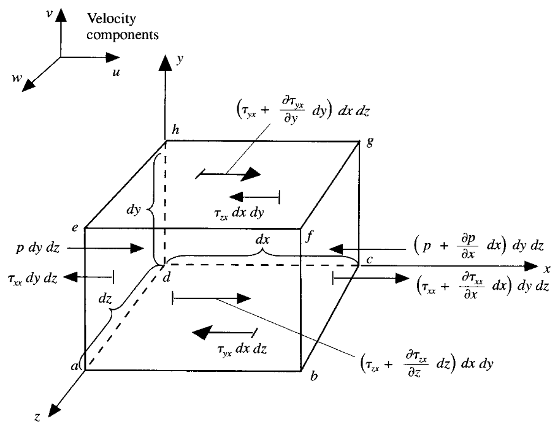

## 0. Preface

Although people now refer to solving the mass, momentum, and energy equation systems corresponding to problems as solving Navier-Stokes equations, narrowly speaking, NS equations specifically refer to the momentum equation.

In 1822, French engineer and physicist Claude-Louis Navier first wrote fluid equations with viscous terms while studying viscous fluids.

In 1845, British mathematician and physicist George Gabriel Stokes more systematically derived fluid motion equations using continuum mechanics methods, and specifically clarified the linear relationship between viscous stress tensor and velocity gradient (i.e., the "Newtonian fluid" model).

Through subsequent discussion, we will understand the difficulty in solving NS momentum equations: they contain nonlinear convective terms, involve strongly coupled physical quantities, and have complex mathematical properties of partial differential equations. Turbulence research involved in the equations is even a century-old problem for humanity.

As for the momentum equation, physically it is essentially based on conservation of momentum equation, i.e.:

$$
F = m \vec{a}
$$

This article mainly discusses:

- [ ] Derivation of momentum equation
- [ ] Derivation from different perspectives
- [ ] Understanding the physical meaning of mathematical expressions

> [!warning]
> The discussion in this article follows previous symbol conventions.

## 1. Component Form

Assume we take an infinitesimal material volume element model.

Perform force analysis on this material volume element.

Considering the $x$ direction:

$$
F_{x} = m a_{x}
$$

The forces on the material volume element can be divided into 2 parts:

- Volume forces: directly acting on the entire volume of the material volume element, long-distance forces closely related to volume (mass), e.g., gravity, electromagnetic forces, etc.
- Surface forces: directly acting on the surface of the material volume element, contact forces closely related to area, with only two sources: pressure generated by surrounding external fluid, and viscous forces (viscous normal stress, viscous shear stress) generated by external fluid pushing/pulling friction.

Both normal and shear stresses depend on the fluid's velocity gradient and are proportional to the rate of deformation. The greater the stress, the faster the deformation rate. In most viscous flows, viscous normal stress is much smaller than viscous shear stress, even negligible. When normal velocity gradients are large (e.g., inside shock waves), normal stress becomes important. We agree to use $\tau_{ij}$ to represent **viscous stress acting on a plane perpendicular to the $i$-axis along the $j$-direction**.

Surface forces in the $x$ direction:

$$
\begin{aligned}
pdydz - (p+\frac{\partial p}{\partial x}dx)dydz \\
+(\tau_{xx}+\frac{\partial\tau_{xx}}{\partial x}dx)dydz - \tau_{xx}dydz \\
+(\tau_{yx} + \frac{\partial\tau_{yx}}{\partial y}dy)dxdz- \tau_{yx}dxdz \\
+(\tau_{zx} + \frac{\partial\tau_{zx}}{\partial z}dz)dxdy - \tau_{zx}dxdy
\end{aligned}
$$

Simplifying and rearranging:

$$
-\frac{\partial p}{\partial x}dxdydz + \frac{\partial\tau_{xx}}{\partial x}dxdydz +\frac{\partial\tau_{yx}}{\partial y}dydxdz + \frac{\partial\tau_{zx}}{\partial z}dzdxdy
$$

Considering volume force (gravity) on the element:

$$
\rho f_{x}dxdydz
$$

We analyze all forces $F_{x}$ in the $x$ direction in the figure:

$$
\begin{align*}
F_{x} &= \bigg(- \frac{\partial p}{\partial x}+\frac{\partial\tau_{xx}}{\partial x}+\frac{\partial\tau_{yx}}{\partial y}+\frac{\partial\tau_{zx}}{\partial z} + \rho f_{x} \bigg)dxdydz
\end{align*}
$$

The mass of this infinitesimal material volume element is:

$$
m = \rho dxdydz
$$

Acceleration in the $x$ direction is:

$$
a_{x} = \frac{Du}{Dt}
$$

We can obtain the momentum equation in the $x$ direction:

$$
\rho\frac{Du}{Dt} dxdydz= \bigg(- \frac{\partial p}{\partial x}+\frac{\partial\tau_{xx}}{\partial x}+\frac{\partial\tau_{yx}}{\partial y}+\frac{\partial\tau_{zx}}{\partial z} + \rho f_{x} \bigg)dxdydz
$$

After rearranging:

$$
\rho\frac{Du}{Dt} = - \frac{\partial p}{\partial x}+\frac{\partial\tau_{xx}}{\partial x}+\frac{\partial\tau_{yx}}{\partial y}+\frac{\partial\tau_{zx}}{\partial z} + \rho f_{x}
$$

Similarly in the $y$ and $z$ directions:

$$
\rho\frac{Dv}{Dt} = -\frac{\partial p}{\partial y} + \frac{\partial\tau_{xy}}{\partial x} + \frac{\partial\tau_{yy}}{\partial y} + \frac{\partial\tau_{zy}}{\partial z} + \rho f_{y}
$$

$$
\rho\frac{Dw}{Dt} = -\frac{\partial p}{\partial z} + \frac{\partial\tau_{xz}}{\partial x} + \frac{\partial\tau_{yz}}{\partial y} + \frac{\partial\tau_{zz}}{\partial z} + \rho f_{z}
$$

According to the derivation in the previous section **【Material Derivative】**:

$$\rho\frac{Db}{Dt} = \rho\frac{\partial b}{\partial t} + \rho U\cdot \nabla b = \frac{\partial (\rho b)}{\partial t} + \nabla \cdot (\rho Ub)$$

Substituting into the momentum equation, taking the $x$ direction as an example:

$$
\rho\frac{Du}{Dt} = \rho\frac{\partial u}{\partial t} + \rho U \cdot \nabla u = \frac{\partial (\rho u)}{\partial t} + \nabla \cdot (\rho u U)
$$

### 1.1. NS Equations

Finally, we have the NS equations:

$$
\frac{\partial (\rho u)}{\partial t} + \nabla \cdot (\rho u U) = -\frac{\partial p}{\partial x} + \frac{\partial\tau_{xx}}{\partial x} + \frac{\partial\tau_{yx}}{\partial y} + \frac{\partial\tau_{zx}}{\partial z} + \rho f_{x}
$$

$$
\frac{\partial (\rho v)}{\partial t} + \nabla \cdot (\rho v U) = -\frac{\partial p}{\partial y} + \frac{\partial\tau_{xy}}{\partial x} + \frac{\partial\tau_{yy}}{\partial y} + \frac{\partial\tau_{zy}}{\partial z} + \rho f_{y}
$$

$$
\frac{\partial (\rho w)}{\partial t} + \nabla \cdot (\rho w U) = -\frac{\partial p}{\partial z} + \frac{\partial\tau_{xz}}{\partial x} + \frac{\partial\tau_{yz}}{\partial y} + \frac{\partial\tau_{zz}}{\partial z} + \rho f_{z}
$$

The component form above still has many fluid-related terms that need discussion.

Taking the $x$ direction as an example, expanding the differential of the first term on the left and the operator of the second term:

$$\bigg(\rho\frac{\partial u}{\partial t} + u\frac{\partial \rho}{\partial t}\bigg) + \bigg( u\nabla\cdot \rho U + \rho U \cdot \nabla u \bigg)$$

According to the previously discussed conservative differential form continuity equation:

$$
\rho \frac{\partial u}{\partial t} + u\underbrace{\bigg( \frac{\partial\rho}{\partial t}+\nabla\cdot\rho U \bigg)}_{=0} + \rho U\cdot\nabla u
$$

So NS equations can also be written as:

$$
\rho \frac{\partial u}{\partial t} + \rho U\cdot\nabla u = -\frac{\partial p}{\partial x} + \frac{\partial\tau_{xx}}{\partial x} + \frac{\partial\tau_{yx}}{\partial y} + \frac{\partial\tau_{zx}}{\partial z} + \rho f_{x}
$$

$$
\rho \frac{\partial v}{\partial t} + \rho U\cdot\nabla v = -\frac{\partial p}{\partial y} + \frac{\partial\tau_{xy}}{\partial x} + \frac{\partial\tau_{yy}}{\partial y} + \frac{\partial\tau_{zy}}{\partial z} + \rho f_{y}
$$

$$
\rho \frac{\partial w}{\partial t} + \rho U\cdot\nabla w = -\frac{\partial p}{\partial z} + \frac{\partial\tau_{xz}}{\partial x} + \frac{\partial\tau_{yz}}{\partial y} + \frac{\partial\tau_{zz}}{\partial z} + \rho f_{z}
$$

### 1.2. Fluid Shear Stress

By the end of the 17th century, Newton pointed out that fluid shear stress is proportional to the time rate of strain (i.e., velocity gradient). Such fluids are also called Newtonian fluids.

For Newtonian fluids, Stokes obtained:

$$\tau_{xx} = \lambda(\nabla\cdot U) + 2\mu\frac{\partial u}{\partial x}$$
$$\tau_{yy} = \lambda(\nabla\cdot U) + 2\mu\frac{\partial v}{\partial y}$$
$$\tau_{zz} = \lambda(\nabla\cdot U) + 2\mu\frac{\partial w}{\partial z}$$
$$\tau_{xy} = \tau_{yx} = \mu(\frac{\partial v}{\partial x} + \frac{\partial u}{\partial y})$$
$$\tau_{xz} = \tau_{zx} = \mu(\frac{\partial u}{\partial z} + \frac{\partial w}{\partial x})$$
$$\tau_{yz} = \tau_{zy} = \mu(\frac{\partial w}{\partial y} + \frac{\partial v}{\partial z})$$

Where $\mu$ is the molecular viscosity coefficient, $\lambda$ is the second viscosity coefficient. Stokes further **assumed**:

$$\lambda = -\frac{2}{3}\mu$$

Substituting this physical relationship assumption yields the complete momentum equation. It will not be expanded here.

## 2. Tensor Form

The component form of equations is very cumbersome,不利于 theoretical expression and analysis. We use tensor form to analyze, derive, and express again.

According to Newton's second law, the rate of momentum change equals the applied force:

$$\bigg(\frac{d(mU)}{dt}\bigg)_{MV}  = \bigg(\int_V \vec{F} dV\bigg)_{MV}$$

Here the applied force $\vec{F}$ includes all volume and surface forces.

According to **【Reynolds Transport Theorem】**:

$$
\bigg(\frac{dB}{dt}\bigg)_{MV} = \int_V\bigg[\frac{\partial}{\partial t}(\rho b) + \nabla \cdot (\rho U b)\bigg]dV = \int_V\bigg[\frac{D}{D t}(\rho b) + \rho b \nabla \cdot U\bigg]dV
$$

Where:

$$
b = \frac{B}{m} = U
$$

The momentum equation can be arranged according to the form on the right side of the above equation,分别整理为 conservative and non-conservative equations.

### 2.1. Non-conservative Form

For non-conservative equations:

$$\int_V\bigg[\frac{D}{D t}(\rho U) + \rho U \nabla \cdot U\bigg]dV - \int_V \vec{F} dV = 0$$

Rearranging gives:

$$\int_V\bigg[\frac{D}{D t}(\rho U) + \rho U \nabla \cdot U - \vec{F}\bigg]dV = 0$$

Further rearranging:

$$\frac{D}{D t}(\rho U) + \rho U \nabla \cdot U = \vec{F}$$

Expanding the total differential of the first term:

$$(\rho\frac{DU}{Dt} + U\frac{D\rho}{Dt}) + \rho U \nabla \cdot U = \vec{F}$$

Rearranged as:

$$\rho\frac{DU}{Dt} + U\underbrace{(\frac{D\rho}{Dt} + \rho \nabla \cdot U)}_{=0} = \vec{F}$$

Note: The term in parentheses on the left side is the non-conservative differential form continuity equation, which should equal zero.

So finally:

$$\rho\frac{DU}{Dt}= \vec{F}$$

According to material derivative, expanding:

**【Non-conservative Differential Form Momentum Equation】**

$$\rho\frac{\partial U}{\partial t} + \rho U\cdot \nabla U= \vec{F}$$

We can see that this equation is consistent with the previous component form discussion.

### 2.2. Conservative Form

For conservative equations:

$$\int_{V}\bigg[\frac{\partial}{\partial t}(\rho U) + \nabla \cdot (\rho U U)\bigg]dV - \int_{V} \vec{F} dV = 0$$

Rearranging gives:

$$\frac{\partial}{\partial t}(\rho U) + \nabla \cdot (\rho UU) = \vec{F}$$

We can see that this form is consistent with the previous component form discussion.

### 2.3. Force Composition

Forces can be divided into surface forces and volume forces:

$$\vec{F} = \vec{F_{s}} + \vec{F_{b}}$$

#### Surface Forces

Surface force equals the product of total stress tensor and area vector:

$$d\vec{F_{s}} = \Sigma \cdot d\vec S = \Sigma\cdot \vec{n} dS$$

Using $\Sigma$ to represent total stress tensor (complete including pressure per unit area and viscous force per unit area):

$$\Sigma =
\begin{bmatrix}
\Sigma_{xx} & \Sigma_{xy} & \Sigma_{xz} \\
\Sigma_{yx} & \Sigma_{xx} & \Sigma_{yz} \\
\Sigma_{zx} & \Sigma_{zy} & \Sigma_{zz}
\end{bmatrix}$$

- Same subscript $\Sigma_{ii}$ represents normal stress: greater than zero indicates tension, less than zero indicates compression. The main physical cause of normal stress is pressure, with viscosity being only a very small part.
- Different subscripts $\Sigma_{ij}$ represent shear stress:表示 $i$ surface $j$ direction ($i$ surface is the plane perpendicular to $i$ direction, same convention as component form). Convention: if the outward normal of the surface is positive, then $i$ is positive. The physical cause of shear stress is viscosity.

$$
\Sigma = -
\begin{bmatrix}
p & 0 & 0 \\
0 & p & 0 \\
0 & 0 & p
\end{bmatrix} +
\begin{Bmatrix}
\tau_{xx} & \tau_{xy} & \tau_{xz} \\
\tau_{yx} & \tau_{yy} & \tau_{yz} \\
\tau_{zx} & \tau_{zy} & \tau_{zz}
\end{Bmatrix}$$

Rearranged as:

$$\Sigma =\begin{Bmatrix}
\tau_{xx} - p & \tau_{xy} & \tau_{xz} \\
\tau_{yx} & \tau_{yy}-p & \tau_{yz} \\
\tau_{zx} & \tau_{zy} & \tau_{zz} - p
\end{Bmatrix} = -p\vec I + \vec{\tau}$$

That is, the sum of pressure and viscous force mentioned earlier.

Referring to previous discussion (00_intro-cfdb), matrices can be decomposed into volumetric and deviatoric parts:

$$
\Sigma = \Sigma^{hyd} + \Sigma^{dev}
$$

Obviously, the volumetric part is the pressure matrix:

$$
-p\vec{I} = |\Sigma^{hyd}|\vec{I} = \frac{1}{3}tr(\Sigma)\vec{I}
$$

Further:

$$
\Sigma = -p\vec{I} + \underbrace{ \bigg[\Sigma- \frac{1}{3}tr(\Sigma)\vec{I} \bigg]}_{viscous-stress}
$$

Also:

$$
\Sigma = \frac{1}{3}tr(\Sigma) + dev(\Sigma)
$$

Analysis shows that the deviatoric part of the total stress tensor is the viscous force tensor.

So surface force is:

$$\int_{V}\vec F_{s}dV = \int_{\partial V} \Sigma\cdot \vec n dS$$

Using divergence theorem:

$$\int_{\partial V} \Sigma\cdot \vec n dS = \int_V\nabla\cdot\Sigma dV$$

Correspondingly, surface force is:

$$\vec F_{S} = \nabla\cdot\Sigma = -\nabla p + \nabla\cdot \tau$$

Continuing discussion of the viscous force part:

For Newtonian fluids, according to previous discussion, we know there is a constitutive relationship:

$$\vec{\tau} = \mu [\nabla U + (\nabla U)^T] + \lambda(\nabla\cdot U)\vec I$$

Stokes assumed:

$$\lambda = - \frac{2}{3} \mu $$

Substituting, the viscous force becomes:

$$
\vec{\tau} = \mu [\nabla U + (\nabla U)^{T}] - \frac{2}{3}\mu (\nabla\cdot U)\vec I
$$

If it's an incompressible fluid, according to previous discussion:

$$\nabla\cdot U = 0$$

Viscous force simplifies to:

$$\vec{\tau} = \mu [\nabla U + (\nabla U)^T]$$

Combining these discussions, we can understand why the term $\lambda(\nabla\cdot U)$ is also called volumetric expansion rate.

At this point, introducing strain rate, also called **deformation rate**, can be expressed as a function of velocity:

$$
\begin{align*}
S &=
\begin{bmatrix}
S_{xx} &S_{xy} &S_{xz}\\
S_{yx} &S_{yy} &S_{yz}\\
S_{zx} &S_{zy} &S_{zz}
\end{bmatrix}\\
&=
\begin{bmatrix}
\frac{1}{2}\left(\frac{\partial u}{\partial x} + \frac{\partial u}{\partial x}\right)& \frac{1}{2}\left(\frac{\partial u}{\partial y} + \frac{\partial v}{\partial x}\right)&
\frac{1}{2}\left(\frac{\partial u}{\partial z} + \frac{\partial w}{\partial x}\right)\\
\frac{1}{2}\left(\frac{\partial v}{\partial x} + \frac{\partial u}{\partial y}\right)& \frac{1}{2}\left(\frac{\partial v}{\partial y} + \frac{\partial v}{\partial y}\right)&
\frac{1}{2}\left(\frac{\partial v}{\partial z} + \frac{\partial w}{\partial y}\right)\\
\frac{1}{2}\left(\frac{\partial w}{\partial x} + \frac{\partial u}{\partial z}\right)& \frac{1}{2}\left(\frac{\partial w}{\partial y} + \frac{\partial v}{\partial z}\right)&
\frac{1}{2}\left(\frac{\partial w}{\partial z} + \frac{\partial w}{\partial z}\right)\\
\end{bmatrix}
\end{align*}
$$

Written in vector form:

$$
S = \frac{1}{2} (\nabla U + \nabla U^{T})
$$

Viscous force expressed as:

$$
\vec{\tau} = 2\mu S
$$

Note $\mu$ is still fluid viscosity, a physical property of the fluid.

#### Volume Forces

Mainly gravity:

$$\vec F_{b} = \rho \vec g$$

For rotating systems, body forces also come from Coriolis force and centrifugal force:

$$\vec F_{b} = -2\rho[\omega \times U] - \rho [\omega\times[\omega\times\vec r]] $$

Generally, gravity and centrifugal force are related to position, not velocity, so they are included in pressure correction terms. Coriolis force is handled separately. Volume forces also include electromagnetic forces, electric field forces, and many other types. Different volume forces need to be added for specific problems. Volume forces in the following equations only consider gravity.

> [!caution]
> When considering relative pressure, the above gravity term is canceled and replaced by a new gravity term. See discussion in interFoam for details; not深入展开讨论 here.

### 2.4. NS Equations

Considering the general case, substituting details of force terms:

$$\frac{\partial}{\partial t}(\rho U) + \nabla \cdot (\rho UU) = \vec{F}$$

Obtaining the more complete form of conservative differential form momentum equation (including viscous force):

$$\frac{\partial}{\partial t}(\rho U) + \nabla \cdot (\rho UU) = -\nabla p + \nabla\cdot\vec{\tau} + \rho\vec{g}$$

In OpenFOAM, generally considered from the complete form, written as:

$$\frac{\partial}{\partial t}(\rho U) + \nabla \cdot (\rho UU) = -\nabla p + (\nabla\cdot rhoR^{eff}) + \rho\vec{g}$$

The complete tensor form of fluid viscous stress is:

$$\vec{\tau} = rhoR^{eff} = \mu [\nabla U + (\nabla U)^{T}] + \lambda(\nabla\cdot U)\vec I$$

Expanding into matrix form is clearer:

$$rhoR^{eff} =
\begin{bmatrix}
2\mu\frac{\partial u}{\partial x} + \lambda\nabla\cdot  U & \mu(\frac{\partial v}{\partial x} + \frac{\partial u}{\partial y}) & \mu(\frac{\partial u}{\partial z} + \frac{\partial w}{\partial x}) \\
\mu(\frac{\partial v}{\partial x} + \frac{\partial u}{\partial y}) & 2\mu\frac{\partial v}{\partial y} + \lambda(\nabla\cdot U)  & \mu(\frac{\partial w}{\partial y} + \frac{\partial v}{\partial z}) \\
\mu(\frac{\partial u}{\partial z} + \frac{\partial w}{\partial x}) & \mu(\frac{\partial w}{\partial y} + \frac{\partial v}{\partial z}) & 2\mu\frac{\partial w}{\partial z} + \lambda(\nabla\cdot U)
\end{bmatrix}$$

Substituting into the conservative differential form momentum equation:

$$
\frac{\partial}{\partial t}(\rho U) + \nabla \cdot (\rho UU) = -\nabla p + \nabla\cdot[\mu (\nabla      U + (\nabla U)^T)] + \nabla(\lambda\nabla\cdot U) + \rho\vec{g}
$$

Where the divergence of stress tensor is, physically representing viscous force action of fluid:

$$
\nabla\cdot\vec{\tau}=\nabla\cdot[\mu (\nabla U + (\nabla U)^{T})] = \nabla\cdot(\mu\nabla U) + \nabla\cdot[\mu (\nabla U)^{T}]
$$

Rearranged as:

$$
\frac{\partial}{\partial t}(\rho U) + \nabla \cdot (\rho UU) = \nabla\cdot(\mu\nabla U)-\nabla p + \nabla\cdot[\mu (\nabla U)^T] + \nabla(\lambda\nabla\cdot U) + \rho\vec{g}
$$

For more general cases, unifying the last three terms on the right as generalized source term:

$$
\frac{\partial}{\partial t}(\rho U) + \nabla \cdot (\rho UU) = \nabla\cdot(\mu\nabla U)-\nabla p + Q
$$

We can see that viscous force action partly acts as diffusion term,表现为 momentum diffusion. Another part acts as generalized source term,表现为 momentum loss.

Including pressure term in source term, rearranged into more general form:

$$
\frac{\partial}{\partial t}(\rho U) + \nabla \cdot (\rho UU) = \nabla\cdot(\mu\nabla U) + Q
$$

Thus obtaining transient term, convective term, diffusion term, and source term.

## 3. Supplementary Discussion

For incompressible fluid:

$$\nabla\cdot U = 0$$

Momentum equation simplifies to:

$$\frac{\partial}{\partial t}(\rho U) + \nabla \cdot (\rho UU) = -\nabla p + \nabla\cdot[\mu (\nabla      U + (\nabla U)^T)] + \cancel{\nabla(\lambda\nabla\cdot U)} + \rho\vec{g} $$

For Newtonian fluids, shear stress $\vec{\tau}$ is linearly related to strain rate $S$ (vector):

$$
\vec{\tau} = 2\mu S = \mu(\nabla U + (\nabla U)^{T})
$$

Combining with Boussnesq assumption: density changes only affect buoyancy; density changes in other terms can be ignored. Even if this is an incompressible fluid:

$$\begin{align*}
\frac{\partial}{\partial t}(\rho U) + \nabla \cdot (\rho UU) &=  -\nabla p + \nabla\cdot[\mu (\nabla      U + (\nabla U)^T)] + \cancel{\nabla(\lambda\nabla\cdot U)} + \rho\vec{g} \\
\frac{\partial U}{\partial t} + \nabla \cdot (UU) - \nabla \cdot[\nu(\nabla U + (\nabla U)^{T}]  &= - \frac{1}{\rho} \nabla p + \vec{g} \\
\frac{\partial U}{\partial t} + \nabla \cdot (UU) - \nabla \cdot (\frac{\vec{\tau}}{\rho})  &= - \frac{1}{\rho} \nabla p + \vec{g} \\
\frac{\partial U}{\partial t} + \nabla \cdot (UU) - \nabla \cdot R^{eff}  &= - \frac{1}{\rho} \nabla p + \vec{g}
\end{align*}$$

If viscosity coefficient $\mu$ is constant, momentum equation can be rearranged and simplified.

**Divergence of viscous stress tensor**:

$$\begin{aligned}
\nabla\cdot \vec{\tau} &= \nabla\cdot[\mu (\nabla U + (\nabla U)^T)] + \nabla(\lambda\nabla\cdot U) \\
&=
\begin{Bmatrix}
\frac{\partial}{\partial x}[2\mu\frac{\partial u}{\partial x} + \lambda\nabla\cdot  U] + \frac{\partial}{\partial y}[\mu(\frac{\partial v}{\partial x} + \frac{\partial u}{\partial y})] +\frac{\partial}{\partial z}[\mu(\frac{\partial u}{\partial z} + \frac{\partial w}{\partial x})] \\
\frac{\partial}{\partial x}[\mu(\frac{\partial v}{\partial x} + \frac{\partial u}{\partial y})] + \frac{\partial}{\partial y}[2\mu\frac{\partial v}{\partial y} + \lambda(\nabla\cdot U)] + \frac{\partial}{\partial z}[\mu(\frac{\partial w}{\partial y} + \frac{\partial v}{\partial z})] \\
\frac{\partial}{\partial x}[\mu(\frac{\partial u}{\partial z} + \frac{\partial w}{\partial x})] + \frac{\partial}{\partial y}[\mu(\frac{\partial w}{\partial y} + \frac{\partial v}{\partial z})] +\frac{\partial}{\partial z}[2\mu\frac{\partial w}{\partial z} + \lambda(\nabla\cdot U)]
\end{Bmatrix}
\end{aligned}$$

Taking the first row of **stress tensor divergence** as an example:

$$\begin{align*}
(\nabla\cdot\tau)_{col1} &= \frac{\partial}{\partial x}[2\mu\frac{\partial u}{\partial x} + \cancel{\lambda\nabla\cdot  U}] + \frac{\partial}{\partial y}[\mu(\frac{\partial v}{\partial x} + \frac{\partial u}{\partial y})] +\frac{\partial}{\partial z}[\mu(\frac{\partial u}{\partial z} + \frac{\partial w}{\partial x})]\\
&= \frac{\partial}{\partial x}[2\mu\frac{\partial u}{\partial x}] + \mu\frac{\partial}{\partial y}[(\frac{\partial v}{\partial x} + \frac{\partial u}{\partial y})] +\mu\frac{\partial}{\partial z}[(\frac{\partial u}{\partial z} + \frac{\partial w}{\partial x})]\\
&= \mu[(\frac{\partial^2 u}{\partial x^2}+\frac{\partial^2 u}{\partial y^2}+\frac{\partial^2 u}{\partial z^2}) + \frac{\partial^2 u}{\partial x^2} + \frac{\partial^2 v}{\partial xy} + \frac{\partial^2 w}{\partial xz}]\\
&=  \mu[(\frac{\partial^2 u}{\partial x^2}+\frac{\partial^2 u}{\partial y^2}+\frac{\partial^2 u}{\partial z^2}) + \frac{\partial }{\partial x}(\frac{\partial u}{\partial x} + \frac{\partial v}{\partial y} + \frac{\partial w}{\partial z})]\\
&= \mu[(\nabla^2 u) + \cancel{\frac{\partial }{\partial x}(\nabla\cdot U)}]\\
\end{align*}
$$

Because fluid is incompressible, density constant, the second term is zero, so momentum equation further simplifies to:

$$\frac{\partial \rho U}{\partial t} + \nabla \cdot (\rho UU) = -\nabla p + \mu \nabla^2U + \rho\vec{g}$$

If fluid has no viscosity, viscous term can be further omitted:

$$
\frac{\partial\rho U}{\partial t} + \nabla \cdot (\rho UU) = -\nabla p  + \rho\vec{g}
$$

## 4. Summary

This article completes discussion of:

- [x] Derivation of momentum equation
- [x] Derivation from different perspectives
- [x] Understanding the physical meaning of mathematical expressions

## References

[1] The Finite Volume Method in Computational Fluid Dynamics, https://link.springer.com/book/10.1007/978-3-319-16874-6

[2] Computational fluid dynamics : the basics with applications, https://searchworks.stanford.edu/view/2989631

[3] Mathematics, Numerics, Derivations and OpenFOAM®, https://holzmann-cfd.com/community/publications/mathematics-numerics-derivations-and-openfoam-free

[4] Notes on Computational Fluid Dynamics: General Principles, https://doc.cfd.direct/notes/cfd-general-principles/

## Support us

>[!tip]
>Hopefully, the sharing here can be helpful to you.
>
>If you find this content helpful, your comments or donations would be greatly appreciated. Your support helps ensure the ongoing updates, corrections, refinements, and improvements to this and future series, ultimately benefiting new readers as well.
>
>The information and message provided during donation will be displayed as an acknowledgment of your support.


  


> Copyright @ 2026 Aerosand
>
> - Course (text, images, etc.): [CC BY-NC-SA 4.0](https://creativecommons.org/licenses/by-nc-sa/4.0/)
> - Code derived from OpenFOAM: [GPL v3](https://www.gnu.org/licenses/gpl-3.0.html)
> - Other code: [MIT License](https://opensource.org/licenses/MIT)