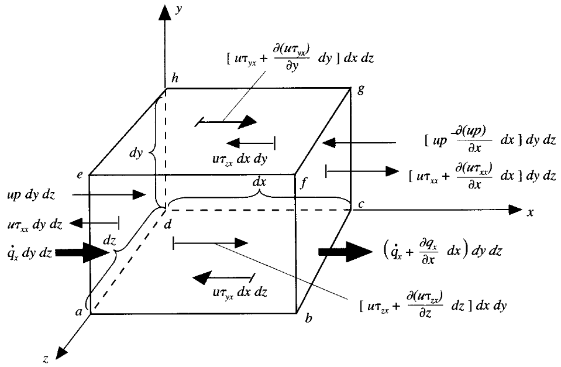

## 0. 前言

前面已经讨论了连续性方程和动量方程，我们也知道物理本质上是基于质量守恒和动量守恒的讨论。很多流动问题还要涉及能量变化的讨论，比如温度的变化。

能量方程的推导基于能量守恒。

本文主要讨论

- [ ] 能量方程的推导
- [ ] 不同角度的推导
- [ ] 理解数学表达的物理意义

## 1. 分量形式

假设我们取一个无穷小物质体微元模型，可以建立控制体系统的**守恒**。

**物质体微元内能量的变化率 A = 单位时间流入微元的净热流量 B + 体积力和表面力对微元做功的功率 C**

### 1.1. 外力做功

前文已经讨论过外力包括体积力和表面力

讨论体积力做功，功率为

$$\rho \vec f\cdot U(dxdydz) $$

讨论表面力做功

以 $x$ 方向为例，约定力沿着坐标轴正向做正功，相反做负功。

压力做功功率为

$$\bigg[up-(up+\frac{\partial(up)}{\partial x}dx) \bigg]dydz = -\frac{\partial(up)}{\partial x}dxdydz$$

粘性力做功功率为

$$
\begin{align*}
\bigg[(u\tau_{xx}+ \frac{\partial{(u\tau_{xx})} }{\partial x}dx)-u\tau_{xx} \bigg]dydz +\\
\bigg[(u\tau_{yx}+\frac{\partial(u\tau_{yx})}{\partial y}dy)-u\tau_{yx} \bigg]dxdz + \\
\bigg[(u\tau_{zx} +  \frac{\partial (u\tau_{zx})}{\partial z}dz )-u\tau_{zx} \bigg]dxdy + \\
= \bigg[\frac{\partial(u\tau_{xx})}{\partial x}+\frac{\partial(u\tau_{yx})}{\partial y}+ \frac{\partial(u\tau_{zx})}{\partial z} \bigg]dxdydz
\end{align*}
$$

综合各个方向的受力做功，最终得到 C 为

$$\begin{aligned}
C &= \bigg[-(\frac{\partial(up)}{\partial x}+\frac{\partial(vp)}{\partial y}+\frac{\partial(wp)}{\partial z}) \\
& +\frac{\partial(u\tau_{xx})}{\partial x} + \frac{\partial(u\tau_{yx})}{\partial y} + \frac{\partial(u\tau_{zx})}{\partial z} \\
&+ \frac{\partial(v\tau_{xy})}{\partial x} + \frac{\partial(v\tau_{yy})}{\partial y} + \frac{\partial(v\tau_{zy})}{\partial z} \\
&+ \frac{\partial(w\tau_{xz})}{\partial x} + \frac{\partial(w\tau_{yz})}{\partial y} + \frac{\partial(w\tau_{zz})}{\partial z} \bigg]dxdydz +\rho \vec f\cdot U(dxdydz)  
\end{aligned}$$

### 1.2. 热量流量

体积加热，如吸收和释放的辐射热

$$\rho \dot qdxdydz$$

温度梯度导致的经过表面的热输运，即热传导

以 $x$ 方向为例考虑热传导为

$$\bigg[\dot q_x - (\dot q_x + \frac{\partial \dot q_x}{\partial x}dx)\bigg]dydz = -\frac{\partial \dot q_x}{\partial x}dxdydz$$

热传导的总加热为

$$-(\frac{\partial \dot q_x}{\partial x}+\frac{\partial \dot q_y}{\partial y}+\frac{\partial \dot q_z}{\partial z})dxdydz$$

综合各项，流入微元的净热流量 B 为

$$B=\bigg[\rho \dot q-(\frac{\partial \dot q_x}{\partial x}+\frac{\partial \dot q_y}{\partial y}+\frac{\partial \dot q_z}{\partial z})\bigg]dxdydz$$

根据傅里叶热传导定律有

$$\dot q_i = -k\frac{\partial T}{\partial x_i}$$

最终

$$B = \bigg[\rho \dot q+ 
\frac{\partial}{\partial x}(k\frac{\partial T}{\partial x}) +
\frac{\partial}{\partial y}(k\frac{\partial T}{\partial y}) + \frac{\partial}{\partial z}(k\frac{\partial T}{\partial z})\bigg]dxdydz$$

### 1.3. 能量变化

微元的总能量包括动能和内能两部分。一部分是分子随机运动而产生的内能，另一部分就是流体微团的动能。

即

$$A = \rho\frac{D}{Dt}(\hat e + \frac{U^2}{2})dxdydz$$

### 1.4. 能量方程

根据守恒形式

$$A = B + C$$

即

$$\begin{aligned}
\rho\frac{D}{Dt}(\hat e &+ \frac{U^2}{2}) = 
\rho \dot q+ 
\frac{\partial}{\partial x}(k\frac{\partial T}{\partial x}) +
\frac{\partial}{\partial y}(k\frac{\partial T}{\partial y}) + \frac{\partial}{\partial z}(k\frac{\partial T}{\partial z})  \\
&-\bigg[\frac{\partial(up)}{\partial x}+\frac{\partial(vp)}{\partial y}+\frac{\partial(wp)}{\partial z}\bigg]+\frac{\partial(u\tau_{xx})}{\partial x} + \frac{\partial(u\tau_{yx})}{\partial y} + \frac{\partial(u\tau_{zx})}{\partial z} \\
&+ \frac{\partial(v\tau_{xy})}{\partial x} + \frac{\partial(v\tau_{yy})}{\partial y} + \frac{\partial(v\tau_{zy})}{\partial z}+ \frac{\partial(w\tau_{xz})}{\partial x}+ \frac{\partial(w\tau_{yz})}{\partial y} + \frac{\partial(w\tau_{zz})}{\partial z} + \rho \vec f\cdot U
\end{aligned}$$

考虑重力为主要体积力

通用形式的能量方程

$$\rho\frac{D(\hat{e}+ \frac{U^{2}}{2})}{Dt} = \nabla\cdot(k\nabla T) -\nabla\cdot(pU)+\rho(U\cdot g) +\nabla\cdot(\tau\cdot U)+\rho \dot{q}$$

后面的讨论把右侧几项都纳入源项 $S$。

### 1.5. 动能和内能

由动量方程 $x$ 方向的受力分析式

$$\rho\frac{Du}{Dt} = -\frac{\partial p}{\partial x} + \frac{\partial\tau_{xx}}{\partial x} + \frac{\partial\tau_{yx}}{\partial y} + \frac{\partial\tau_{zx}}{\partial z} + \rho f_{x}$$

两边同时乘以 $x$，整理可以得到

$$\rho\frac{D}{Dt}(\frac{u^2}{2}) = -u\frac{\partial p}{\partial x} + u\frac{\partial\tau_{xx}}{\partial x} + u\frac{\partial\tau_{yx}}{\partial y} + u\frac{\partial\tau_{zx}}{\partial z} + \rho uf_x$$

而

$$\rho\frac{D}{Dt}(\frac{U^2}{2}) = \rho\frac{D}{Dt}(\frac{u^2}{2} + \frac{v^2}{2} + \frac{w^2}{2})$$

从能量方程中减去所有方向的动能项，可以得到只有内能的能量方程

$$\begin{aligned}
\rho\frac{D\hat e}{Dt} &= 
\rho \dot q+ 
\frac{\partial}{\partial x}(k\frac{\partial T}{\partial x}) +
\frac{\partial}{\partial y}(k\frac{\partial T}{\partial y}) + \frac{\partial}{\partial z}(k\frac{\partial T}{\partial z}) -p(\frac{\partial u}{\partial x}+\frac{\partial v}{\partial y}+\frac{\partial w}{\partial z}) \\
&+ \tau_{xx}\frac{\partial u}{\partial x} + \tau_{yx}\frac{\partial u }{\partial y} + \tau_{zx}\frac{\partial u }{\partial z} + \tau_{xy}\frac{\partial v }{\partial x} + \tau_{yy}\frac{\partial v }{\partial y} + \tau_{zy}\frac{\partial v }{\partial z} + \tau_{xz}\frac{\partial w }{\partial x} + \tau_{yz}\frac{\partial w }{\partial y} + \tau_{zz}\frac{\partial w }{\partial z}
\end{aligned}$$

> [!tip]
> 注意该形式的能量方程不包含体积力项，应力在速度梯度之外

切应力具有对称形

$$\tau_{ij} = \tau_{ji}$$

有

$$
\begin{aligned}
\rho\frac{D\hat e}{Dt} &= 
\rho \dot q+ 
\frac{\partial}{\partial x}(k\frac{\partial T}{\partial x}) +
\frac{\partial}{\partial y}(k\frac{\partial T}{\partial y}) + \frac{\partial}{\partial z}(k\frac{\partial T}{\partial z}) -p(\frac{\partial u}{\partial x}+\frac{\partial v}{\partial y}+\frac{\partial w}{\partial z}) \\
&+ \tau_{xx}\frac{\partial u}{\partial x} + \tau_{yx}\frac{\partial u }{\partial y} + \tau_{zx}\frac{\partial u }{\partial z} + \tau_{xy}\frac{\partial v }{\partial x} + \tau_{yy}\frac{\partial v }{\partial y} + \tau_{zy}\frac{\partial v }{\partial z} + \tau_{xz}\frac{\partial w }{\partial x} + \tau_{yz}\frac{\partial w }{\partial y} + \tau_{zz}\frac{\partial w }{\partial z} \\
&= \rho \dot q+ \frac{\partial}{\partial x}(k\frac{\partial T}{\partial x}) +
\frac{\partial}{\partial y}(k\frac{\partial T}{\partial y}) + \frac{\partial}{\partial z}(k\frac{\partial T}{\partial z}) -p(\frac{\partial u}{\partial x}+\frac{\partial v}{\partial y}+\frac{\partial w}{\partial z}) \\
&+ \tau_{xx}\frac{\partial u}{\partial x} + \tau_{yy}\frac{\partial v }{\partial y} + \tau_{zz}\frac{\partial w }{\partial z} + \tau_{yx}\left(\frac{\partial u }{\partial y}+\frac{\partial v }{\partial x}\right)+ \tau_{zx}\left(\frac{\partial u }{\partial z}+\frac{\partial w }{\partial x}\right)+ \tau_{zy}(\frac{\partial v }{\partial z}+\frac{\partial w }{\partial y})
\end{aligned}
$$

利用前文讨论过的斯托克斯的流体物性关系

内能能量方程进一步可以改写成完全流场变量表示的能量方程，即

$$
\begin{aligned}
\rho\frac{D\hat e}{Dt} &= 
\rho \dot q+ 
\frac{\partial}{\partial x}(k\frac{\partial T}{\partial x}) +
\frac{\partial}{\partial y}(k\frac{\partial T}{\partial y}) + \frac{\partial}{\partial z}(k\frac{\partial T}{\partial z}) -p(\frac{\partial u}{\partial x}+\frac{\partial v}{\partial y}+\frac{\partial w}{\partial z}) \\
&+ \lambda( \frac{\partial u}{\partial x} + \frac{\partial v}{\partial y} + \frac{\partial w}{\partial z})^{2} + \mu\bigg[2(\frac{\partial u}{\partial x})^{2}+2(\frac{\partial v }{\partial y})^{2}  + 2(\frac{\partial w }{\partial z})^{2} \\
&+ (\frac{\partial u }{\partial y}+\frac{\partial v }{\partial x})^{2}+(\frac{\partial u }{\partial z}+\frac{\partial w }{\partial x})^{2} + (\frac{\partial v }{\partial z}+\frac{\partial w }{\partial y})^{2} \bigg]
\end{aligned}
$$

完整形式的能量方程当然也可以代入物性关系进行整理。

### 1.6. 守恒和非守恒

注意到上文讨论的方程是非守恒形式。

根据【物质导数换算】，有

$$
\rho\frac{D\hat{e}}{Dt} = \frac{\partial \rho \hat{e}}{\partial t} + \nabla \cdot (\rho \hat{e}U)
$$

可以将前文非守恒型方程改成守恒型方程

$$
\begin{align*}
\frac{\partial \rho \hat{e}}{\partial t} + \nabla\cdot(\rho \hat{e}U) &= 
\rho \dot q+ 
\frac{\partial}{\partial x}(k\frac{\partial T}{\partial x}) +
\frac{\partial}{\partial y}(k\frac{\partial T}{\partial y}) + \frac{\partial}{\partial z}(k\frac{\partial T}{\partial z}) -p(\frac{\partial u}{\partial x}+\frac{\partial v}{\partial y}+\frac{\partial w}{\partial z}) \\
&+ \lambda( \frac{\partial u}{\partial x} + \frac{\partial v}{\partial y} + \frac{\partial w}{\partial z})^{2} + \mu\bigg[2(\frac{\partial u}{\partial x})^{2}+2(\frac{\partial v }{\partial y})^{2}  + 2(\frac{\partial w }{\partial z})^{2} \\
&+ (\frac{\partial u }{\partial y}+\frac{\partial v }{\partial x})^{2}+(\frac{\partial u }{\partial z}+\frac{\partial w }{\partial x})^{2} + (\frac{\partial v }{\partial z}+\frac{\partial w }{\partial y})^{2} \bigg]
\end{align*}
$$

使用广义源项，整理为通用形式能量方程为

$$\frac{\partial}{\partial t}\rho \hat{e}  + \nabla\cdot (\rho U \hat{e})= \nabla\cdot(k\nabla T) + S$$

## 2. 张量形式

物质体流体微团的能量为

$$E = m(\hat e + \frac{1}{2}U^2)$$

有

$$
\frac{dE}{dm} = \hat{e} + \frac{1}{2}U^{2} = e
$$

根据热力学第一定律，

**能量的变化 = 吸收的热量 - 系统对外做的功**

$$(\frac{dE}{dt})_{MV} = Q - W$$

### 2.1. 吸收热量

内部产生和消失的 $Q_V$ 

$$Q_V = \int_V \dot q_V dV$$

增加为正，减少为负。此处为正，即热量增加。

此外还有通过表面输运的 $Q_S$ 

$$Q_S = -\int_S \dot q_S\cdot \vec n dS = -\int_V \nabla\cdot \dot q_S dV$$

沿着面法向向外为正，向内为负。此处负号表示热量流入物质体，即热量增加。

### 2.2. 对外做功

对外做功包括体积力和表面力两部分的做功。

体积力做功，有

$$W_b = -\int_V(\vec f_b \cdot U)dV$$

体积力做功加负号，就是物质体通过体积力对外做功。

表面力做功，有

$$W_S = -\int_{\partial V}(\vec f_{S}\cdot U)dV = -\int_{\partial V}(\Sigma\cdot U)\cdot\vec ndS = -\int_V\nabla\cdot(\Sigma\cdot U)dV $$

> [!tip]
> 记得之前讨论过，使用 $\Sigma$ 表示总应力张量（total stress tensor)（完整包含单位面积的压力和单位面积的粘性力）

面积力沿着法向向外为正，向内为负。面积力做功加负号，就是物质体通过面积力对外做功。
利用动量方程中对表面力的讨论，得到

$$W_S =-\int_V\nabla\cdot[(-p\vec I + \tau)\cdot U]dV$$

利用张量计算法则，得到

$$W_S =-\int_V [-\nabla\cdot(p U) + \nabla\cdot(\tau\cdot U)]dV$$

### 2.3. 能量方程

将上述代入

$$(\frac{dE}{dt})_{MV} = Q - W$$

根据【**雷诺输运定理**】

$$
\bigg(\frac{dB}{dt}\bigg)_{MV} = \int_V\bigg[\frac{\partial}{\partial t}(\rho b) + \nabla \cdot (\rho U b)\bigg]dV = \int_V\bigg[\frac{D}{D t}(\rho b) + \rho b \nabla \cdot U\bigg]dV
$$

有

$$\begin{align*}
(\frac{dE}{dt})_{MV} &= \int_V[\frac{\partial}{\partial t}(\rho e) + \nabla\cdot(\rho U e)]dV \\
&= \int_V \dot q_V dV-\int_V \nabla\cdot \dot q_S dV + \int_V [-\nabla\cdot(pU) + \nabla\cdot(\tau\cdot U)]dV + \int_V(\vec f_b \cdot  U)dV
\end{align*}$$

拿去相同的积分，得到

**【完整能量方程】**

$$\frac{\partial}{\partial t}(\rho e) + \nabla\cdot(\rho U e) = -\nabla\cdot \dot q_S -\nabla\cdot(pU) + \nabla\cdot(\tau\cdot U) + \vec f_b \cdot U + \dot{q_V}$$

我们将动能部分去除以得到内能表达形式的能量方程。

考虑动量方程（动量方程一文已经讨论过）

$$
\rho\frac{\partial U}{\partial t} + \rho U\cdot \nabla U= \vec f
$$

有

$$
\bigg[\rho\frac{\partial U}{\partial t} + \rho U\cdot \nabla U \bigg] \cdot U= \vec f\cdot U
$$

根据张量计算关系，整理有

$$
\frac{\partial}{\partial t}(\rho U\cdot U) -\rho U\cdot \frac{\partial U}{\partial t} + \nabla\cdot[\rho(U\cdot U)U]-\rho U\cdot[(U\cdot\nabla)U] = \vec{f}\cdot U
$$

进一步整理为

$$
\frac{\partial}{\partial t}(\rho U\cdot U) - + \nabla\cdot[\rho(U\cdot U)U] - U\cdot \underbrace{\rho\bigg[\frac{\partial U}{\partial t}+(U\cdot\nabla)U  \bigg]}_{=\vec{f}} = \vec{f}\cdot U
$$

外力为

$$\vec f = [\nabla\cdot\Sigma] = -\nabla p + [\nabla\cdot \tau] +\vec{f_{b}}$$

代入之后整理，两边同时除以 2 ，

$$
\frac{\partial}{\partial t}\left(\rho \frac{1}{2} U\cdot U\right)+ \nabla\cdot[\rho(  \frac{1}{2} U\cdot U)U]= -U\cdot \nabla p + U\cdot [\nabla\cdot \tau] + \vec{f_{b}}\cdot U
$$

利用张量计算关系有

$$
\begin{align*}
\frac{\partial}{\partial t}\left(\rho \frac{1}{2} U\cdot U\right)+ \nabla\cdot\bigg[\rho(  \frac{1}{2} U\cdot U)U\bigg] &= -\nabla\cdot[pU]+p\nabla\cdot U + \nabla\cdot[\tau\cdot U] - (\tau:\nabla U)  +\vec{f_{b}}\cdot U
\end{align*}
$$

将总能量方程减去此基于动能的能量方程，得到基于内能的能量方程，为

$$
\frac{\partial}{\partial t}(\rho \hat{e}) + \nabla\cdot[\rho U \hat{e}]  = -\nabla\cdot \dot{q_{s}} - p\nabla\cdot U + (\tau:\nabla U) + \dot{q_{v}} 
$$

### 2.4. 温度方程

考虑焓的表达

$$
\hat{e} = \hat{h} - \frac{p}{\rho}
$$

代入基于内能的能量方程，有

$$
\frac{\partial}{\partial t}(\rho\hat{h}) + \nabla\cdot[\rho U \hat{h}] = -\nabla\cdot \dot{q_{s}} - \frac{Dp}{Dt} + (\tau:\nabla U) + \dot{q_{V}} 
$$

> [!tip]
> 能量方程很少求解完整形式，往往因具体问题采用不同的形式，为了保证理解，本阶段暂不深入。不用担心，以后遇到会在合适的时候继续讨论。

这里直接给出温度相关的能量方程为

$$\frac{\partial}{\partial t}(\rho c_pT) + \nabla\cdot(\rho c_p U T) = \nabla\cdot(k\nabla T) + Q^T$$

## 3. 小结

本文完成讨论

- [x] 能量方程的推导
- [x] 不同角度的推导
- [x] 理解数学表达的物理意义

## References

[1] The Finite Volume Method in Computational Fluid Dynamics, https://link.springer.com/book/10.1007/978-3-319-16874-6

[2] Computational fluid dynamics : the basics with applications, https://searchworks.stanford.edu/view/2989631

[3] Notes on Computational Fluid Dynamics: General Principles, https://doc.cfd.direct/notes/cfd-general-principles/
