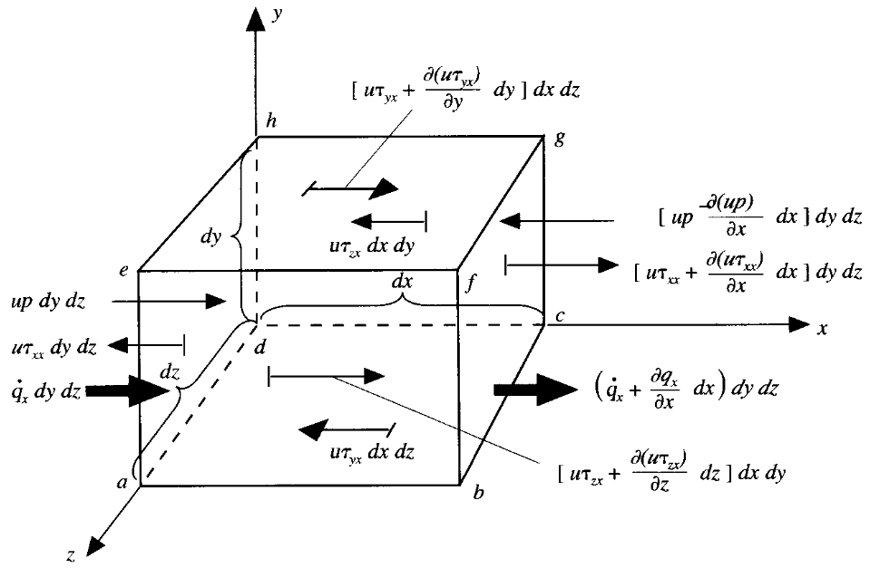

## 0. Preface

We have previously discussed the continuity equation and momentum equation, and we know that physics is essentially based on the conservation of mass and momentum. Many flow problems also involve discussions of energy changes, for example, temperature variations.

The derivation of the energy equation is based on energy conservation.

This article mainly discusses:

- [ ] Derivation of the energy equation
- [ ] Derivation from different perspectives
- [ ] Understanding the physical meaning of mathematical expressions

## 1. Component Form

Assuming we take an infinitesimal material volume element model, we can establish **conservation** for the control volume system.

**Rate of change of energy in the material volume element A = Net heat flux into the element per unit time B + Power done by body forces and surface forces on the element C**

### 1.1. Work Done by External Forces

As discussed previously, external forces include body forces and surface forces.

Considering work done by body forces, the power is:

$$\rho \vec f\cdot U(dxdydz) $$

Considering work done by surface forces:

Taking the $x$ direction as an example, we define work as positive when the force is in the positive coordinate axis direction, and negative when opposite.

The power of pressure work is:

$$\bigg[up-(up+\frac{\partial(up)}{\partial x}dx) \bigg]dydz = -\frac{\partial(up)}{\partial x}dxdydz$$

The power of viscous force work is:

$$
\begin{align*}
\bigg[(u\tau_{xx}+ \frac{\partial{(u\tau_{xx})} }{\partial x}dx)-u\tau_{xx} \bigg]dydz +\\
\bigg[(u\tau_{yx}+\frac{\partial(u\tau_{yx})}{\partial y}dy)-u\tau_{yx} \bigg]dxdz + \\
\bigg[(u\tau_{zx} +  \frac{\partial (u\tau_{zx})}{\partial z}dz )-u\tau_{zx} \bigg]dxdy + \\
= \bigg[\frac{\partial(u\tau_{xx})}{\partial x}+\frac{\partial(u\tau_{yx})}{\partial y}+ \frac{\partial(u\tau_{zx})}{\partial z} \bigg]dxdydz
\end{align*}
$$

Combining work done by forces in all directions, we finally obtain C as:

$$\begin{aligned}
C &= \bigg[-(\frac{\partial(up)}{\partial x}+\frac{\partial(vp)}{\partial y}+\frac{\partial(wp)}{\partial z}) \\
& +\frac{\partial(u\tau_{xx})}{\partial x} + \frac{\partial(u\tau_{yx})}{\partial y} + \frac{\partial(u\tau_{zx})}{\partial z} \\
&+ \frac{\partial(v\tau_{xy})}{\partial x} + \frac{\partial(v\tau_{yy})}{\partial y} + \frac{\partial(v\tau_{zy})}{\partial z} \\
&+ \frac{\partial(w\tau_{xz})}{\partial x} + \frac{\partial(w\tau_{yz})}{\partial y} + \frac{\partial(w\tau_{zz})}{\partial z} \bigg]dxdydz +\rho \vec f\cdot U(dxdydz)
\end{aligned}$$

### 1.2. Heat Flux

Volume heating, such as absorbed and emitted radiation heat:

$$\rho \dot qdxdydz$$

Heat transport through surfaces due to temperature gradients, i.e., heat conduction:

Taking the $x$ direction as an example, heat conduction is:

$$\bigg[\dot q_x - (\dot q_x + \frac{\partial \dot q_x}{\partial x}dx)\bigg]dydz = -\frac{\partial \dot q_x}{\partial x}dxdydz$$

The total heating from heat conduction is:

$$-(\frac{\partial \dot q_x}{\partial x}+\frac{\partial \dot q_y}{\partial y}+\frac{\partial \dot q_z}{\partial z})dxdydz$$

Combining all terms, the net heat flux B into the element is:

$$B=\bigg[\rho \dot q-(\frac{\partial \dot q_x}{\partial x}+\frac{\partial \dot q_y}{\partial y}+\frac{\partial \dot q_z}{\partial z})\bigg]dxdydz$$

According to Fourier's law of heat conduction:

$$\dot q_i = -k\frac{\partial T}{\partial x_i}$$

Finally:

$$B = \bigg[\rho \dot q+
\frac{\partial}{\partial x}(k\frac{\partial T}{\partial x}) +
\frac{\partial}{\partial y}(k\frac{\partial T}{\partial y}) + \frac{\partial}{\partial z}(k\frac{\partial T}{\partial z})\bigg]dxdydz$$

### 1.3. Energy Change

The total energy of the element includes kinetic energy and internal energy. One part is the internal energy generated by random molecular motion, and the other part is the kinetic energy of the fluid element.

That is:

$$A = \rho\frac{D}{Dt}(\hat e + \frac{U^2}{2})dxdydz$$

### 1.4. Energy Equation

According to the conservation form:

$$A = B + C$$

That is:

$$\begin{aligned}
\rho\frac{D}{Dt}(\hat e &+ \frac{U^2}{2}) =
\rho \dot q+
\frac{\partial}{\partial x}(k\frac{\partial T}{\partial x}) +
\frac{\partial}{\partial y}(k\frac{\partial T}{\partial y}) + \frac{\partial}{\partial z}(k\frac{\partial T}{\partial z})  \\
&-\bigg[\frac{\partial(up)}{\partial x}+\frac{\partial(vp)}{\partial y}+\frac{\partial(wp)}{\partial z}\bigg]+\frac{\partial(u\tau_{xx})}{\partial x} + \frac{\partial(u\tau_{yx})}{\partial y} + \frac{\partial(u\tau_{zx})}{\partial z} \\
&+ \frac{\partial(v\tau_{xy})}{\partial x} + \frac{\partial(v\tau_{yy})}{\partial y} + \frac{\partial(v\tau_{zy})}{\partial z}+ \frac{\partial(w\tau_{xz})}{\partial x}+ \frac{\partial(w\tau_{yz})}{\partial y} + \frac{\partial(w\tau_{zz})}{\partial z} + \rho \vec f\cdot U
\end{aligned}$$

Considering gravity as the main body force:

The general form of the energy equation:

$$\rho\frac{D(\hat{e}+ \frac{U^{2}}{2})}{Dt} = \nabla\cdot(k\nabla T) -\nabla\cdot(pU)+\rho(U\cdot g) +\nabla\cdot(\tau\cdot U)+\rho \dot{q}$$

In later discussions, all terms on the right side are incorporated into the source term $S$.

### 1.5. Kinetic and Internal Energy

From the momentum equation's force analysis in the $x$ direction:

$$\rho\frac{Du}{Dt} = -\frac{\partial p}{\partial x} + \frac{\partial\tau_{xx}}{\partial x} + \frac{\partial\tau_{yx}}{\partial y} + \frac{\partial\tau_{zx}}{\partial z} + \rho f_{x}$$

Multiplying both sides by $x$, we can obtain:

$$\rho\frac{D}{Dt}(\frac{u^2}{2}) = -u\frac{\partial p}{\partial x} + u\frac{\partial\tau_{xx}}{\partial x} + u\frac{\partial\tau_{yx}}{\partial y} + u\frac{\partial\tau_{zx}}{\partial z} + \rho uf_x$$

And:

$$\rho\frac{D}{Dt}(\frac{U^2}{2}) = \rho\frac{D}{Dt}(\frac{u^2}{2} + \frac{v^2}{2} + \frac{w^2}{2})$$

Subtracting all directional kinetic energy terms from the energy equation, we obtain the energy equation for internal energy only:

$$\begin{aligned}
\rho\frac{D\hat e}{Dt} &=
\rho \dot q+
\frac{\partial}{\partial x}(k\frac{\partial T}{\partial x}) +
\frac{\partial}{\partial y}(k\frac{\partial T}{\partial y}) + \frac{\partial}{\partial z}(k\frac{\partial T}{\partial z}) -p(\frac{\partial u}{\partial x}+\frac{\partial v}{\partial y}+\frac{\partial w}{\partial z}) \\
&+ \tau_{xx}\frac{\partial u}{\partial x} + \tau_{yx}\frac{\partial u }{\partial y} + \tau_{zx}\frac{\partial u }{\partial z} + \tau_{xy}\frac{\partial v }{\partial x} + \tau_{yy}\frac{\partial v }{\partial y} + \tau_{zy}\frac{\partial v }{\partial z} + \tau_{xz}\frac{\partial w }{\partial x} + \tau_{yz}\frac{\partial w }{\partial y} + \tau_{zz}\frac{\partial w }{\partial z}
\end{aligned}$$

> [!tip]
> Note that this form of the energy equation does not include body force terms, and stresses are outside the velocity gradients.

Shear stresses have symmetry:

$$\tau_{ij} = \tau_{ji}$$

Thus:

$$
\begin{aligned}
\rho\frac{D\hat e}{Dt} &=
\rho \dot q+
\frac{\partial}{\partial x}(k\frac{\partial T}{\partial x}) +
\frac{\partial}{\partial y}(k\frac{\partial T}{\partial y}) + \frac{\partial}{\partial z}(k\frac{\partial T}{\partial z}) -p(\frac{\partial u}{\partial x}+\frac{\partial v}{\partial y}+\frac{\partial w}{\partial z}) \\
&+ \tau_{xx}\frac{\partial u}{\partial x} + \tau_{yx}\frac{\partial u }{\partial y} + \tau_{zx}\frac{\partial u }{\partial z} + \tau_{xy}\frac{\partial v }{\partial x} + \tau_{yy}\frac{\partial v }{\partial y} + \tau_{zy}\frac{\partial v }{\partial z} + \tau_{xz}\frac{\partial w }{\partial x} + \tau_{yz}\frac{\partial w }{\partial y} + \tau_{zz}\frac{\partial w }{\partial z} \\
&= \rho \dot q+ \frac{\partial}{\partial x}(k\frac{\partial T}{\partial x}) +
\frac{\partial}{\partial y}(k\frac{\partial T}{\partial y}) + \frac{\partial}{\partial z}(k\frac{\partial T}{\partial z}) -p(\frac{\partial u}{\partial x}+\frac{\partial v}{\partial y}+\frac{\partial w}{\partial z}) \\
&+ \tau_{xx}\frac{\partial u}{\partial x} + \tau_{yy}\frac{\partial v }{\partial y} + \tau_{zz}\frac{\partial w }{\partial z} + \tau_{yx}\left(\frac{\partial u }{\partial y}+\frac{\partial v }{\partial x}\right)+ \tau_{zx}\left(\frac{\partial u }{\partial z}+\frac{\partial w }{\partial x}\right)+ \tau_{zy}(\frac{\partial v }{\partial z}+\frac{\partial w }{\partial y})
\end{aligned}
$$

Using the fluid constitutive relations discussed previously (Stokes' relations):

The internal energy equation can be further rewritten into a completely flow-variable-represented energy equation, i.e.:

$$
\begin{aligned}
\rho\frac{D\hat e}{Dt} &=
\rho \dot q+
\frac{\partial}{\partial x}(k\frac{\partial T}{\partial x}) +
\frac{\partial}{\partial y}(k\frac{\partial T}{\partial y}) + \frac{\partial}{\partial z}(k\frac{\partial T}{\partial z}) -p(\frac{\partial u}{\partial x}+\frac{\partial v}{\partial y}+\frac{\partial w}{\partial z}) \\
&+ \lambda( \frac{\partial u}{\partial x} + \frac{\partial v}{\partial y} + \frac{\partial w}{\partial z})^{2} + \mu\bigg[2(\frac{\partial u}{\partial x})^{2}+2(\frac{\partial v }{\partial y})^{2}  + 2(\frac{\partial w }{\partial z})^{2} \\
&+ (\frac{\partial u }{\partial y}+\frac{\partial v }{\partial x})^{2}+(\frac{\partial u }{\partial z}+\frac{\partial w }{\partial x})^{2} + (\frac{\partial v }{\partial z}+\frac{\partial w }{\partial y})^{2} \bigg]
\end{aligned}
$$

The complete form of the energy equation can also be rearranged by substituting constitutive relations.

### 1.6. Conservative and Non-Conservative Forms

Note that the equations discussed above are in non-conservative form.

According to the **Material Derivative Conversion**, we have:

$$
\rho\frac{D\hat{e}}{Dt} = \frac{\partial \rho \hat{e}}{\partial t} + \nabla \cdot (\rho \hat{e}U)
$$

We can convert the previous non-conservative equation to conservative form:

$$
\begin{align*}
\frac{\partial \rho \hat{e}}{\partial t} + \nabla\cdot(\rho \hat{e}U) &=
\rho \dot q+
\frac{\partial}{\partial x}(k\frac{\partial T}{\partial x}) +
\frac{\partial}{\partial y}(k\frac{\partial T}{\partial y}) + \frac{\partial}{\partial z}(k\frac{\partial T}{\partial z}) -p(\frac{\partial u}{\partial x}+\frac{\partial v}{\partial y}+\frac{\partial w}{\partial z}) \\
&+ \lambda( \frac{\partial u}{\partial x} + \frac{\partial v}{\partial y} + \frac{\partial w}{\partial z})^{2} + \mu\bigg[2(\frac{\partial u}{\partial x})^{2}+2(\frac{\partial v }{\partial y})^{2}  + 2(\frac{\partial w }{\partial z})^{2} \\
&+ (\frac{\partial u }{\partial y}+\frac{\partial v }{\partial x})^{2}+(\frac{\partial u }{\partial z}+\frac{\partial w }{\partial x})^{2} + (\frac{\partial v }{\partial z}+\frac{\partial w }{\partial y})^{2} \bigg]
\end{align*}
$$

Using generalized source terms, the general form energy equation is:

$$\frac{\partial}{\partial t}\rho \hat{e}  + \nabla\cdot (\rho U \hat{e})= \nabla\cdot(k\nabla T) + S$$

## 2. Tensor Form

The energy of a material fluid element is:

$$E = m(\hat e + \frac{1}{2}U^2)$$

Thus:

$$
\frac{dE}{dm} = \hat{e} + \frac{1}{2}U^{2} = e
$$

According to the first law of thermodynamics,

**Change in energy = Heat absorbed - Work done by the system**

$$(\frac{dE}{dt})_{MV} = Q - W$$

### 2.1. Heat Absorption

Internally generated and dissipated $Q_V$:

$$Q_V = \int_V \dot q_V dV$$

Increase is positive, decrease is negative. Here it is positive, meaning heat increase.

Additionally, there is heat transport through surfaces $Q_S$:

$$Q_S = -\int_S \dot q_S\cdot \vec n dS = -\int_V \nabla\cdot \dot q_S dV$$

Outward along the surface normal is positive, inward is negative. The negative sign here indicates heat flowing into the material volume, i.e., heat increase.

### 2.2. Work Done on the Surroundings

Work done on the surroundings includes work done by body forces and surface forces.

Work done by body forces:

$$W_b = -\int_V(\vec f_b \cdot U)dV$$

Adding a negative sign to body force work means work done by the material volume on the surroundings through body forces.

Work done by surface forces:

$$W_S = -\int_{\partial V}(\vec f_{S}\cdot U)dV = -\int_{\partial V}(\Sigma\cdot U)\cdot\vec ndS = -\int_V\nabla\cdot(\Sigma\cdot U)dV $$

> [!tip]
> Remember previously discussed: using $\Sigma$ to represent the total stress tensor (complete including pressure per unit area and viscous force per unit area).

Surface forces are positive outward along the normal, negative inward. Adding a negative sign to surface force work means work done by the material volume on the surroundings through surface forces.

Using the discussion of surface forces in the momentum equation, we obtain:

$$W_S =-\int_V\nabla\cdot[(-p\vec I + \tau)\cdot U]dV$$

Using tensor calculation rules, we get:

$$W_S =-\int_V [-\nabla\cdot(p U) + \nabla\cdot(\tau\cdot U)]dV$$

### 2.3. Energy Equation

Substituting the above into:

$$(\frac{dE}{dt})_{MV} = Q - W$$

According to the **Reynolds Transport Theorem**:

$$
\bigg(\frac{dB}{dt}\bigg)_{MV} = \int_V\bigg[\frac{\partial}{\partial t}(\rho b) + \nabla \cdot (\rho U b)\bigg]dV = \int_V\bigg[\frac{D}{D t}(\rho b) + \rho b \nabla \cdot U\bigg]dV
$$

We have:

$$\begin{align*}
(\frac{dE}{dt})_{MV} &= \int_V[\frac{\partial}{\partial t}(\rho e) + \nabla\cdot(\rho U e)]dV \\
&= \int_V \dot q_V dV-\int_V \nabla\cdot \dot q_S dV + \int_V [-\nabla\cdot(pU) + \nabla\cdot(\tau\cdot U)]dV + \int_V(\vec f_b \cdot  U)dV
\end{align*}$$

Removing the common integral, we obtain:

**【Complete Energy Equation】**

$$\frac{\partial}{\partial t}(\rho e) + \nabla\cdot(\rho U e) = -\nabla\cdot \dot q_S -\nabla\cdot(pU) + \nabla\cdot(\tau\cdot U) + \vec f_b \cdot U + \dot{q_V}$$

We remove the kinetic energy part to obtain the energy equation in internal energy form.

Considering the momentum equation (discussed in the momentum equation article):

$$
\rho\frac{\partial U}{\partial t} + \rho U\cdot \nabla U= \vec f
$$

We have:

$$
\bigg[\rho\frac{\partial U}{\partial t} + \rho U\cdot \nabla U \bigg] \cdot U= \vec f\cdot U
$$

According to tensor calculation relations, rearranging gives:

$$
\frac{\partial}{\partial t}(\rho U\cdot U) -\rho U\cdot \frac{\partial U}{\partial t} + \nabla\cdot[\rho(U\cdot U)U]-\rho U\cdot[(U\cdot\nabla)U] = \vec{f}\cdot U
$$

Further rearranging:

$$
\frac{\partial}{\partial t}(\rho U\cdot U) - + \nabla\cdot[\rho(U\cdot U)U] - U\cdot \underbrace{\rho\bigg[\frac{\partial U}{\partial t}+(U\cdot\nabla)U  \bigg]}_{=\vec{f}} = \vec{f}\cdot U
$$

The external force is:

$$\vec f = [\nabla\cdot\Sigma] = -\nabla p + [\nabla\cdot \tau] +\vec{f_{b}}$$

Substituting and rearranging, dividing both sides by 2:

$$
\frac{\partial}{\partial t}\left(\rho \frac{1}{2} U\cdot U\right)+ \nabla\cdot[\rho(  \frac{1}{2} U\cdot U)U]= -U\cdot \nabla p + U\cdot [\nabla\cdot \tau] + \vec{f_{b}}\cdot U
$$

Using tensor calculation relations:

$$
\begin{align*}
\frac{\partial}{\partial t}\left(\rho \frac{1}{2} U\cdot U\right)+ \nabla\cdot\bigg[\rho(  \frac{1}{2} U\cdot U)U\bigg] &= -\nabla\cdot[pU]+p\nabla\cdot U + \nabla\cdot[\tau\cdot U] - (\tau:\nabla U)  +\vec{f_{b}}\cdot U
\end{align*}
$$

Subtracting this kinetic energy-based equation from the total energy equation, we obtain the internal energy-based energy equation:

$$
\frac{\partial}{\partial t}(\rho \hat{e}) + \nabla\cdot[\rho U \hat{e}]  = -\nabla\cdot \dot{q_{s}} - p\nabla\cdot U + (\tau:\nabla U) + \dot{q_{v}}
$$

### 2.4. Temperature Equation

In many cases (non-supersonic, non-combustion reactions), we don't need to solve the complete energy equation, only need to obtain the temperature field distribution.

Considering enthalpy expression:

$$
\hat{e} = \hat{h} - \frac{p}{\rho}
$$

Substituting into the internal energy-based energy equation:

$$
\frac{\partial}{\partial t}(\rho\hat{h}) + \nabla\cdot[\rho U \hat{h}] = -\nabla\cdot \dot{q_{s}} - \frac{Dp}{Dt} + (\tau:\nabla U) + \dot{q_{V}}
$$

> [!tip]
> The energy equation is rarely solved in complete form; different forms are often used for specific problems. To ensure understanding, we won't delve deeper at this stage. Don't worry, we'll continue discussing when appropriate in the future.

Here we directly give the temperature-related energy equation:

$$\frac{\partial}{\partial t}(\rho c_pT) + \nabla\cdot(\rho c_p U T) = \nabla\cdot(k\nabla T) + Q^T$$

## 3. Summary

This article completes the discussion of:

- [x] Derivation of the energy equation
- [x] Derivation from different perspectives
- [x] Understanding the physical meaning of mathematical expressions

## References

[1] The Finite Volume Method in Computational Fluid Dynamics, https://link.springer.com/book/10.1007/978-3-319-16874-6

[2] Computational fluid dynamics : the basics with applications, https://searchworks.stanford.edu/view/2989631

[3] Mathematics, Numerics, Derivations and OpenFOAM®, https://holzmann-cfd.com/community/publications/mathematics-numerics-derivations-and-openfoam-free

[4] Notes on Computational Fluid Dynamics: General Principles, https://doc.cfd.direct/notes/cfd-general-principles/

## Support us

>[!tip]
>Hopefully, the sharing here can be helpful to you.
>
>If you find this content helpful, your comments or donations would be greatly appreciated. Your support helps ensure the ongoing updates, corrections, refinements, and improvements to this and future series, ultimately benefiting new readers as well.
>
>The information and message provided during donation will be displayed as an acknowledgment of your support.


  


> Copyright @ 2026 Aerosand
>
> - Course (text, images, etc.)：[CC BY-NC-SA 4.0](https://creativecommons.org/licenses/by-nc-sa/4.0/)
> - Code derived from OpenFOAM：[GPL v3](https://www.gnu.org/licenses/gpl-3.0.html)
> - Other code：[MIT License](https://opensource.org/licenses/MIT)