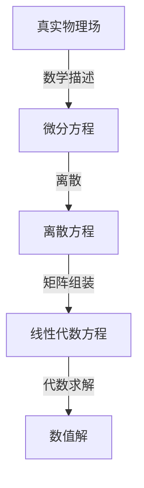
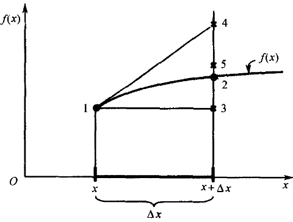
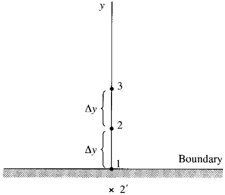

## 0. 前言

经过前文讨论，我们有流体动力学基本方程的通用形式如下

$$
\frac{\partial}{\partial t}(\rho \phi) + \nabla \cdot (\rho U\phi) = \nabla\cdot(\Gamma\nabla\phi) + S_{\phi}
$$

方程中包含了不同的偏导项（偏分算子也是偏导项），那么偏导项在数值计算中应该怎么处理呢？

本文主要讨论

- [ ] 理解离散化
- [ ] 复习泰勒展开
- [ ] 熟悉有限差分法基础
- [ ] 了解 FDM 的理论应用

## 1. 离散化

对于某一类类似的物理现象，学者总是能找出其中的物理规律，建立物理模型。然后使用数学工具分析，得到描述该物理现象的一个或者一组数学方程（常微分方程 ODE 或偏微分方程 PDE），也就是使用数学方程来描述某个物理场在空间和时间中的连续变化情况。这类方程大多过于复杂而难以直接解析求解，比如流体动力学基本方程。

学者对连续方程提出数值求解方法。一般是建立对连续空间和时间的有限离散，即使用有限数量的空间节点和时间节点代替连续的物理区域和时间区间。每个离散点上都可以通过处理后的离散方程求得数值。当离散点足够多的时候，各个离散点上的计算值可以近似认为是连续的。我们认为数值计算得到了整个连续物理场，即近似求得了原数学方程的数值解。

不过，离散点总归是有限的，使用有限的离散点去近似代替连续的时空物理量场总是有误差存在。当误差能满足科研或者生产要求时，我们认为数值求解结果正确，可以指导科研和生产。

一般来说，数值方法的通用思路如下：

学者们提出了不同的离散方法，比如有限差分法、有限体积法、有限元法等等。有限差分法（FDM）作为最基础最易于理解的离散方法，下文将从 FDM 开始，进行数值计算方法的入门讨论。

## 2. 泰勒展开

假设有连续方程 

$$
f(x)= sin2\pi x
$$

该连续函数在 $x+\Delta x$ 处的准确值应该是点 2 处的函数值。怎么去求点 2 的函数值呢？

### 2.1. 解析解

该连续函数在 1 点处的解析解为直接代入的计算准确值

$$
f( 0.2 ) = 0.9511...
$$

现在取

$$
\Delta x = 0.02
$$

求出该连续函数在 2 点处的解析解为

$$
f(x+ \Delta x) = f(0.22) = 0.9823...
$$

### 2.2. 数值解

如果我们采用数值方法，该怎么求解呢？

我们知道对 $x$ 的连续函数 $f(x)$ 有泰勒展开，有

$$
f(x+\Delta x)=f(x)+\frac{\partial f}{\partial x}\Delta x+\frac{\partial^2f}{\partial x^2}\frac{(\Delta x)^2}{2} + ...
$$

如果采用泰勒展开的第一项来估计数值解，即采用上一点的 y 值，也就是图中的点 3 ，此时

$$
f(0.22) \approx f(0.2) = 0.9511...
$$

此结果的相对误差为

$$
\varepsilon \approx \bigg|\frac{0.9823 - 0.9511 }{0.9823} \bigg| =  3.176\%
$$

如果采用泰勒展开的前两项来估计数值解，即采用上一点的 y 值加上一点斜率带来的增值，也就是图中的点 4 ，此时

$$
f(0.22) \approx f(x) + \frac{\partial f}{\partial x}\Delta x \approx 0.9899
$$

此结果的相对误差为

$$
\varepsilon \approx \bigg|\frac{0.9823 - 0.9899 }{0.9823} \bigg| =  0.775\%
$$

很明显这个结果更加接近准确的解析解。

如果采用泰勒展开的前三项来估计数值解，也就是途中的点 5, 此时

$$
f(0.22) = f(x+\Delta x) \approx f(x)+\frac{\partial f}{\partial x} \Delta x + \frac{\partial^{2}f}{\partial x^{2}} \frac{(\Delta x)^{2}}{2} \approx 0.9824
$$

此结果的相对误差为

$$
\varepsilon \approx \bigg|\frac{0.9823 - 0.9824 }{0.9823} \bigg| =  0.01\%
$$

可见，采用泰勒展开的前三项即可得到十分逼近准确解析解的数值解。

## 3. 有限差分法

我们可以对物理量 $\phi_{ij}$ 进行以下的泰勒展开

$$
\begin{align*}
\phi_{i+1,j} &= \phi_{i,j} + (\frac{\partial\phi}{\partial x})_{i,j}\Delta x + (\frac{\partial^2\phi}{\partial x^2})_{i,j}\frac{(\Delta x)^2}{2} + (\frac{\partial^3\phi}{\partial x^3})_{i,j}\frac{(\Delta x)^3}{6}+...\\
\phi_{i-1,j} &= \phi_{i,j} - (\frac{\partial\phi}{\partial x})_{i,j}\Delta x + (\frac{\partial^2\phi}{\partial x^2})_{i,j}\frac{(\Delta x)^2}{2} - (\frac{\partial^3\phi}{\partial x^3})_{i,j}\frac{(\Delta x)^3}{6}+...
\end{align*}
$$

分别移项加减整理

得到一阶偏导数的一阶向前差分（前项减去本项），具有一阶精度

$$
(\frac{\partial\phi}{\partial x})_{i,j} = \frac{\phi_{i+1,j}-\phi_{i,j}}{\Delta x} + O(\Delta x)
$$

得到一阶偏导数的一阶向后差分（本项减去后项），具有一阶精度

$$
(\frac{\partial\phi}{\partial x})_{i,j} = \frac{\phi_{i,j}-\phi_{i-1,j}}{\Delta x} + O(\Delta x) 
$$

得到一阶偏导数的二阶中心差分（前项减去后项），具有二阶精度

$$
(\frac{\partial\phi}{\partial x})_{i,j} =\frac{\phi_{i+1,j}-\phi_{i-1,j}}{2\Delta x} + O(\Delta x)^2 
$$

得到二阶偏导数的二阶中心差分（前项加上后项减去二倍本项），具有二阶精度

$$
(\frac{\partial^2\phi}{\partial x^2})_{i,j} = \frac{\phi_{i+1,j}-2\phi_{i,j} + \phi_{i-1,j}}{2\Delta x} + O(\Delta x)^2
$$

对于混合偏导数，可以对一阶偏微分作以下的泰勒展开

$$
\begin{align*}
(\frac{\partial\phi}{\partial y})_{i+1,j} &= (\frac{\partial\phi}{\partial y})_{i,j} + (\frac{\partial^2\phi}{\partial x\partial y})_{i,j}\Delta x + (\frac{\partial^3\phi}{\partial x^2\partial y})_{i,j}\frac{(\Delta x)^2}{2} + (\frac{\partial^4\phi}{\partial x^3\partial y})_{i,j}\frac{(\Delta x)^3}{6} + ...\\
(\frac{\partial\phi}{\partial y})_{i-1,j} &= (\frac{\partial\phi}{\partial y})_{i,j} - (\frac{\partial^2\phi}{\partial x\partial y})_{i,j}\Delta x + (\frac{\partial^3\phi}{\partial x^2\partial y})_{i,j}\frac{(\Delta x)^2}{2} + (\frac{\partial^4\phi}{\partial x^3\partial y})_{i,j}\frac{(\Delta x)^3}{6} + ...
\end{align*}
$$

整理可得

$$
(\frac{\partial^2\phi}{\partial x\partial y})_{i,j} = \frac{(\frac{\partial\phi}{\partial y})_{i+1,j}-(\frac{\partial\phi}{\partial y})_{i-1,j}}{2\Delta x} + (\frac{\partial^4\phi}{\partial x^3\partial y})_{i,j}\frac{(\Delta x)^2}{12} +...
$$

偏导项替换为下面的一阶偏微分的二阶中心差分格式（保持精度一致）（仅对 $y$ 方向）

$$
\begin{align*}
(\frac{\partial\phi}{\partial y})_{i+1,j} &= \frac{\phi_{i+1,j+1}-\phi_{i+1,j-1}}{2\Delta y} + O(\Delta y)^2\\
(\frac{\partial\phi}{\partial y})_{i-1,j} &=\frac{\phi_{i-1,j+1}-\phi_{i-1,j-1}}{2\Delta y} + O(\Delta y)^2
\end{align*}
$$

有

$$
(\frac{\partial^2\phi}{\partial x\partial y})_{i,j} =\frac{\phi_{i+1,j+1}-\phi_{i+1,j-1}-\phi_{i-1,j+1}+\phi_{i-1,j-1}}{4\Delta x\Delta y} + O[(\Delta x)^2,(\Delta y)^2]
$$

当然，我们还可以构造推导出更多形式或者更高精度的差分格式。对于常见的大多数的 CFD 计算，偏导处理到二阶精度已经足够。

我们还可以通过多项式来构造一些差分格式。

对于上图的边界情况，边界点 1 上可以构造一阶精度的差分格式

$$
(\frac{\partial \phi}{\partial y})_1 = \frac{\phi_2-\phi_1}{\Delta y} + O(\Delta y)
$$

但是想构造二阶精度差分格式就比较困难，因为边界上缺失一侧的构造点。例如

$$
\cancel{(\frac{\partial \phi}{\partial y})_1 = \frac{\phi_2 - \phi_2^{'}}{2\Delta y} + O(\Delta y)^2}
$$

假设物理量 $\phi$ 在这么一段微小离散尺度上是连续的，那么可以用多项式描述

$$
\phi = a + by + cy^2
$$

那么，在图上 1 点，有

$$
y = 0,\phi_{1} = a
$$

在图上 2 点，有

$$
y = \Delta y, \phi_2 = a + b\Delta y + c(\Delta y)^2
$$

在图上 3 点，有

$$
y = 2\Delta y, \phi_2 = a + b(2\Delta y) + c(2\Delta y)^2
$$

由这三点可以求解得到

$$
b = \frac{-3\phi_1 + 4\phi_2-\phi_3}{2\Delta y}
$$

对多项式求 $y$ 偏导，有

$$
\frac{\partial\phi}{\partial y}=b + 2cy
$$

在边界处，有

$$
y = 0,(\frac{\partial\phi}{\partial y})_{1}=b
$$

从而得到单侧差分格式（和泰勒展开的项进行对比，可以知道此表达式的精度为二阶精度）

$$
(\frac{\partial\phi}{\partial y})_1=\frac{-3\phi_1 + 4\phi_2-\phi_3}{2\Delta y}+O(\Delta y)^2
$$

类似的，我们可以使用多项式方法构造出其他精度和样式的差分格式，以保证边界上计算准确。

## 4. 应用

### 4.1. 理论方程

以一维非稳态热传导方程为例（材料总长 `L`）

$$
\frac{\partial T}{\partial t}=\alpha\frac{\partial^2T}{\partial x^2}
$$

> [!tip]
> 左侧为时间项，右侧为扩散项，该方程没有对流项和源项

如果是 Dirichlet 边界条件

$$
\begin{cases}
T(0,t) &= T_{r} \\
T(L,t) &= T_{l}
\end{cases}
$$

如果是 Neumann 边界条件

$$
\begin{cases}
\frac{\partial T}{\partial x}(0,t) = T^{'}_r(t) \\
\frac{\partial T}{\partial x}(L,t) = T^{'}_l(t)
\end{cases}
$$

初始条件

$$
T(x,0) = T_0(x)
$$

### 4.2. 显示构造

利用差分格式得到差分方程为

$$
\frac{T^{n+1}_i-T^{n}_i}{\Delta t}=\alpha\frac{T^{n}_{i+1}-2T^{n}_{i}+T^{n}_{i-1}}{(\Delta x)^2}
$$

- 上标 $n$ 为当前时间步，已知量
- 上标 $n+1$ 为下一时间步，待求未知量
- 下标 $i$ 为当前点，$i-1$ 为上一点， $i+1$ 为下一点

整理后可得

$$
T^{n+1}_i=T^{n}_i+\alpha\frac{\Delta t}{(\Delta x)^2}(T^{n}_{i+1}-2T^{n}_{i}+T^{n}_{i-1})
$$

方程左边为待求未知量，右侧为已知量。

这种类型的表达式可以直接迭代求解。即显式的按时间推进求解，通过每一个时间步的旧值可以算出下一个时间步的新值。

### 4.3. 隐式构造

如果我们处理差分方程得到如下形式

$$
\frac{T^{n+1}_i-T^{n}_i}{\Delta t}=\alpha\frac{\frac{T^{n+1}_{i+1}+T^{n}_{i+1}}{2}-2(\frac{T^{n+1}_{i}+T^{n}_{i}}{2})+\frac{T^{n+1}_{i-1}+T^{n}_{i-1}}{2}}{(\Delta x)^2}
$$

这种引入新时间步与旧时间步之间平均值的格式被称为克兰克 - 尼科尔森格式。这种格式下，新时间步的未知量不止是 $T^{n+1}_i$ ，而且还有 $T^{n+1}_{i+1}$ 和 $T^{n+1}_{i-1}$ 。

整理上式有

$$
\begin{aligned}
\frac{\alpha\Delta t}{2(\Delta x)^2}T^{n+1}_{i-1} &- \bigg[1 +  \frac{\alpha\Delta t}{(\Delta x)^2}\bigg]T_i^{n+1} + \frac{\alpha\Delta t}{2(\Delta x)^2}T_{i+1}^{n+1} \\
&= -T_i^n -  \frac{\alpha\Delta t}{2(\Delta x)^2}(T_{i+1}^{n} - 2T_i^n + T_{i-1}^n)
\end{aligned}
$$

方程的左侧的三项都是待求未知量，右侧是已知量。

这种格式不能再按时间推进求解，而必须列出完整代数方程组，即构建 $Ax = b$， 同时求出所有的未知量。这种方法就是隐式求解。

### 4.4. 显隐比较

显式构造看起来更加直观，算法和编程实现也更加方便。但是基于稳定性考虑，时间步长和空间步长有严格的要求。

隐式构造有点在于使用大得多的时间步长也能保持计算稳定。但是算法和编程实现更复杂，计算量更。

这里暂不讨论后续的线性代数系统求解。线性代数系统求解是一个相对独立于流体动力学的部分，可以参考数值计算相关参考书。

## 5. 小结

我们从泰勒展开讲起，讨论了有限差分法和数值求解的基础。

本文完成讨论

- [x] 理解离散化
- [x] 复习泰勒展开
- [x] 熟悉有限差分法基础
- [x] 了解 FDM 的应用

## References

[1] The Finite Volume Method in Computational Fluid Dynamics, https://link.springer.com/book/10.1007/978-3-319-16874-6

[2] Computational fluid dynamics : the basics with applications, https://searchworks.stanford.edu/view/2989631

[3] Mathematics, Numerics, Derivations and OpenFOAM®, https://holzmann-cfd.com/community/publications/mathematics-numerics-derivations-and-openfoam-free

[4] Notes on Computational Fluid Dynamics: General Principles, https://doc.cfd.direct/notes/cfd-general-principles/

