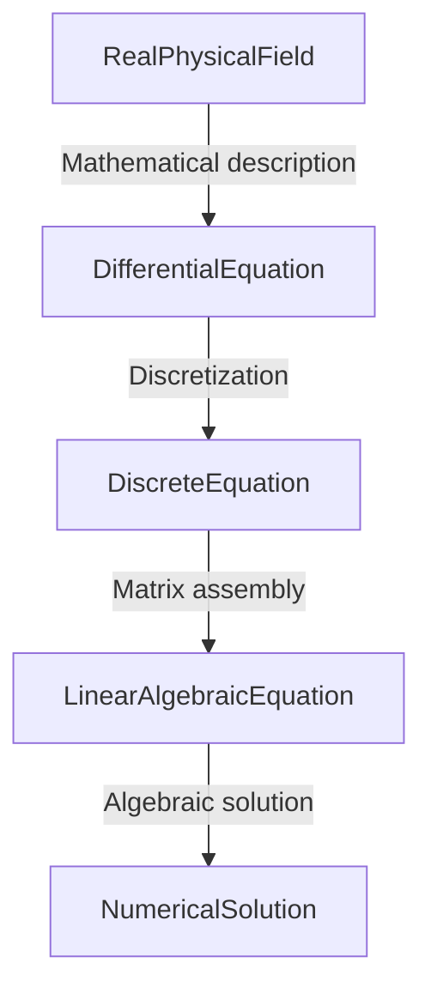
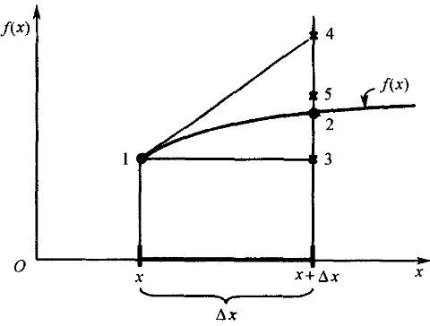
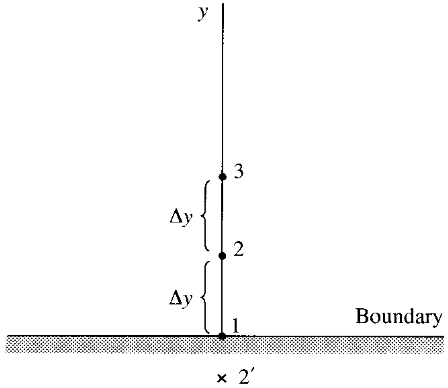

## 0. Preface

Through previous discussions, we have the general form of the basic equations of fluid dynamics as follows:

$$
\frac{\partial}{\partial t}(\rho \phi) + \nabla \cdot (\rho U\phi) = \nabla\cdot(\Gamma\nabla\phi) + S_{\phi}
$$

The equation contains different partial derivative terms (partial differential operators are also partial derivative terms), so how should partial derivative terms be handled in numerical calculations?

This article mainly discusses:

- [ ] Understanding discretization
- [ ] Reviewing Taylor expansion
- [ ] Familiarizing with the basics of the finite difference method
- [ ] Understanding the theoretical application of FDM

## 1. Discretization

For a certain class of similar physical phenomena, scholars can always find the physical laws and establish physical models. Then using mathematical tools for analysis, they obtain one or a set of mathematical equations (ordinary differential equations ODE or partial differential equations PDE) describing the physical phenomenon, i.e., using mathematical equations to describe the continuous changes of a physical field in space and time. Most of these equations are too complex to solve directly analytically, for example, the basic equations of fluid dynamics.

Scholars propose numerical solution methods for continuous equations. Generally, they establish finite discretization of continuous space and time, i.e., using a finite number of spatial nodes and time nodes to replace continuous physical regions and time intervals. At each discrete point, numerical values can be obtained through processed discrete equations. When there are enough discrete points, the calculated values at each discrete point can be approximately considered continuous. We consider that numerical calculation has obtained the entire continuous physical field, i.e., approximately obtained the numerical solution of the original mathematical equation.

However, discrete points are ultimately finite, and using finite discrete points to approximate continuous spatiotemporal physical quantity fields always has errors. When the error can meet scientific research or production requirements, we consider the numerical solution results correct and can guide scientific research and production.

Generally, the general approach of numerical methods is as follows:

Scholars have proposed different discretization methods, for example, finite difference method, finite volume method, finite element method, etc. The finite difference method (FDM), as the most basic and easiest to understand discretization method, will be used below to begin the introductory discussion of numerical calculation methods.

## 2. Taylor Expansion

Assuming there is a continuous equation:

$$
f(x)= sin2\pi x
$$

The accurate value of this continuous function at $x+\Delta x$ should be the function value at point 2. How to find the function value at point 2?

### 2.1. Analytical Solution

The analytical solution of this continuous function at point 1 is the directly calculated accurate value:

$$
f( 0.2 ) = 0.9511...
$$

Now take:

$$
\Delta x = 0.02
$$

Find the analytical solution of this continuous function at point 2:

$$
f(x+ \Delta x) = f(0.22) = 0.9823...
$$

### 2.2. Numerical Solution

If we use numerical methods, how should we solve it?

We know that for a continuous function $f(x)$ of $x$, there is Taylor expansion:

$$
f(x+\Delta x)=f(x)+\frac{\partial f}{\partial x}\Delta x+\frac{\partial^2f}{\partial x^2}\frac{(\Delta x)^2}{2} + ...
$$

If we use the first term of the Taylor expansion to estimate the numerical solution, i.e., use the y-value of the previous point, which is point 3 in the figure, then:

$$
f(0.22) \approx f(0.2) = 0.9511...
$$

The relative error of this result is:

$$
\varepsilon \approx \bigg|\frac{0.9823 - 0.9511 }{0.9823} \bigg| =  3.176\%
$$

If we use the first two terms of the Taylor expansion to estimate the numerical solution, i.e., use the y-value of the previous point plus the increment from the slope, which is point 4 in the figure, then:

$$
f(0.22) \approx f(x) + \frac{\partial f}{\partial x}\Delta x \approx 0.9899
$$

The relative error of this result is:

$$
\varepsilon \approx \bigg|\frac{0.9823 - 0.9899 }{0.9823} \bigg| =  0.775\%
$$

Clearly, this result is closer to the accurate analytical solution.

If we use the first three terms of the Taylor expansion to estimate the numerical solution, which is point 5 in the figure, then:

$$
f(0.22) = f(x+\Delta x) \approx f(x)+\frac{\partial f}{\partial x} \Delta x + \frac{\partial^{2}f}{\partial x^{2}} \frac{(\Delta x)^{2}}{2} \approx 0.9824
$$

The relative error of this result is:

$$
\varepsilon \approx \bigg|\frac{0.9823 - 0.9824 }{0.9823} \bigg| =  0.01\%
$$

It can be seen that using the first three terms of the Taylor expansion can yield a numerical solution very close to the accurate analytical solution.

## 3. Finite Difference Method

We can perform the following Taylor expansions for physical quantity $\phi_{ij}$:

$$
\begin{align*}
\phi_{i+1,j} &= \phi_{i,j} + (\frac{\partial\phi}{\partial x})_{i,j}\Delta x + (\frac{\partial^2\phi}{\partial x^2})_{i,j}\frac{(\Delta x)^2}{2} + (\frac{\partial^3\phi}{\partial x^3})_{i,j}\frac{(\Delta x)^3}{6}+...\\
\phi_{i-1,j} &= \phi_{i,j} - (\frac{\partial\phi}{\partial x})_{i,j}\Delta x + (\frac{\partial^2\phi}{\partial x^2})_{i,j}\frac{(\Delta x)^2}{2} - (\frac{\partial^3\phi}{\partial x^3})_{i,j}\frac{(\Delta x)^3}{6}+...
\end{align*}
$$

Rearranging by addition and subtraction respectively:

Obtain first-order forward difference for first-order partial derivative (forward term minus current term), with first-order accuracy:

$$
(\frac{\partial\phi}{\partial x})_{i,j} = \frac{\phi_{i+1,j}-\phi_{i,j}}{\Delta x} + O(\Delta x)
$$

Obtain first-order backward difference for first-order partial derivative (current term minus backward term), with first-order accuracy:

$$
(\frac{\partial\phi}{\partial x})_{i,j} = \frac{\phi_{i,j}-\phi_{i-1,j}}{\Delta x} + O(\Delta x)
$$

Obtain second-order central difference for first-order partial derivative (forward term minus backward term), with second-order accuracy:

$$
(\frac{\partial\phi}{\partial x})_{i,j} =\frac{\phi_{i+1,j}-\phi_{i-1,j}}{2\Delta x} + O(\Delta x)^2
$$

Obtain second-order central difference for second-order partial derivative (forward term plus backward term minus twice current term), with second-order accuracy:

$$
(\frac{\partial^2\phi}{\partial x^2})_{i,j} = \frac{\phi_{i+1,j}-2\phi_{i,j} + \phi_{i-1,j}}{2\Delta x} + O(\Delta x)^2
$$

For mixed partial derivatives, we can perform the following Taylor expansion for first-order partial differentials:

$$
\begin{align*}
(\frac{\partial\phi}{\partial y})_{i+1,j} &= (\frac{\partial\phi}{\partial y})_{i,j} + (\frac{\partial^2\phi}{\partial x\partial y})_{i,j}\Delta x + (\frac{\partial^3\phi}{\partial x^2\partial y})_{i,j}\frac{(\Delta x)^2}{2} + (\frac{\partial^4\phi}{\partial x^3\partial y})_{i,j}\frac{(\Delta x)^3}{6} + ...\\
(\frac{\partial\phi}{\partial y})_{i-1,j} &= (\frac{\partial\phi}{\partial y})_{i,j} - (\frac{\partial^2\phi}{\partial x\partial y})_{i,j}\Delta x + (\frac{\partial^3\phi}{\partial x^2\partial y})_{i,j}\frac{(\Delta x)^2}{2} + (\frac{\partial^4\phi}{\partial x^3\partial y})_{i,j}\frac{(\Delta x)^3}{6} + ...
\end{align*}
$$

Rearranging gives:

$$
(\frac{\partial^2\phi}{\partial x\partial y})_{i,j} = \frac{(\frac{\partial\phi}{\partial y})_{i+1,j}-(\frac{\partial\phi}{\partial y})_{i-1,j}}{2\Delta x} + (\frac{\partial^4\phi}{\partial x^3\partial y})_{i,j}\frac{(\Delta x)^2}{12} +...
$$

Replace partial derivative terms with the following second-order central difference scheme for first-order partial derivatives (maintaining consistent accuracy) (only for $y$ direction):

$$
\begin{align*}
(\frac{\partial\phi}{\partial y})_{i+1,j} &= \frac{\phi_{i+1,j+1}-\phi_{i+1,j-1}}{2\Delta y} + O(\Delta y)^2\\
(\frac{\partial\phi}{\partial y})_{i-1,j} &=\frac{\phi_{i-1,j+1}-\phi_{i-1,j-1}}{2\Delta y} + O(\Delta y)^2
\end{align*}
$$

Thus:

$$
(\frac{\partial^2\phi}{\partial x\partial y})_{i,j} =\frac{\phi_{i+1,j+1}-\phi_{i+1,j-1}-\phi_{i-1,j+1}+\phi_{i-1,j-1}}{4\Delta x\Delta y} + O[(\Delta x)^2,(\Delta y)^2]
$$

Of course, we can also construct and derive more forms or higher accuracy difference schemes. For most common CFD calculations, partial derivative processing to second-order accuracy is sufficient.

We can also construct some difference schemes using polynomials.

For the boundary situation in the above figure, a first-order accuracy difference scheme can be constructed at boundary point 1:

$$
(\frac{\partial \phi}{\partial y})_1 = \frac{\phi_2-\phi_1}{\Delta y} + O(\Delta y)
$$

But constructing a second-order accuracy difference scheme is more difficult because one side of construction points is missing at the boundary. For example:

$$
\cancel{(\frac{\partial \phi}{\partial y})_1 = \frac{\phi_2 - \phi_2^{'}}{2\Delta y} + O(\Delta y)^2}
$$

Assuming physical quantity $\phi$ is continuous over such a small discrete scale, it can be described by a polynomial:

$$
\phi = a + by + cy^2
$$

Then, at point 1 in the figure:

$$
y = 0,\phi_{1} = a
$$

At point 2 in the figure:

$$
y = \Delta y, \phi_2 = a + b\Delta y + c(\Delta y)^2
$$

At point 3 in the figure:

$$
y = 2\Delta y, \phi_2 = a + b(2\Delta y) + c(2\Delta y)^2
$$

From these three points, we can solve:

$$
b = \frac{-3\phi_1 + 4\phi_2-\phi_3}{2\Delta y}
$$

Taking the partial derivative of the polynomial with respect to $y$:

$$
\frac{\partial\phi}{\partial y}=b + 2cy
$$

At the boundary:

$$
y = 0,(\frac{\partial\phi}{\partial y})_{1}=b
$$

Thus obtaining a one-sided difference scheme (comparing with Taylor expansion terms, we know this expression has second-order accuracy):

$$
(\frac{\partial\phi}{\partial y})_1=\frac{-3\phi_1 + 4\phi_2-\phi_3}{2\Delta y}+O(\Delta y)^2
$$

Similarly, we can use polynomial methods to construct other accuracy and style difference schemes to ensure accurate calculation at boundaries.

## 4. Application

### 4.1. Theoretical Equation

Taking the one-dimensional unsteady heat conduction equation as an example (material total length `L`):

$$
\frac{\partial T}{\partial t}=\alpha\frac{\partial^2T}{\partial x^2}
$$

> [!tip]
> Left side is the time term, right side is the diffusion term. This equation has no convection term or source term.

If it's Dirichlet boundary conditions:

$$
\begin{cases}
T(0,t) &= T_{r} \\
T(L,t) &= T_{l}
\end{cases}
$$

If it's Neumann boundary conditions:

$$
\begin{cases}
\frac{\partial T}{\partial x}(0,t) = T^{'}_r(t) \\
\frac{\partial T}{\partial x}(L,t) = T^{'}_l(t)
\end{cases}
$$

Initial condition:

$$
T(x,0) = T_0(x)
$$

### 4.2. Explicit Construction

Using difference schemes to obtain the difference equation:

$$
\frac{T^{n+1}_i-T^{n}_i}{\Delta t}=\alpha\frac{T^{n}_{i+1}-2T^{n}_{i}+T^{n}_{i-1}}{(\Delta x)^2}
$$

- Superscript $n$ is the current time step, known quantity
- Superscript $n+1$ is the next time step, unknown quantity to be solved
- Subscript $i$ is the current point, $i-1$ is the previous point, $i+1$ is the next point

Rearranging gives:

$$
T^{n+1}_i=T^{n}_i+\alpha\frac{\Delta t}{(\Delta x)^2}(T^{n}_{i+1}-2T^{n}_{i}+T^{n}_{i-1})
$$

The left side of the equation is the unknown quantity to be solved, the right side is known quantities.

This type of expression can be directly solved iteratively. That is, explicit time-marching solution, where the new value at the next time step can be calculated from the old value at each time step.

### 4.3. Implicit Construction

If we process the difference equation to obtain the following form:

$$
\frac{T^{n+1}_i-T^{n}_i}{\Delta t}=\alpha\frac{\frac{T^{n+1}_{i+1}+T^{n}_{i+1}}{2}-2(\frac{T^{n+1}_{i}+T^{n}_{i}}{2})+\frac{T^{n+1}_{i-1}+T^{n}_{i-1}}{2}}{(\Delta x)^2}
$$

This format that introduces the average between the new time step and the old time step is called the Crank-Nicolson scheme. In this format, the unknown quantities at the new time step are not only $T^{n+1}_i$, but also $T^{n+1}_{i+1}$ and $T^{n+1}_{i-1}$.

Rearranging the above equation:

$$
\begin{aligned}
\frac{\alpha\Delta t}{2(\Delta x)^2}T^{n+1}_{i-1} &- \bigg[1 +  \frac{\alpha\Delta t}{(\Delta x)^2}\bigg]T_i^{n+1} + \frac{\alpha\Delta t}{2(\Delta x)^2}T_{i+1}^{n+1} \\
&= -T_i^n -  \frac{\alpha\Delta t}{2(\Delta x)^2}(T_{i+1}^{n} - 2T_i^n + T_{i-1}^n)
\end{aligned}
$$

All three terms on the left side of the equation are unknown quantities to be solved, the right side is known quantities.

This format can no longer be solved by time marching, but must list the complete algebraic equation system, i.e., construct $Ax = b$, and solve all unknown quantities simultaneously. This method is implicit solution.

### 4.4. Explicit vs. Implicit Comparison

Explicit construction appears more intuitive, and algorithm and programming implementation are more convenient. However, based on stability considerations, there are strict requirements for time step size and spatial step size.

The advantage of implicit construction is that much larger time steps can be used while maintaining computational stability. However, algorithm and programming implementation are more complex, and computational load is greater.

We won't discuss subsequent linear algebraic system solution here. Linear algebraic system solution is a relatively independent part from fluid dynamics, and can be referred to in numerical calculation reference books.

## 5. Summary

We started from Taylor expansion, discussed the finite difference method and the basics of numerical solution.

This article completes the discussion of:

- [x] Understanding discretization
- [x] Reviewing Taylor expansion
- [x] Familiarizing with the basics of the finite difference method
- [x] Understanding the application of FDM

## References

[1] The Finite Volume Method in Computational Fluid Dynamics, https://link.springer.com/book/10.1007/978-3-319-16874-6

[2] Computational fluid dynamics : the basics with applications, https://searchworks.stanford.edu/view/2989631

[3] Mathematics, Numerics, Derivations and OpenFOAM®, https://holzmann-cfd.com/community/publications/mathematics-numerics-derivations-and-openfoam-free

[4] Notes on Computational Fluid Dynamics: General Principles, https://doc.cfd.direct/notes/cfd-general-principles/

## Support us

>[!tip]
>Hopefully, the sharing here can be helpful to you.
>
>If you find this content helpful, your comments or donations would be greatly appreciated. Your support helps ensure the ongoing updates, corrections, refinements, and improvements to this and future series, ultimately benefiting new readers as well.
>
>The information and message provided during donation will be displayed as an acknowledgment of your support.


  


> Copyright @ 2026 Aerosand
>
> - Course (text, images, etc.)：[CC BY-NC-SA 4.0](https://creativecommons.org/licenses/by-nc-sa/4.0/)
> - Code derived from OpenFOAM：[GPL v3](https://www.gnu.org/licenses/gpl-3.0.html)
> - Other code：[MIT License](https://opensource.org/licenses/MIT)