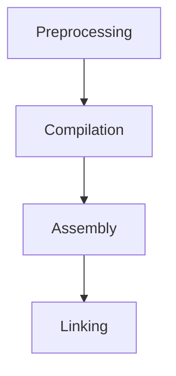
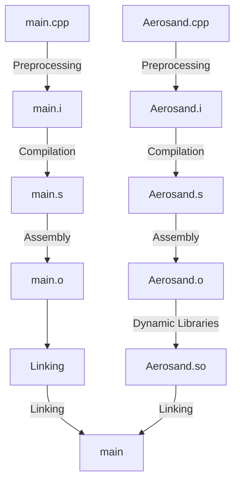

> [!important]
> Visit [https://aerosand.cc](https://aerosand.cc/) for the latest updates.

## 0. Preface

This section primarily discusses the following:

- [ ] Understanding the compilation principles of C++ code
- [ ] Understanding dynamic libraries
- [ ] Compiling and running the helloWorld project

## 1. Getting Started

> [!tip]
> For OpenFOAM, solvers and test cases can be placed in any directory. Storing them under the $FOAM_RUN path is merely a matter of convenience for management.


We create an `ofsp/` folder in a user-defined path (`.../userPath/`) and then create sub-folders for each individual project within it.

Run the following command in the terminal to create the main project folder:

```terminal {filename="terminal"}
mkdir .../userPath/ofsp  
```

> `ofsp` is an abbreviation for OpenFOAM Sharing Programming.

We can set `ofsp` as a shortcut command, so that entering `ofsp` in the terminal will directly navigate to the project folder.

Run the following command in the terminal to open the `bashrc` file:

```terminal {filename="terminal"}
gedit ~/.bashrc
```

Add the following lines to the end of the `bashrc` file:

```bash {fileName="bashrc"}
alias ofsp='cd /userPath/ofsp'
alias ofss='cd /userPath/ofss'
```

Run the following command in the terminal to activate the shortcut command:

```terminal {fileName="terminal"}
source ~/.bashrc
```

## 2. Project

Create the subproject folder for this section via the terminal.

Enter the following commands in the terminal:

```terminal {fileName="terminal"}
ofsp
mkdir ofsp_01_helloWorld
code ofsp_01_helloWorld
```

After opening the project with VS Code, you can use `Ctrl + ~` to bring up the VS Code terminal console for convenient command execution.

Enter the following commands in the terminal to create the project files and save them as blank files:

```terminal {fileName="terminal"}
code main.cpp Aerosand.cpp Aerosand.h
```

Run the `tree` command in the terminal to view the file tree structure:

```terminal {fileName="terminal"}
tree
.
├── Aerosand.cpp
├── Aerosand.h
└── main.cpp
```

> [!tip]
> If the `tree` command is not available, please follow the terminal prompts to install `tree`.

We now write the code as follows.

The class declaration in `Aerosand.h` is as follows:

```cpp {fileName="/Aerosand.h",linenos=table,linenostart=1}
#pragma once

class Aerosand
{
public:
    void setLocalTime(double t);
    double getLocalTime() const;


private:
    double localTime_;
};
```

> [!tip]
> The code style here is intentionally aligned with that of OpenFOAM—for example, function and variable names use camelCase, while private member variable names are suffixed with an underscore.

The class definition in `Aerosand.cpp` is as follows:

```cpp {fileName="/Aerosand.cpp",linenos=table}
#include "Aerosand.h"

void Aerosand::setLocalTime(double t) {
    localTime_ = t;
}

double Aerosand::getLocalTime() const {
    return localTime_;
}
```

The main source code in `main.cpp` is as follows:

```cpp {fileName="/main.cpp", linenos=table}
#include <iostream>

#include "Aerosand.h"

using namespace std;

int main()
{
    int a = 1;
    double pi = 3.1415926;

    cout << "Hi, OpenFOAM!" << " Here we are." << endl;
    cout << a << " + " << pi << " = " << a + pi << endl;
    cout << a << " * " << pi << " = " << a * pi << endl;


    Aerosand mySolver;
    mySolver.setLocalTime(0.2);
    cout << "\nCurrent time step is : " << mySolver.getLocalTime() << endl;

    return 0;
}
```


Although we generally refer to the entire process from source code to executable program as "compilation," in a Linux system, the "compilation" of a C++ program actually consists of four stages.



>[!warning]
>For all subsequent terminal commands discussed in this section, the working directory remains unchanged at `ofsp/ofsp_01_helloWorld/`.


## 3. Code Compilation

### 3.1. Preprocessing

**Preprocessing** is the first stage of the compilation process, occurring before the actual compilation (which generates object code). It is handled by the **preprocessor**, which processes directives in the source code that begin with `#`. These directives are also known as **preprocessor directives**.

For example, `#include` instructs the preprocessor to insert the contents of another file at the current location, while `#define` instructs it to replace macro definitions accordingly.

The preprocessed output is then generated.

Run the following commands in the terminal to perform preprocessing:

```terminal {fileName="terminal"}
g++ -E Aerosand.cpp -o Aerosand.i  
g++ -E main.cpp -o main.i
```

Where:

- The `-E` flag instructs the preprocessor to perform preprocessing.
- The `-o` (lowercase) flag specifies the name of the output file.

Under a Linux system, two new files are generated:

- `Aerosand.i` 
- `main.i`

The suffix `.i` stands for **intermediate preprocessing output**.

### 3.2. Compilation

**Compilation** is the process in which the **compiler** translates preprocessed source code (`.i` files) into assembly code (`.s` files).

During this stage, the compiler performs syntactic analysis, semantic analysis, and optimization on the expanded source code (which has already incorporated header files and expanded macros), ultimately generating assembly code.

Run the following commands in the terminal to perform compilation:

```terminal {fileName="terminal"}
g++ -S Aerosand.i -o Aerosand.s
g++ -S main.i -o main.s
```

- The `-S` flag (uppercase `S`) instructs the compiler to perform compilation.

Under a Linux system, two new files are generated:

- `Aerosand.s` 
- `main.s`

The lowercase `.s` suffix denotes **source code written in assembly**.

### 3.3. Assembly

**Assembly** is the process in which the **assembler** translates source files written in assembly language (with the `.s` suffix) into **machine code**, outputting **object files**.

During this stage, the assembler converts the files from the previous step into human-readable assembly language and ultimately generates platform-dependent binary files. These binary files cannot be executed directly and require further processing.

Run the following commands in the terminal to perform assembly:

```terminal {fileName="terminal"}
g++ -c Aerosand.s -o Aerosand.o
g++ -c main.s -o main.o
```

- The `-c` flag (lowercase) instructs the assembler to perform assembly.

Under a Linux system, two new files are generated:

- `Aerosand.o` 
- `main.o`

The lowercase `.o` suffix denotes **object file**.

### 3.4. Linking

**Linking** is the process in which the **linker** combines multiple object files and system libraries into a complete executable program.

Although object files contain machine instructions, they are not yet complete programs. The linker resolves references to external symbols—such as function calls—and generates a final executable binary.

Run the following command in the terminal to perform direct linking:

```terminal {fileName="terminal"}
g++ Aerosand.o main.o -o main.out
```

Under a Linux system, a new executable file is generated:

- `main.out`

The `.out` suffix here is not significant. In the linking command, the executable can be specified without any suffix.

Run the following command in the terminal to execute the program:

```terminal {fileName="terminal"}
./main.out
Hi, OpenFOAM! Here we are.
1 + 3.14159 = 4.14159
1 * 3.14159 = 3.14159

Current time step is : 0.2
```

The program runs successfully and produces the expected output.

## 4. Dynamic Libraries

Even though the compilation and execution of the program have been completed successfully, there is still more to discuss.

When a project involves a large number of **classes**, it is often desirable to stabilize certain classes to provide specific functionalities. Such functionalities form a **library** that can be reused. Since the library itself has already undergone the full compilation process, when other projects use it, the library does not need to be preprocessed, compiled, or assembled again—it only needs to be linked with the project.

Static libraries incur significant overhead, waste space, and are difficult to update and maintain. Therefore, OpenFOAM makes extensive use of dynamic libraries, and we will focus exclusively on dynamic libraries here.

A dynamic library is **not linked** into the target code during program **compilation**; instead, it is **loaded and linked** only at **runtime**. If multiple programs call the same dynamic library, only one instance of the library needs to reside in memory, as it can be **shared** among them. This significantly reduces memory waste. Additionally, because dynamic libraries are loaded at runtime, updating and maintaining them independently is also highly convenient.

After assembly, the compiler can organize the resulting `.o` object files into a dynamic library, which is generated as a `.so` file under Linux.

Run the following command in the terminal to generate a dynamic library:

```terminal {fileName="terminal"}
g++ -shared -fPIC Aerosand.o -o libAerosand.so
```

- The `-shared` flag instructs the compiler to generate a shared (dynamic) library.
- The `-fPIC` flag instructs the compiler to generate position-independent code (`f` stands for file, `PIC` stands for position-independent code).
- Dynamic library files are prefixed with `lib`.

Under a Linux system, a linkable dynamic library file is generated:

- `libAerosand.so`

The `.so` suffix denotes **shared object**.

## 5. Linking with a Dynamic Library

Instead of using the direct linking method described in Section 3.4, we will compile the program by linking with a dynamic library.

Run the following command in the terminal to remove the previously compiled executable:

```terminal {fileName="terminal"}
rm main.out
```

Run the following command to view the current dynamic library search path; note that it does not include the project’s local directory by default:

```terminal {fileName="terminal"}
echo $LD_LIBRARY_PATH
```

Run the following command to temporarily set the dynamic library path to the current folder:

```terminal {fileName="terminal"}
export LD_LIBRARY_PATH=.
echo $LD_LIBRARY_PATH
```

>[!tip]
>- Do not worry; this temporary setting does not affect the environment configuration for OpenFOAM’s dynamic library paths.
>- If the system is restarted and you wish to run the `main` program again, you must re-specify the dynamic library path.
>- Whether the newly developed library is placed in the current project directory or any other directory, any project from any location can link to this dynamic library as long as the correct path is provided. This exemplifies the significance of dynamic libraries—they are relatively independent and freely linkable.

Run the following command to link the dynamic library and generate the executable:

```terminal {fileName="terminal"}
g++ main.o -L. -lAerosand -o main
```

- The `-L` flag specifies the path to the dynamic library; `-L.` indicates that the dynamic library is located in the current directory.
- The `-l` flag specifies the name of the dynamic library; the `lib` prefix is omitted when using this flag.
- As previously noted, the suffix of the executable file is not significant here.

Under a Linux system, an executable program is generated:

- `main`

The process is concluded here:




Run the following command in the terminal to execute the program:

```terminal {fileName="terminal"}
./main
```


The output displayed in the terminal is as follows:

```terminal {fileName="terminal"}
Hi, OpenFOAM! Here we are.
1 + 3.14159 = 4.14159
1 * 3.14159 = 3.14159

Current time step is : 0.2
```

The program runs successfully and produces the expected output.

## 6. Summary

This section has completed the following discussions:


- [x] Understanding the compilation principles of C++ code
- [x] Understanding dynamic libraries
- [x] Compiling and running the helloWorld project


## Support us

>[!tip]
>Hopefully, the sharing here can be helpful to you.
>
>If you find this content helpful, your comments or donations would be greatly appreciated. Your support helps ensure the ongoing updates, corrections, refinements, and improvements to this and future series, ultimately benefiting new readers as well.
>
>The information and message provided during donation will be displayed as an acknowledgment of your support.


  



> Copyright @ 2026 Aerosand
> 
> - Course (text, images, etc.)：[CC BY-NC-SA 4.0](https://creativecommons.org/licenses/by-nc-sa/4.0/)
> - Code derived from OpenFOAM：[GPL v3](https://www.gnu.org/licenses/gpl-3.0.html)
> - Other code：[MIT License](https://opensource.org/licenses/MIT)

