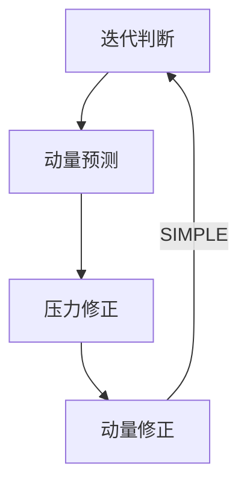

> [!important]
> 访问 https://aerosand.cn 以获取最近更新。

## 0. 前言

我们回忆计算流体力学的基本控制方程 https://aerosand.cc/docs/cfd/cfdb/05_general-conservation/


1. 质量方程

$$\frac{\partial}{\partial t}\rho + \nabla\cdot(\rho U) = 0$$

2. 动量方程

$$\frac{\partial}{\partial t}(\rho U) + \nabla \cdot (\rho UU) = -\nabla p + \nabla\cdot\vec{\tau} + \rho\vec{g}$$

参考 `03_momentumConservation`， 可以简化成通用形式

$$\frac{\partial}{\partial t}(\rho U) + \nabla \cdot (\rho UU) = \nabla\cdot(\mu\nabla U)-\nabla p + Q$$

3. 能量方程

$$\frac{\partial}{\partial t}(\rho c_pT) + \nabla\cdot(\rho c_p U T) = \nabla\cdot(k\nabla T) + Q^T$$

总结有通用形式基本方程

$$\frac{\partial}{\partial t}(\rho \phi) + \nabla \cdot (\rho U\phi) = \nabla\cdot(\Gamma\nabla\phi) + S_{\phi}$$

在 OpenFOAM 中，SIMPLE（**S**emi-**I**mplicit **M**ethod for **P**ressure **L**inked **E**quations）算法用于求解稳态问题。

本文主要讨论

- [ ] 压力速度耦合方程
- [ ] 非线性项的显隐
- [ ] 粘性项的计算
- [ ] SIMPLE 算法
- [ ] SIMPLE 代码框架


## 1. 控制方程

为了方便讨论，考虑无重力稳态不可压缩流动的 NS 方程

连续方程（质量方程）

$$
\nabla\cdot U = 0
$$

通用形式的动量方程

$$\frac{\partial}{\partial t}(\rho U) + \nabla \cdot (\rho UU) = \nabla\cdot(\mu\nabla U)-\nabla p + Q$$


在 OpenFOAM 的不可压缩求解器中，压力 $p$ 实际上是动压头，隐含的已经除以了密度，即实际上

$$
p[m^{2}.s^{-2}] = \frac{P[Pa]}{\rho[kg.m^{-3}]}
$$

其中，$P$ 是物理压力，此时的 $p$ 的单位为 $[m^{2}.s^{-2}]$ 

此外，即使已经使用了动压头，动压头也是基于参考点的相对压力。因为对于流体动力学的计算来说，压力梯度才会真正影响流动。而设置真实压力，因为数量级悬殊会引起计算精度的损失。所以一般参考点选择在计算域内部（例如 cell 0），尽量保证计算域内相对压力的计算稳定性。

类似的，在 OpenFOAM 不可压缩求解器中，粘性力项也默认除以了密度，用运动粘度 `nu` 代替了动力粘度 `mu` ，即

$$
\nu[m^{2}.s^{-1}] = \frac{\mu[Pa.s]}{\rho[kg.m^{-3}]}
$$

不可压的粘性力为

$$\vec{\tau} = -rhoR^{eff} = \mu [\nabla U + (\nabla U)^{T}] + \cancel{\lambda(\nabla\cdot U)\vec I}$$

除以密度后有

$$R^{eff} = - \nu [\nabla U + (\nabla U)^{T}] + \cancel{\lambda(\nabla\cdot U)\vec I}$$


> [!note]
> 在 OpenFOAM 中，为了将粘性项置于方程左侧且为正号，代码中进行了相应的符号处理。

此时，我们知道在 OpenFOAM 中使用的控制方程为

连续方程（质量方程）

$$
\nabla\cdot U = 0
$$

动量方程为

$$
\nabla \cdot (UU) + \nabla\cdot R^{eff} = - \nabla p
$$

对于此控制方程，在求解中面临两个问题：

- $\nabla\cdot(UU)$ 的非线性
- 压力和速度的耦合

我们需要一定的算法来求解此方程组。

## 2. 非线性

回忆之前的对流项，物理量 $\phi$ 和质量通量 $F$ 作为整体被称为对流通量。而这里相当于是自己输运自己（速度输运）。

> [!note]
> 如果完整考虑密度的话，其实是动量输运。

现在的对流项，作体积积分后离散

$$
\begin{aligned}
\int_{V_{P}}\nabla\cdot(UU)dV &= \int_{\partial V_{P}}(UU)\cdot d S \\
&= \sum\limits_{f}\int_{f}(UU) \cdot d S\\
&\approx \sum\limits_{f}\underbrace{(UU)_{f}}_{nonlinear}\cdot S_{f} \\
&= \sum\limits_{f}\underbrace{(\cancel{\rho} U_{f}\cdot S_{f})}_{flux}U_{f} \\
&=  \sum\limits_{f}F_{f}U_{f} \\
&= a_{P}U_{P} + \sum\limits_{f}a_{N}U_{N}
\end{aligned}
$$

对于其中的非线性部分 $(UU)$，实践中更倾向于线性处理，也就是令质量通量中的速度使用上一时间步的值作为已知值，即所谓的显式处理。质量通量之外的速度，用待求时间步的值作为未知量，即所谓的隐式处理。当然，这样会导致计算过程中，非线性项存在一个延迟。不过这对于稳态计算来说并不重要。

对于瞬态计算来说，仍然可以忽略非线性延迟而作一个线性化处理，也可以单独对非线性项作迭代进行处理。但是，单独作迭代会增加计算消耗。

当时间步很小的时候，连续解之间的差别就会很小，此时非线性延迟也就不再显著。

讨论可以知道，对流项中的质量通量是变化的核心，可以作为一个独立的量进行处理。

> [!note]
> 需要注意，既然进行了线性化处理，可以想到上式中 $a_{P},a_{N}$ 对某一时间步来说可以作为已知量参与计算。但是对于时间步变化来说，这两个系数是跟着速度更新而变化的。这些系数也构成了下文中的 $M$ 矩阵。

实践中，一般使用 PISO 压力-速度耦合算法来计算瞬态流动计算，使用 SIMPLE 压力-速度耦合算法来计算稳态流动计算。后续将分别介绍这些算法。

## 3. 压力速度耦合

动量方程的形式可以简化为（忽略其他源项）

$$
MU = -\nabla p
$$

可以想见场的系数矩阵 $M$ 是一个对角占优的稀疏方阵（或者说我们希望它能够对角占优），$M$ 矩阵的对角线都是离散方程中的本元素，同一行上，对角线前后（在该行也许不紧挨）的元素都是和该单元相邻的单元。

### 3.1. 动量预测

最基本的思路是，在某个时间步或者初始时间步，我们由上一步求得的已知压力场或者初始已知压力场，根据动量方程直接求出一个预测的速度场。

约定每个迭代步【动量预测】求解动量方程得到的预测速度表示为 $U^{pre}$

动量方程为

$$
MU^{pre} = -\nabla p^{old}
$$

为了方便理解，我们摘抄历史版本的主要代码如下 https://github.com/OpenFOAM/OpenFOAM-2.2.x/blob/master/applications/solvers/incompressible/simpleFoam/UEqn.H

```cpp {fileName="simpleFoam/uEqn.H"}
    // Momentum predictor // 动量预测

    tmp<fvVectorMatrix> UEqn // 构建动量方程矩阵
    (
        fvm::div(phi, U)
      // + turbulence->divDevReff(U) // 粘性项，暂不深究
      ==
      //  fvOptions(U) // 源项框架，暂不深究
    );

	...

    solve(UEqn() == -fvc::grad(p)); // 求解动量方程

    ...
```

这个直接求解动量方程的步骤被称为【动量预测】，求得预测速度 $U^{pre}$。

### 3.2. 压力修正

基于【动量预测】得到的预测速度，需要满足质量方程的约束，以此修正压力。

我们先处理系数矩阵 $M$ 。

> [!note]
> 记得 $M$ 矩阵是由类似于上文讨论的离散后 $a_{P}U_{P} + \sum\limits_{f}a_{N}U_{N}$ 中的系数构成的。

从 $M$ 矩阵中分解出对角矩阵 $A$ （不是求解线性代数系统 $Ax=b$ 中的 $A$），对角矩阵 $A$ 可以很容易求出逆矩阵。

OpenFOAM 中的对角矩阵以及求解方法已经高度抽象化，也更易读

对角矩阵 $A$ 的逆矩阵在代码中为

```cpp
// 对角矩阵的倒数
volScalarField rAU(1.0/UEqn.A());
```

动量方程的左侧抽离对角矩阵，可以写成

$$
MU = AU - H
$$

> [!note]
> 为什么不是 $MU = AU + H$ 呢？这两种表达差别在 $H$ 的正负号上，其实没有本质区别。这里是 OpenFOAM 采用的符号约定。

相应的非对角矩阵为

$$
H = AU - MU
$$

OpenFOAM 中也提供可以直接调用的成员方法 `UEqn.H()` 。

作为比较，注意以下处理是错误的。

$$
\cancel{MU = AU - HU}
$$

分解后的动量方程为

$$
AU - H = -\nabla p
$$

两边同时乘以 $A$ 的逆矩阵

$$
A^{-1}AU = \underbrace{A^{-1}H}_{HbyA} -A^{-1}\nabla p
$$

其中的 $A^{-1}H$ 也被称为 HbyA（其实就是 H 除以 A 的意思），在代码中为

```cpp
// HbyA
HbyA = rAU*UEqn().H();
```

继续数学推导有

$$
U = A^{-1}H -A^{-1}\nabla p
$$

速度还需要满足连续方程

$$
\nabla\cdot U = 0
$$

即有

$$
\nabla\cdot(A^{-1}H -A^{-1}\nabla p) = 0
$$

整理有

$$
\nabla\cdot(A^{-1}\nabla p^{}) = \nabla\cdot(A^{-1}H)
$$

所谓的压力修正，即有

$$
\nabla\cdot(A^{-1,pre}\nabla p^{cor}) = \nabla\cdot(A^{-1,pre}H^{pre})
$$

上式中，$A^{-1,pre}$ 基于【动量预测】的预测速度求得，$H^{pre}(= A^{pre}U^{pre} - M^{pre}U^{pre})$ 同样基于【动量预测】的预测速度求得。

> [!note]
> 这里需要注意，上式左侧本质上是“扩散”（laplacian），右侧本质上是“对流”（div）。简单来说，在数值层面上，扩散在数学物理上是由梯度决定的，计算可以一步到位。但是，对流在数学物理上是由通量决定的，很多情况下计算中的通量在循环中需要修正等操作，并不能一步到位。所以在 OpenFOAM 中，通量被设计为独立的量，用于对流计算中。另外，在一些算法中一旦通量确定，会在循环（如非正交修正循环）中反复计算，避免了使用变量每次修正都需要重新计算通量。如果有点困惑不用担心，我们以后会深入详细讨论。


在 OpenFOAM 中主要代码如下 https://github.com/OpenFOAM/OpenFOAM-2.2.x/blob/master/applications/solvers/incompressible/simpleFoam/pEqn.H

```cpp {fileName="simpleFoam/pEqn.H"}
    volScalarField rAU(1.0/UEqn().A()); // A^{-1}
    volVectorField HbyA("HbyA", U); 
    HbyA = rAU*UEqn().H(); // HbyA
    ...

    surfaceScalarField phiHbyA("phiHbyA", fvc::interpolate(HbyA) & mesh.Sf());
    // HbyA 面通量插值
	...

    // Non-orthogonal pressure corrector loop
    while (simple.correctNonOrthogonal()) // 修正非正交，暂不深究
    {
        fvScalarMatrix pEqn // 构建压力修正方程矩阵
        (
            fvm::laplacian(rAU, p) == fvc::div(phiHbyA) // 压力修正方程
        );

        ...

        pEqn.solve(); // 求解压力修正方程
		
		...
    }
    
    ...
```

由此，可以求解得到【压力修正】后的修正压力 $p^{cor}$。

### 3.4. 动量修正

在【压力修正】后，修正速度有

$$
U^{cor} = A^{-1,pre}H^{pre} -A^{-1,pre}\nabla p^{cor}
$$

上式中，$A^{-1,pre}$ 同样是基于【动量预测】的预测速度求得，$H^{pre}$ 也是基于【动量预测】的预测速度求得。$p^{cor}$ 是第一次压力修正后的修正压力。

我们同样摘抄主要代码如下 https://github.com/OpenFOAM/OpenFOAM-2.2.x/blob/master/applications/solvers/incompressible/simpleFoam/pEqn.H

```cpp {fileName="simpleFoam/pEqn.H"}
    ...

    // Momentum corrector // 动量修正
    U = HbyA - rAU*fvc::grad(p); // 基于上面的修正压力，求得修正速度
    ...
```

可以求解得到【动量修正】后的修正速度 $U^{cor}$ 。

对于稳态问题，【压力修正】和【动量修正】均只执行一次。

### 3.5. 外循环

每个迭代结束后，计算得到的修正压力 $p^{cor}$ （用于压力源项）和修正速度 $U^{cor}$ （用于非线性）参加下一次迭代的【动量预测】（动量方程计算）。

摘抄主要代码如下

```cpp {fileName="simpleFoam.C"}
...
    while (simple.loop()) // SIMPLE循环
    {
        Info<< "Time = " << runTime.timeName() << nl << endl;

        // --- Pressure-velocity SIMPLE corrector
        {
            #include "UEqn.H" // 动量预测
            #include "pEqn.H" // 压力修正 + 动量修正，均修正一次
        }

        ...
    }
...
```

迭代循环直到满足字典中设定的次数。

>[!tip] 
>这个过程也被称为 outer loop

整理流程可以总结如下



> [!note]
> 为什么叫【动量预测】【动量修正】，而不是直观的【速度预测】【速度修正】呢？
> 1. 【动量预测】中求解的确实是动量方程。
> 2. 称呼“动量“更能强调物理守恒的是动量。
> 3. 虽然有人忽略密度将对流说成“速度的输运”，但与可压缩流动和多相流保持统一，动量输运的描述更接近方程描述的物理本质。


## 4. 小结

本文介绍了压力速度耦合方程的求解问题，并讨论了 SIMPLE 算法的理论和实现。

通过讨论，我们明白了 SIMPLE 算法的主要思路，不过我们还是有一些问题未完全解答，例如为什么使用 $phiHbyA$ 而不是 $HbyA$ 。

这些问题暂且记下，我们会在以后再次讨论，无需担心。读者也可先行探索思考。

本文完成讨论

- [x] 压力速度耦合方程
- [x] 非线性项的显隐
- [x] 粘性项的计算
- [x] SIMPLE 算法
- [x] SIMPLE 代码框架


## 支持我们

>[!tip]
>希望这里的分享可以对坚持、热爱又勇敢的您有所帮助。 
>
>如果这里的分享对您有帮助，您的评论、转发和赞助将对本系列以及后续其他系列的更新、勘误、迭代和完善都有很大的意义，这些行动也会为后来的新同学的学习有很大的助益。 
>
>赞助打赏时的信息和留言将用于展示和感谢。


  

