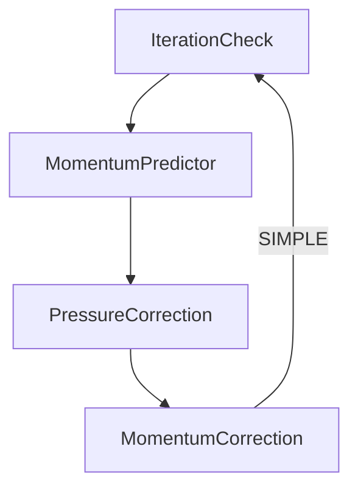

> [!important]
> 访问 [https://aerosand.cc](https://aerosand.cc/) 以获取最近更新。  
> Visit [https://aerosand.cc](https://aerosand.cc/) for the latest updates.

## 0. Preface

Let us recall the fundamental governing equations of computational fluid dynamics: [https://aerosand.cc/docs/cfd/cfdb/05_general-conservation/](https://aerosand.cc/docs/cfd/cfdb/05_general-conservation/)

1. Mass equation:

$$\frac{\partial}{\partial t}\rho + \nabla\cdot(\rho U) = 0$$

2. Momentum equation:

$$\frac{\partial}{\partial t}(\rho U) + \nabla \cdot (\rho UU) = -\nabla p + \nabla\cdot\vec{\tau} + \rho\vec{g}$$

Referring to `cfdb/03_momentumConservation`, this can be simplified into a general form:

$$\frac{\partial}{\partial t}(\rho U) + \nabla \cdot (\rho UU) = \nabla\cdot(\mu\nabla U)-\nabla p + Q$$

3. Energy equation:

$$\frac{\partial}{\partial t}(\rho c_pT) + \nabla\cdot(\rho c_p U T) = \nabla\cdot(k\nabla T) + Q^T$$

In summary, the general form of the fundamental equations is:

$$\frac{\partial}{\partial t}(\rho \phi) + \nabla \cdot (\rho U\phi) = \nabla\cdot(\Gamma\nabla\phi) + S_{\phi}$$

In OpenFOAM, the **S**emi-**I**mplicit **M**ethod for **P**ressure **L**inked **E**quations (SIMPLE) algorithm is used to solve steady-state problems.

This section primarily discusses:

- [ ] Density treatment and pressure reference
- [ ] Pressure-velocity coupling equations
- [ ] Explicit and implicit treatment of nonlinear terms
- [ ] The SIMPLE algorithm
- [ ] The SIMPLE code framework


## 1. Density and Pressure

For ease of discussion, consider the Navier-Stokes equations for steady, incompressible flow without body forces:

Continuity equation (mass equation):

$$
\nabla\cdot U = 0
$$

The general form of the momentum equation (including a source term $S$, which is temporarily set to zero for simplicity):

$$\cancel{\frac{\partial}{\partial t}(\rho U)} + \nabla \cdot (\cancel{\rho} UU) = \nabla\cdot(\nu\nabla U) + S -\nabla p$$

In OpenFOAM's incompressible solvers, the pressure $p$ is actually the dynamic head, implicitly divided by density. That is:

$$
p[m^{2}.s^{-2}] = \frac{P[Pa]}{\rho[kg.m^{-3}]}
$$

where $P$ is the physical pressure, and $p$ has units of $[m^{2}.s^{-2}]$.

Even when using dynamic head, it is still a relative pressure based on a reference point. Since pressure gradients truly affect the flow, setting absolute pressures may lead to loss of computational accuracy due to large differences in magnitude. A pressure reference is generally chosen. The reference point is typically selected inside the computational domain (e.g., cell 0) to ensure computational stability of the relative pressure within the domain.

Similarly, in OpenFOAM's incompressible solvers, the viscous force term is also implicitly divided by density, using kinematic viscosity `nu` instead of dynamic viscosity `mu`, i.e.:

$$
\nu[m^{2}.s^{-1}] = \frac{\mu[Pa.s]}{\rho[kg.m^{-3}]}
$$

## 2. Governing Equations

The governing equations are:

Continuity equation (mass equation):

$$
\nabla\cdot U = 0
$$

Momentum equation:

$$\nabla \cdot (UU) = \nabla\cdot(\nu\nabla U) + S -\nabla p$$

Solving this system of equations faces two challenges:

- The nonlinearity of $\nabla\cdot(UU)$
- The coupling between pressure and velocity

We need certain algorithms to solve this system.

## 3. Nonlinearity

Recall the convection term from earlier discussions, where the physical quantity $\phi$ and the mass flux $F$ together form the convective flux. Here, it is essentially the transport of velocity by itself (self-transport).

> [!note]
> If density were fully considered, this would be called "momentum transport."


The current convection term, after volume integration and discretization:

$$
\begin{aligned}
\int_{V_{P}}\nabla\cdot(UU)dV &= \int_{\partial V_{P}}(UU)\cdot d S \\
&= \sum\limits_{f}\int_{f}(UU) \cdot d S\\
&\approx \sum\limits_{f}\underbrace{(UU)_{f}}_{nonlinear}\cdot S_{f} \\
&= \sum\limits_{f}\underbrace{(\cancel{\rho} U_{f}\cdot S_{f})}_{flux}U_{f} \\
&=  \sum\limits_{f}F_{f}U_{f} \\
&= a_{P}U_{P} + \sum\limits_{f}a_{N}U_{N}
\end{aligned}
$$

For the nonlinear part $(UU)$, practice tends toward linearization—that is, using the velocity from the previous time step as a known value in the mass flux (explicit treatment). The velocity outside the mass flux is treated as an unknown using the value at the current time step (implicit treatment). This introduces a lag in the nonlinear term during computation. However, this is not significant for steady-state calculations.

For transient calculations, the nonlinear lag can be ignored as a linearization, or iterations can be performed specifically for the nonlinear term. However, separate iterations increase computational cost. When the time step is small, the difference between successive solutions becomes small, making the nonlinear lag negligible.
From this discussion, we can see that the mass flux in the convection term is the core of the variation and can be treated as an independent quantity.

> [!note]
> Since linearization is performed, it can be understood that $a_{P}$ and $a_{N}$ in the above expression can be treated as known quantities for a given time step. However, over all time steps, these coefficients change as the velocity updates. These coefficients also form the $M$ matrix discussed below (so the $M$ matrix is different at each time step).


In practice, the SIMPLE pressure-velocity coupling algorithm is commonly used for steady-state flow calculations, while the PISO algorithm is used for transient flow calculations. These algorithms will be introduced separately in the future.

## 4. Pressure-Velocity Coupling

The momentum equation can be simplified to the form (ignoring other source terms):

$$
MU = -\nabla p
$$

It can be seen that the coefficient matrix $M$ is a diagonally dominant sparse square matrix (or rather, we desire it to be diagonally dominant). The diagonal entries of the $M$ matrix correspond to the current element in the discretized equation, while the off-diagonal entries on the same row (which may not be adjacent in that row) correspond to neighboring cells.

### 4.1. Momentum Predictor

The basic idea is that, at a given time step or the initial time step, we use the known velocity and pressure fields from the previous step or the initial known fields to directly solve for a predicted velocity field from the momentum equation.

Let the predicted velocity obtained from solving the momentum equation in each iteration step be denoted as $U^{pre}$ (predict).

The momentum equation is:

$$
MU^{pre} = -\nabla p^{old}
$$

For ease of understanding, we excerpt the main code from a historical version: [https://github.com/OpenFOAM/OpenFOAM-2.2.x/blob/master/applications/solvers/incompressible/simpleFoam/UEqn.H](https://github.com/OpenFOAM/OpenFOAM-2.2.x/blob/master/applications/solvers/incompressible/simpleFoam/UEqn.H)

```cpp {fileName="simpleFoam/uEqn.H"}
    // Momentum predictor
    tmp<fvVectorMatrix> UEqn // Construct the momentum equation matrix
    (
        fvm::div(phi, U)
       + turbulence->divDevReff(U) // Viscous term, not to be explored here
      ==
        fvOptions(U) // Source term framework, not to be explored here
    );
    // Considering the subsequent construction of H(), the pressure gradient is not included here
	...
	UEqn.relax(); // Equation relaxation, to be discussed later
	...
    solve(UEqn() == -fvc::grad(p)); // Solve the momentum equation
    ...
```

This step of directly solving the momentum equation is called the **momentum predictor**, yielding the predicted velocity $U^{pre}$.


> [!question]
> Why is the pressure term not included in the construction of UEqn?
> 
> Readers are encouraged to think about this question first; we will discuss it in detail later.


> [!note]
> Some readers may wonder: since both velocity and pressure need to be solved, why does the `UEqn` constructed here definitely solve for velocity rather than pressure?
> 
> In fact, the `fvm::` discretization returns a matrix, constructing an `fvVectorMatrix` type matrix, and the discretization operation targets the parameter $U$, i.e., the unknown quantity to be solved. Meanwhile, the `fvc::` discretization returns a field (a known quantity used for computation), i.e., computes a field of type `volVectorField`.

### 4.2. Pressure Correction

Based on the predicted velocity obtained from the **momentum predictor**, we also need to satisfy the constraint of the continuity equation, which can be used to correct the pressure.

First, we process the coefficient matrix $M$.

> [!note]
> Recall that the $M$ matrix is composed of coefficients like $a_{P}U_{P} + \sum\limits_{f}a_{N}U_{N}$ after discretization, as discussed earlier.

From the $M$ matrix, we decompose the diagonal matrix $A$ (not to be confused with the $A$ in the linear system $Ax=b$). The diagonal matrix $A$ can be easily inverted.

In OpenFOAM, the diagonal matrix and its inversion method are highly abstracted and more readable:

```cpp
// Reciprocal of the diagonal matrix
volScalarField rAU(1.0/UEqn.A());
```

By extracting the diagonal matrix from the left-hand side of the momentum equation, we can write:

$$
MU = AU - H(U)
$$

The corresponding off-diagonal matrix is:

$$
H(U) = AU - MU
$$

OpenFOAM also provides a directly callable member method `UEqn.H()`.

Returning to the momentum equation. After decomposition, the momentum equation becomes:

$$
AU - H(U) = -\nabla p
$$

Multiplying both sides by the inverse of $A$:

$$
A^{-1}AU = \underbrace{A^{-1}H(U)}_{HbyA(U)} -A^{-1}\nabla p
$$

where $A^{-1}H(U)$ is also referred to as $HbyA(U)$ (meaning H divided by A). In code:

```cpp
// HbyA
HbyA = rAU*UEqn().H();
```

Continuing the mathematical derivation:

$$
U = A^{-1}H(U) -A^{-1}\nabla p
$$

The velocity must also satisfy the continuity equation:

$$
\nabla\cdot U = 0
$$

Thus:

$$
\nabla\cdot(A^{-1}H(U) -A^{-1}\nabla p) = 0
$$

Rearranging gives the **pressure correction equation**:

$$
\nabla\cdot(A^{-1}\nabla p^{}) = \nabla\cdot(HbyA(U))
$$


Theoretically, to solve for the exact pressure, we should provide an accurate $HbyA(U^{acc})$.

$$
HbyA(U^{acc})=HbyA(U^{pre})+HbyA(U^{'})
$$

In practice, we can only provide $HbyA(U^{pre})$ based on the predicted velocity for the solution.

This operation essentially assumes that ignoring $HbyA(U^{'})$ does not significantly affect the calculation.

> [!question]
> What effect does this neglect actually have?


Thus, using the predicted velocity from the **momentum predictor** to calculate the new pressure (corrected pressure):

$$
\nabla\cdot(A^{-1,pre}\nabla p^{cor}) = \nabla\cdot(HbyA(U^{pre}))
$$

In the above equation, $A^{-1,pre}$ is obtained based on the predicted velocity from the **momentum predictor**, and $HbyA(U^{pre})(= A^{-1,pre}H(U)^{pre})$ is also obtained based on the predicted velocity from the **momentum predictor**.

> [!note]
> It should be noted here that the left-hand side of the above equation is essentially a "diffusion" term (laplacian), while the right-hand side is essentially a "convection" term (div). In simple terms, at the numerical level, diffusion is determined by gradients and can be computed in one step. However, convection is determined by fluxes, which often require correction within loops and cannot be computed in one step. Therefore, in OpenFOAM, the flux is designed as an independent quantity for use in convection calculations. Additionally, in some algorithms, once the flux is computed, it can be repeatedly used in loops (such as non-orthogonal correction loops) without being recomputed each time. If this is confusing, don't worry—we will discuss it in more depth later.


In OpenFOAM, the main code is as follows: [https://github.com/OpenFOAM/OpenFOAM-2.2.x/blob/master/applications/solvers/incompressible/simpleFoam/pEqn.H](https://github.com/OpenFOAM/OpenFOAM-2.2.x/blob/master/applications/solvers/incompressible/simpleFoam/pEqn.H)

```cpp {fileName="simpleFoam/pEqn.H"}
    volScalarField rAU(1.0/UEqn().A()); // A^{-1}
    volVectorField HbyA("HbyA", U); 
    HbyA = rAU*UEqn().H(); // HbyA
    ...

    surfaceScalarField phiHbyA("phiHbyA", fvc::interpolate(HbyA) & mesh.Sf());
    // Interpolate HbyA to faces to obtain the flux
	...

    // Non-orthogonal pressure corrector loop
    while (simple.correctNonOrthogonal()) // Correct non-orthogonality, not to be explored here
    {
        fvScalarMatrix pEqn // Construct the pressure correction equation matrix
        (
            fvm::laplacian(rAU, p) == fvc::div(phiHbyA) // Pressure correction equation
            // phiHbyA is not recomputed for each non-orthogonal correction
        );

        ...

        pEqn.solve(); // Solve the pressure correction equation
		
		...
    }
    
    ...
```

From this, we can solve for the corrected pressure $p^{cor}$ after **pressure correction**.

### 4.3. Momentum Correction

After **pressure correction**, the corrected velocity is:

$$
U^{cor} = HbyA(U^{pre}) -A^{-1,pre}\nabla p^{cor}
$$

In the above equation, $A^{-1,pre}$ is again obtained based on the predicted velocity from the **momentum predictor**, $HbyA(U^{pre})(= A^{-1,pre}H(U)^{pre})$ is also based on the predicted velocity from the **momentum predictor**, and $p^{cor}$ is the corrected pressure after pressure correction.

We excerpt the main code as follows: [https://github.com/OpenFOAM/OpenFOAM-2.2.x/blob/master/applications/solvers/incompressible/simpleFoam/pEqn.H](https://github.com/OpenFOAM/OpenFOAM-2.2.x/blob/master/applications/solvers/incompressible/simpleFoam/pEqn.H)

```cpp {fileName="simpleFoam/pEqn.H"}
    ...

    // Momentum corrector
    U = HbyA - rAU*fvc::grad(p); // Based on the corrected pressure above, obtain the corrected velocity
    ...
```

This solves for the corrected velocity $U^{cor}$ after **momentum correction**.

> [!question]
> Since the velocity is always solved here, and the equation used to solve for velocity is derived from the momentum equation, could we skip the equation solution in the momentum predictor?


For steady-state problems, both **pressure correction** and **momentum correction** are performed only once.


> [!question]
> Why only once?


### 4.4. Outer Loop

After each iteration, the computed corrected pressure $p^{cor}$ (used for the pressure source term) and corrected velocity $U^{cor}$ (used for nonlinearity) participate in the next iteration's **momentum predictor** (momentum equation solution).

The iteration loop continues until the number of iterations specified in the dictionary is reached, or the convergence criteria set in the dictionary are met (e.g., the velocity and pressure residuals after iteration are below the convergence tolerance).

>[!tip] 
>This process is also referred to as the outer loop.

The workflow can be summarized as follows:




Regarding the SIMPLE algorithm, the main code is excerpted as follows:

```cpp {fileName="simpleFoam.C"}
...
    while (simple.loop()) // SIMPLE loop
    {
        Info<< "Time = " << runTime.timeName() << nl << endl;
		
		...
		
        // --- Pressure-velocity SIMPLE corrector
        {
            #include "UEqn.H" // Momentum predictor
            #include "pEqn.H" // Pressure correction + Momentum correction, each performed once
        }

        ...
    }
...
```


> [!note]
> Why are the steps called **momentum predictor** and **momentum correction** instead of the more intuitive **velocity predictor** and **velocity correction**?
> 1. The **momentum predictor** indeed solves the momentum equation.
> 2. The term "momentum" emphasizes that momentum is the physically conserved quantity.
> 3. Although some may ignore density and describe convection as "velocity transport," to maintain consistency with compressible flow and multiphase flow, describing it as momentum transport is closer to the physical essence described by the equations.


## 5. Summary

This section introduced the problem of solving the pressure-velocity coupled equations and discussed the theory and implementation of the SIMPLE algorithm.

Through this discussion, we have understood the main idea of the SIMPLE algorithm, though some questions remain unanswered. For example:

- Why is the pressure gradient not included in the construction of `UEqn`?
- What effect does the approximation used in the pressure correction equation have?
- Can the momentum predictor be omitted?
- Why are pressure correction and momentum correction performed only once in the SIMPLE example?
- Why is `phiHbyA` used in the pressure correction equation instead of `HbyA`?

Let us note these questions for now; we will discuss them in detail later. There is no need to worry—these points do not affect our understanding of the main idea of the algorithm for the time being. Readers are also encouraged to explore and think about these questions on their own.

This section has completed the following discussions:

- [x] Density treatment and pressure reference
- [x] Pressure-velocity coupling equations
- [x] Explicit and implicit treatment of nonlinear terms
- [x] The SIMPLE algorithm
- [x] The SIMPLE code framework


## 支持我们 Support us

>[!tip]
>希望这里的分享可以对坚持、热爱又勇敢的您有所帮助。   
>Hopefully, the sharing here can be helpful to you.
>
>如果这里的分享对您有帮助，您的评论或赞助将对本系列以及后续其他系列的更新、勘误、迭代和完善都有很大的意义，这些行动也会为后来的新同学的学习有很大的助益。  
>If you find this content helpful, your comments or donations would be greatly appreciated. Your support helps ensure the ongoing updates, corrections, refinements, and improvements to this and future series, ultimately benefiting new readers as well.
>
>赞助打赏时的信息和留言将用于展示和感谢。  
>The information and message provided during donation will be displayed as an acknowledgment of your support.


  



> Copyright @ 2026 Aerosand
> 
> - 课程（文本、图片等）Course (text, images, etc.)：[CC BY-NC-SA 4.0](https://creativecommons.org/licenses/by-nc-sa/4.0/)
> - OpenFOAM 开发代码 Code derived from OpenFOAM：[GPL v3](https://www.gnu.org/licenses/gpl-3.0.html)
> - 其他代码 Other code：[MIT License](https://opensource.org/licenses/MIT)


