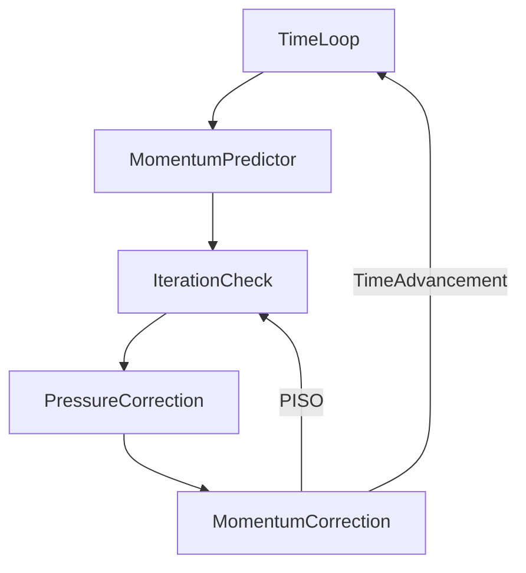

> [!important]
> 访问 [https://aerosand.cc](https://aerosand.cc/) 以获取最近更新。  
> Visit [https://aerosand.cc](https://aerosand.cc/) for the latest updates.

## 0. Preface

The previous two sections discussed the SIMPLE algorithm and its code implementation, which is primarily used for steady-state problems. This section discusses the PISO algorithm for solving transient problems.

This section primarily discusses:

- [ ] The PISO algorithm
- [ ] Equation relaxation

## 1. Governing Equations

Consider the Navier-Stokes equations for transient, incompressible flow without body forces:

Continuity equation (mass equation):

$$
\nabla\cdot U = 0
$$

Momentum equation describing viscous forces:

$$
\frac{\partial}{\partial t}(\cancel{\rho} U) + \nabla \cdot (\cancel{\rho} UU) = - \frac{1}{\rho} \nabla p + \frac{1}{\rho} \nabla\cdot\vec{\tau} + \cancel{\rho\vec{g}}
$$

Referring to the previous discussion on the treatment of density in the pressure and viscosity terms, we ultimately have:

Continuity equation (mass equation):

$$
\nabla\cdot U = 0
$$

Momentum equation describing viscous forces:

$$
\frac{\partial U}{\partial t} + \nabla \cdot ( UU) = -  \nabla p + (\nabla\cdot\vec{\tau})
$$


## 2. PISO

In OpenFOAM, the **P**ressure-**I**mplicit with **S**plitting of **O**perators (PISO) algorithm is used to solve transient problems.

> [!tip]
> Our initial discussions will be somewhat detailed and repetitive.

### 2.1. Momentum Predictor

At a given time step or the initial time step, we use the known velocity and pressure fields from the previous step or the initial known fields to directly solve for a predicted velocity field from the momentum equation.

$$
\frac{\partial U}{\partial t} + \nabla \cdot ( UU) = -  \nabla p + (\nabla\cdot\vec{\tau})
$$

Within each time iteration step, the predicted velocity obtained from solving the momentum equation in the **momentum predictor** is denoted as $U^{pre}$.

The momentum equation is simplified to:

$$
MU^{pre} = -\nabla p^{old}
$$

The step of solving the momentum equation is called the **momentum predictor**, yielding the predicted velocity $U^{pre}$.

### 2.2. First Pressure Correction

Solving the continuity equation is equivalent to solving the pressure correction equation.

We have an analysis similar to that of the SIMPLE algorithm, as follows:

Momentum equation:

$$
MU = AU - H(U) = -\nabla p
$$

Thus:

$$
U = A^{-1}H(U) -A^{-1}\nabla p
$$

The velocity must also satisfy the continuity equation:

$$
\nabla\cdot U = 0
$$

Therefore:

$$
\nabla\cdot(A^{-1}H(U) -A^{-1}\nabla p) = 0
$$

Rearranging:

$$
\nabla\cdot(A^{-1}\nabla p^{}) = \nabla\cdot(A^{-1}H(U))
$$

where

$$HbyA(U) = A^{-1}H(U)$$

The so-called pressure correction uses the predicted velocity obtained above to calculate a new pressure (corrected pressure):

$$
\nabla\cdot(A^{-1,pre}\nabla p^{cor1}) = \nabla\cdot(HbyA(U^{pre}))
$$

where

$$
HbyA(U^{pre}) = A^{-1,pre}H(U^{pre})
$$

Theoretically, to solve for the exact pressure, we should provide an accurate $HbyA(U^{acc})$.

$$
HbyA(U^{acc})=HbyA(U^{pre})+HbyA(U^{'})
$$

In practice, we can only provide $HbyA(U^{pre})$ based on the predicted velocity for the solution.

This operation essentially assumes that ignoring $HbyA(U^{'})$ does not significantly affect the calculation.


> [!question]
> Again, what effect does this neglect actually have?


In the above equation, $A^{-1,pre}$ is obtained based on the predicted velocity from the **momentum predictor**, and $HbyA(U^{pre})(= A^{-1,pre}H(U^{pre}))$ is also obtained based on the predicted velocity from the **momentum predictor**.

From this, we can solve for the first corrected pressure $p^{cor1}$ after the **first pressure correction**.

### 2.3. First Momentum Correction

After the **first pressure correction**, the corrected velocity is:

$$
U^{cor1} = HbyA(U^{pre}) -A^{-1,pre}\nabla p^{cor1}
$$

In the above equation, $A^{-1,pre}$ is obtained based on the predicted velocity from the **momentum predictor**, $HbyA(U^{pre})(= A^{-1,pre}H(U^{pre}))$ is also based on the predicted velocity from the **momentum predictor**, and $p^{cor1}$ is the corrected pressure after the **first pressure correction**.

This solves for the first corrected velocity $U^{cor1}$ after the **first momentum correction**.
For steady-state problems, the SIMPLE algorithm performs the pressure and momentum correction only once. If multiple corrections were performed, since each correction uses the old $A$, the benefit would be minimal, and it would be less effective than directly performing an outer loop.

For transient problems, the solved field values at each time step are crucial for the calculation of the next time step. For each time step, $H(U)$ involved in the calculation changes as the velocity field updates. Multiple corrections can address the deviations introduced when satisfying the continuity equation.

### 2.4. Second Pressure Correction

Because the velocity has been corrected,

$$
HbyA(U^{cor1}) = A^{-1,pre}H(U^{cor1})
$$

Thus, $HbyA(U^{pre})$ is automatically updated to $HbyA(U^{cor1})$.

> [!note]
> Recall that $H(U)$ is different from $A$; $H(U)$ varies with $U$.

$$
\nabla\cdot(A^{-1,pre}\nabla p^{cor2}) = \nabla\cdot(HbyA(U^{cor1}))
$$

From this, we can solve for the second corrected pressure $p^{cor2}$ after the **second pressure correction**.

### 2.5. Second Momentum Correction

After the **second pressure correction**, the corrected velocity is:

$$
U^{cor2} = HbyA(U^{cor1}) -A^{-1,pre}\nabla p^{cor2}
$$

In the above equation, $A^{-1,pre}$ is still obtained based on the predicted velocity from the **momentum predictor**, while $HbyA(U^{cor1})(= A^{-1,pre}H(U^{cor1}))$ has been updated as the predicted velocity from the **first momentum correction** changes, and $p^{cor2}$ is the corrected pressure after the **second pressure correction**.

This solves for the second corrected velocity $U^{cor2}$ after the **second momentum correction**.

### 2.6. Inner Loop

Pressure correction and momentum correction can form an iterative loop until the corrected pressure and velocity meet the requirements.

Generally, two pressure-momentum corrections are sufficient; further corrections yield diminishing returns. A simple interpretation is that the first correction satisfies the continuity equation, while the second correction addresses errors introduced when satisfying the continuity equation (such as errors from neglecting neighbor velocity corrections), along with other errors.

>[!tip] 
>This process is also referred to as the inner loop.


The velocity and pressure fields obtained at the end of the inner loop serve as the results for the old time step and participate in the calculation of the next time step.

The workflow can be summarized as follows:



Regarding the PISO algorithm framework, the main code is excerpted as follows:

```cpp {fileName="pisoFoam",base_url="https://aerosand.cc",linenos=table,linenostart=1}

    while (runTime.loop())
    {
        Info<< "Time = " << runTime.timeName() << nl << endl;
		
		...

        // Pressure-velocity PISO corrector
        {
            #include "UEqn.H"

            // --- PISO loop
            while (piso.correct())
            {
                #include "pEqn.H"
            }
        }

		...

    }
```

### 2.7. Other Discussions

As we questioned earlier: since the velocity can be obtained from the momentum correction, and the momentum correction is derived from the momentum equation, is the momentum predictor still necessary?

In fact, examining the native solver code reveals that OpenFOAM provides an option for whether to perform the momentum predictor. For example, in `pisoFoam`, there is:

```cpp {fileName="pisoFoam/UEqn.H",base_url="https://aerosand.cc",linenos=table,linenostart=1}
...
if (piso.momentumPredictor())
{
    solve(UEqn == -fvc::grad(p));

    fvOptions.correct(U);
}

```

Although OpenFOAM provides this option, skipping the predictor means that at the beginning of each time step, the velocity field is simply taken from the previous time step. This reduces computational effort per time step, but without the direct constraint of the momentum equation, the convergence rate is likely to decrease, and computational stability may also degrade.

In general, solvers require the momentum predictor.

Additionally, for the PISO algorithm, the Courant number is generally required to be less than 1. This discussion focuses on the main ideas of the algorithm; we will not delve into this issue here, but it will be discussed in detail later.

## 3. Equation Relaxation

After covering the theory of SIMPLE and PISO, we can briefly discuss the previously mentioned relaxation issue by comparing the two algorithms.

The SIMPLE algorithm was originally designed for steady-state flow, i.e., without a transient term.

When a transient term is present and the time step is very small, the discretized transient term becomes significantly larger than the other terms and dominates the diagonal elements of the coefficient matrix.

The smaller the time step, the more diagonally dominant the coefficient matrix becomes. Physically, diagonal dominance means that the influence of the finite volume cell itself is greater than that of its neighbors. Mathematically, diagonal dominance ensures the invertibility of the coefficient matrix, the applicability of iterative methods, and prevents the amplification of numerical errors.

For steady-state problems, there is no such advantage of diagonal dominance from the transient term. Therefore, to achieve diagonal dominance, solvers use under-relaxation to enhance diagonal dominance and improve computational stability.

> [!tip]
> If there is confusion about the discretized equations, it is necessary to review the fundamentals of the finite volume method.

Referring to the earlier discussion in `07_fvmBasics`, for a general physical field $\phi$ (or $U$ from earlier), the discretized governing equation is:

$$
a_{P}\phi_{P}+\sum\limits_{N}a_{N}\phi_{N} = S - \nabla p
$$

By adding artificial terms, the discretized equation becomes:

$$
\frac{1-\alpha}{\alpha}a_{P}\phi_{P} + a_{P}\phi_{P} + \sum\limits a_{N}\phi_{N} - \frac{1-\alpha}{\alpha}a_{P}\phi_{P} = S - \nabla p
$$

The discretized equation then becomes:

$$
\frac{1}{\alpha}a_{P}\phi_{P} + \sum\limits a_{N}\phi_{N} - \frac{1-\alpha}{\alpha}a_{P}\phi_{P} = S - \nabla p
$$

For steady-state calculations, or when the solution gradually converges to a steady state, or when the field difference between two iterations is small, we assume that the artificial term on the right-hand side is approximately equal for the new and old iterations:

$$
\phi_{P}^{old-iteration} = \phi_{P}
$$

The rearranged discretized equation is:

$$
\frac{1}{\alpha}a_{P}\phi_{P} + \sum\limits a_{N}\phi_{N} = S - \nabla p+ \frac{1-\alpha}{\alpha}a_{P}\phi_{P}^{old-iteration}
$$

Generally, the relaxation factor $0 < \alpha < 1$. Therefore, for the coefficient matrix of the algebraic system, the diagonal elements are increased, enhancing diagonal dominance and thus improving computational stability.

Note that for the relaxed equation above, the numerical solution is still approximately equivalent to solving the original equation.

> [!warning]
> Note that this discussion only covers equation relaxation, not field relaxation. Field relaxation will be discussed later.


## 4. Summary

We have discussed the PISO algorithm together. By comparing the PISO and SIMPLE algorithms, we also discussed matrix relaxation. I believe that through these discussions, we have developed a relatively complete understanding of the entire processes of the SIMPLE and PISO algorithms.

This section has completed the following discussions:

- [x] The PISO algorithm
- [x] Equation relaxation


## 支持我们 Support us

>[!tip]
>希望这里的分享可以对坚持、热爱又勇敢的您有所帮助。   
>Hopefully, the sharing here can be helpful to you.
>
>如果这里的分享对您有帮助，您的评论或赞助将对本系列以及后续其他系列的更新、勘误、迭代和完善都有很大的意义，这些行动也会为后来的新同学的学习有很大的助益。  
>If you find this content helpful, your comments or donations would be greatly appreciated. Your support helps ensure the ongoing updates, corrections, refinements, and improvements to this and future series, ultimately benefiting new readers as well.
>
>赞助打赏时的信息和留言将用于展示和感谢。  
>The information and message provided during donation will be displayed as an acknowledgment of your support.


  



> Copyright @ 2026 Aerosand
> 
> - 课程（文本、图片等）Course (text, images, etc.)：[CC BY-NC-SA 4.0](https://creativecommons.org/licenses/by-nc-sa/4.0/)
> - OpenFOAM 开发代码 Code derived from OpenFOAM：[GPL v3](https://www.gnu.org/licenses/gpl-3.0.html)
> - 其他代码 Other code：[MIT License](https://opensource.org/licenses/MIT)


