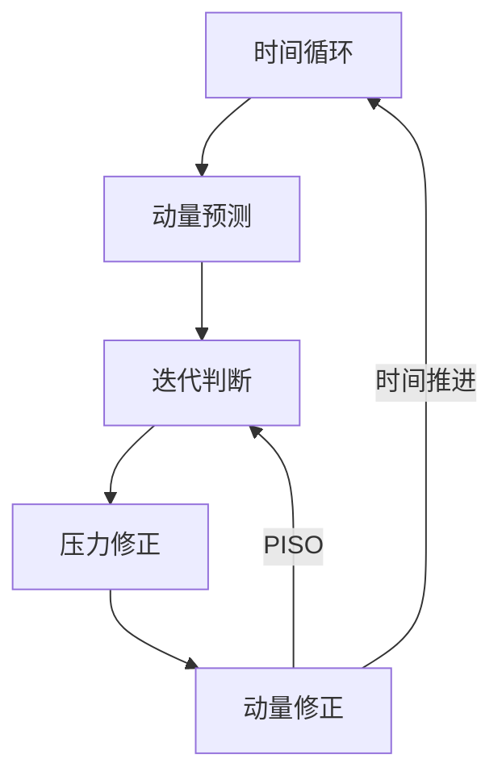

> [!important]
> 访问 [https://aerosand.cc](https://aerosand.cc/) 以获取最近更新。
> Visit [https://aerosand.cc](https://aerosand.cc/) for the latest updates.

## 0. 前言

前面两篇讨论了主要基于稳态问题的 SIMPLE 算法和代码实现，本文讨论求解瞬态问题的 PISO 算法。

本文主要讨论

- [ ] PISO 算法
- [ ] 方程松弛

## 1. 控制方程

考虑无重力瞬态不可压缩流动的 NS 方程

连续方程（质量方程）

$$
\nabla\cdot U = 0
$$

描述了粘性力的动量方程

$$
\frac{\partial}{\partial t}(\cancel{\rho} U) + \nabla \cdot (\cancel{\rho} UU) = - \frac{1}{\rho} \nabla p + \frac{1}{\rho} \nabla\cdot\vec{\tau} + \cancel{\rho\vec{g}}
$$

参考前文关于压力项和粘度项的密度处理，最终有

控制方程为

连续方程（质量方程）

$$
\nabla\cdot U = 0
$$

描述了粘性力的动量方程

$$
\frac{\partial U}{\partial t} + \nabla \cdot ( UU) = -  \nabla p + (\nabla\cdot\vec{\tau})
$$


## 2. PISO

在 OpenFOAM 中，PISO（**P**ressure-**I**mplicit with **S**plitting of **O**perators）算法用于求解瞬态问题。

> [!tip]
> 我们最初的几次讨论将会繁琐啰嗦一些。


### 2.1. 动量预测

在某个时间步或者初始时间步，我们由上一步求得的已知速度压力场或者初始已知速度压力场，根据动量方程直接求出一个预测的速度场。

$$
\frac{\partial U}{\partial t} + \nabla \cdot ( UU) = -  \nabla p + (\nabla\cdot\vec{\tau})
$$

约定每个时间迭代步内，【动量预测】求解动量方程得到的预测速度表示为 $U^{pre}$

动量方程简化为

$$
MU^{pre} = -\nabla p^{old}
$$

求解动量方程的步骤被称为【动量预测】（momentum predictor），求得预测速度 $U^{pre}$。

### 2.2. 第一次压力修正

求解连续方程，也即求解压力修正方程

我们有类似于 SIMPLE  算法的分析，如下

动量方程

$$
MU = AU - H(U) = -\nabla p
$$

有

$$
U = A^{-1}H(U) -A^{-1}\nabla p
$$

速度还需要满足连续方程

$$
\nabla\cdot U = 0
$$

即有

$$
\nabla\cdot(A^{-1}H(U) -A^{-1}\nabla p) = 0
$$

整理有

$$
\nabla\cdot(A^{-1}\nabla p^{}) = \nabla\cdot(A^{-1}H(U))
$$

其中

$$HbyA(U) = A^{-1}H(U)$$

所谓的压力修正，也就是，用上面得到的预测速度来计算新的压力（修正压力）

$$
\nabla\cdot(A^{-1,pre}\nabla p^{cor1}) = \nabla\cdot(HbyA(U^{pre}))
$$

其中 

$$
HbyA(U^{pre}) = A^{-1,pre}H(U^{pre})
$$

理论上，为了求解得精确压力，我们应该提供精确的 $HbyA(U^{acc})$。

$$
HbyA(U^{acc})=HbyA(U^{pre})+HbyA(U^{'})
$$

实际上，我们只能提供基于预测速度的 $HbyA(U^{pre})$ 参与求解计算。

这样的操作，在实际上是假设忽略 $HbyA(U^{'})$ 对计算的影响并不大。


> [!question]
> 同样会问，这里的忽略到底会产生什么影响呢？


上式中，$A^{-1,pre}$ 基于【动量预测】的预测速度求得，$HbyA(U^{pre})(= A^{-1,pre}H(U^{pre}))$ 同样基于【动量预测】的预测速度求得。

由此，可以求解得到【第一次压力修正】后的第一次修正压力 $p^{cor1}$。

### 2.3. 第一次动量修正

在【第一次压力修正】后，修正速度有

$$
U^{cor1} = HbyA(U^{pre}) -A^{-1,pre}\nabla p^{cor1}
$$

上式中，$A^{-1,pre}$ 基于【动量预测】的预测速度求得，$HbyA(U^{pre})(= A^{-1,pre}H(U^{pre}))$ 同样基于【动量预测】的预测速度求得，$p^{cor1}$ 是【第一次压力修正】后的修正压力。

可以求解得到【第一次动量修正】后的第一次修正速度 $U^{cor1}$ 。

对于稳态问题， SIMPLE 算法只执行一次压力动量修正。如果多次修正的话，因为每次修正都使用旧的$A$，收益不大，效果不如直接进行外循环。

对于瞬态问题，每个时间步的求解场值都对下一个时间步的计算至关重要。对于每个时间步，参与计算的 $H(U)$ 随着速度场更新而变化。多次修正，可以解决为了满足连续性方程时，所产生的偏差。

### 2.4. 第二次压力修正


因为速度得到了修正，

$$
HbyA(U^{cor1}) = A^{-1,pre}H(U^{cor1})
$$

所以此时的 $HbyA(U^{pre})$ 自动更新成了 $HbyA(U^{cor1})$。

> [!note]
> 还记得 $H(U)$ 和 $A$ 不同，$H(U)$ 是关于 $U$ 变化的。

$$
\nabla\cdot(A^{-1,pre}\nabla p^{cor2}) = \nabla\cdot(HbyA(U^{cor1}))
$$

由此，可以求解得到【第二次压力修正】后的第二次修正压力 $p^{cor2}$。

### 2.5. 第二次动量修正

在【第一次压力修正】后，修正速度有

$$
U^{cor2} = HbyA(U^{cor1}) -A^{-1,pre}\nabla p^{cor2}
$$

上式中，$A^{-1,pre}$ 依然是基于【动量预测】的预测速度求得，而 $HbyA(U^{cor1})(= A^{-1,pre}H(U^{cor1}))$ 随着【第一次动量预测】的预测速度变化而发生了更新，$p^{cor2}$ 是【第二次压力修正】后的修正压力。

可以求解得到【第二次动量修正】后的第二次修正速度 $U^{cor2}$ 。

### 2.6. 内循环


压力修正和动量修正可以形成循环迭代，直到修正压力和修正速度满足要求。

一般来说，压力动量修正两次就可以了，次数再多的收益会很小。可以简单理解为，第一次修正是为了满足连续性方程。第二次修正是为了解决在满足连续性方程时所产生的误差（如忽略邻点速度修正的误差），以及其他误差。

>[!tip] 
>这个过程也被称为 inner loop

由内循环迭代结束时候得到的速度场和压力场作为旧时间步的结果，参与到下一个时间步的计算。

整理流程可以总结如下



关于 PISO 算法框架，摘抄主要代码如下

```cpp {fileName="pisoFoam",base_url="https://aerosand.cc",linenos=table,linenostart=1}

    while (runTime.loop())
    {
        Info<< "Time = " << runTime.timeName() << nl << endl;
		
		...

        // Pressure-velocity PISO corrector
        {
            #include "UEqn.H"

            // --- PISO loop
            while (piso.correct())
            {
                #include "pEqn.H"
            }
        }

		...

    }
```

### 2.7. 其他讨论

就像我们之前提出的疑问，既然在动量修正中可以求解得到速度，而且动量修正是基于动量方程推导而来的，还需要进行动量预测吗？

事实上，观察原生求解器代码会注意到，OpenFOAM 提供了是否动量预测的选项，例如在 `pisoFoam` 中，有

```cpp {fileName="pisoFoam/UEqn.H",base_url="https://aerosand.cc",linenos=table,linenostart=1}
...
if (piso.momentumPredictor())
{
    solve(UEqn == -fvc::grad(p));

    fvOptions.correct(U);
}

```

虽然 OpenFOAM 提供了此选项，但是跳过预测会使得每个时间步开始计算时，速度场是简单使用上一个时间步的速度场，这样会对每一个时间步减少一定的计算量，但是少了动量方程的直接约束，收敛速度很可能会降低，计算的稳定性也很有可能下降。

一般情况下，求解器都需要进行动量预测。

此外，对于 PISO 算法来说，一般要求库朗数必须小于 1 。本文的讨论以算法主要思路为重点，暂不深究这个问题，以后会详细讨论。

## 3. 方程松弛

在讲完 SIMPLE 和 PISO 理论后，通过两种算法的对比，可以简单讨论一下之前提到的松弛问题。

SIMPLE 算法最一开始用来计算稳态流动，也就是没有时间瞬态项。

如果有时间瞬态项，当时间步长很小的时候，离散后的时间瞬态项将比其他项大的多得多，此时也会主导系数矩阵的对角元素。

越小的时间步长，系数矩阵越占优。对角占优在物理上意味着有限体积单元的本单元影响大于邻单元的影响。对角占优在数学上保证了系数矩阵的可逆性，保证了迭代法的可用，也保证数值误差不会被放大。

而对于稳态问题，没有瞬态问题中对角占优的优势，所以为了达到对角占优，求解器需要使用亚松弛来增加对角占优性质，从而提高计算稳定性。

> [!tip]
> 对离散方程有困惑的，需要复习有限体积法的基础知识。

参考前文 `07_fvmBasics` ，对于一般的物理场 $\phi$ （或者是前文的 $U$ ） 来说，离散后的控制方程如下

$$
a_{P}\phi_{P}+\sum\limits_{N}a_{N}\phi_{N} = S - \nabla p
$$

增加相同的人工项，离散方程依然为

$$
\frac{1-\alpha}{\alpha}a_{P}\phi_{P} + a_{P}\phi_{P} + \sum\limits a_{N}\phi_{N} - \frac{1-\alpha}{\alpha}a_{P}\phi_{P} = S - \nabla p
$$

离散方程此时为

$$
\frac{1}{\alpha}a_{P}\phi_{P} + \sum\limits a_{N}\phi_{N} - \frac{1-\alpha}{\alpha}a_{P}\phi_{P} = S - \nabla p
$$

对于稳态计算，或者当计算逐渐收敛于稳定状态的时候，或者两次迭代之间的场量差很小，我们认为右侧人工项的新迭代步和旧迭代步的场量几乎相等，即

$$
\phi_{P}^{old-iteration} = \phi_{P}
$$

整理后的离散方程也就是

$$
\frac{1}{\alpha}a_{P}\phi_{P} + \sum\limits a_{N}\phi_{N} = S - \nabla p+ \frac{1-\alpha}{\alpha}a_{P}\phi_{P}^{old-iteration}
$$

一般情况下，松弛因子 $0 < \alpha < 1$ ，所以对于求解代数系统的系数矩阵，其对角元素增大了，也就是增加了对角占优性质，也就是增加了计算稳定性。

注意到，对于上述松弛后的方程，在数值求解上，仍然约等于求解原方程。

> [!warning]
> 注意，这里只讨论了方程松弛，没有讨论场量松弛。以后会继续讨论场量松弛。


## 4. 小结

我们一起讨论了 PISO 算法。在 PISO 算法和 SIMPLE 算法的比较中，讨论了矩阵松弛。相信通过这些讨论，我们已经较为完整的理解了 SIMPLE 和 PISO 算法的整个过程。

本文完成讨论

- [x] PISO 算法
- [x] 方程松弛


## 支持我们 Support us

>[!tip]
>希望这里的分享可以对坚持、热爱又勇敢的您有所帮助。 
>Hopefully, the sharing here can be helpful to you.
>
>如果这里的分享对您有帮助，您的评论或赞助将对本系列以及后续其他系列的更新、勘误、迭代和完善都有很大的意义，这些行动也会为后来的新同学的学习有很大的助益。
>If you find this content helpful, your comments or donations would be greatly appreciated. Your support helps ensure the ongoing updates, corrections, refinements, and improvements to this and future series, ultimately benefiting new readers as well.
>
>赞助打赏时的信息和留言将用于展示和感谢。
>The information and message provided during donation will be displayed as an acknowledgment of your support.


  



> Copyright @ 2026 Aerosand
> 
> - 课程（文本、图片等）：[CC BY-NC-SA 4.0](https://creativecommons.org/licenses/by-nc-sa/4.0/)
> - OpenFOAM 开发代码：[GPL v3](https://www.gnu.org/licenses/gpl-3.0.html)
> - 其他代码：[MIT License](https://opensource.org/licenses/MIT)
> 
> - Course (text, images, etc.): [CC BY-NC-SA 4.0](https://creativecommons.org/licenses/by-nc-sa/4.0/)
> - Code derived from OpenFOAM: [GPL v3](https://www.gnu.org/licenses/gpl-3.0.html)
> - Other code: [MIT License](https://opensource.org/licenses/MIT)

