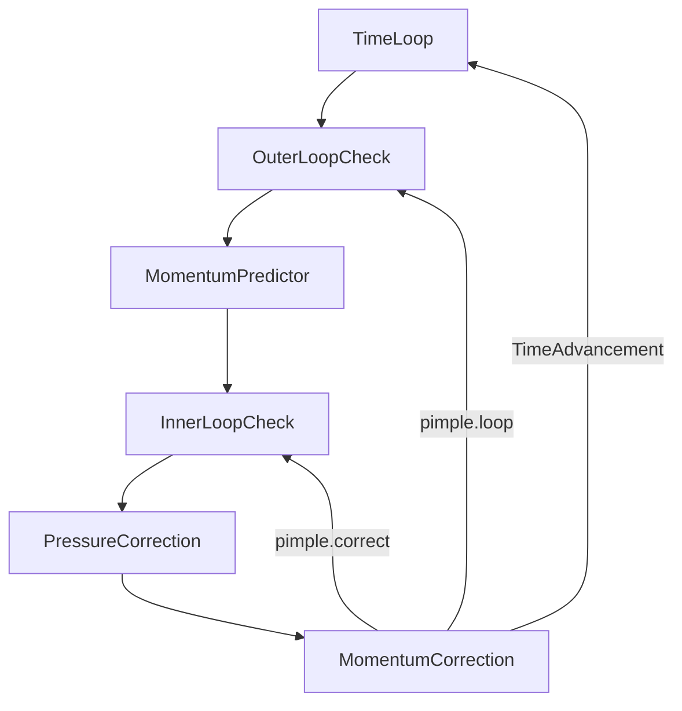

> [!important]
> 访问 [https://aerosand.cc](https://aerosand.cc/) 以获取最近更新。  
> Visit [https://aerosand.cc](https://aerosand.cc/) for the latest updates.


## 0. Preface

The previous two sections discussed the SIMPLE algorithm for steady-state problems and the PISO algorithm for transient problems. This section will discuss the PIMPLE algorithm, which balances transient accuracy and computational efficiency.

This section primarily discusses:

- [ ] The PIMPLE algorithm


## 1. Governing Equations

Similar to the discussion in `22_piso`, consider the Navier-Stokes equations for transient, incompressible flow without body forces:

Continuity equation (mass equation):

$$
\nabla\cdot U = 0
$$

Momentum equation describing viscous forces:

$$
\frac{\partial}{\partial t}(\cancel{\rho} U) + \nabla \cdot (\cancel{\rho} UU) = - \frac{1}{\rho} \nabla p + \frac{1}{\rho} \nabla\cdot\vec{\tau} + \cancel{\rho\vec{g}}
$$

Referring to the previous discussion on the treatment of density in the pressure and viscosity terms, we ultimately have:

Continuity equation (mass equation):

$$
\nabla\cdot U = 0
$$

Momentum equation describing viscous forces:

$$
\frac{\partial U}{\partial t} + \nabla \cdot ( UU) = -  \nabla p + (\nabla\cdot\vec{\tau})
$$


## 2. PIMPLE

In OpenFOAM, the PIMPLE algorithm combines the features of both PISO and SIMPLE algorithms.

It is generally believed that the PISO algorithm offers high accuracy and is suitable for capturing fine transient flow details. However, the PISO algorithm requires the Courant number to be less than 1, meaning the time step must be very small, leading to slow computation, especially for problems with fine meshes or high velocities, where the computational cost becomes high.

The SIMPLE algorithm is considered robust and allows the use of larger relaxation factors to ensure stability, making it well-suited for steady-state problems. However, when applied to transient problems, its performance is insufficient.

In view of this, researchers introduced the PIMPLE algorithm to combine the advantages of both PISO and SIMPLE.

### 2.1. Momentum Predictor

We also have a momentum predictor.

At a given time step or the initial time step, we use the known velocity and pressure fields from the previous step or the initial known fields to directly solve for a predicted velocity field from the momentum equation.

$$
\frac{\partial U}{\partial t} + \nabla \cdot ( UU) = -  \nabla p + (\nabla\cdot\vec{\tau})
$$

Within each time iteration step, the predicted velocity obtained from solving the momentum equation in the **momentum predictor** is denoted as $U^{pre}$.

The momentum equation is simplified to:

$$
MU^{pre} = -\nabla p^{old}
$$

The step of solving the momentum equation is called the **momentum predictor**, yielding the predicted velocity $U^{pre}$.

### 2.2. First Pressure Correction

Solving the continuity equation is equivalent to solving the pressure correction equation.

We have an analysis similar to that of the SIMPLE and PISO algorithms, as follows:

Momentum equation:

$$
MU = AU - H(U) = -\nabla p
$$

Thus:

$$
U = A^{-1}H(U) -A^{-1}\nabla p
$$

The velocity must also satisfy the continuity equation:

$$
\nabla\cdot U = 0
$$

Therefore:

$$
\nabla\cdot(A^{-1}H(U) -A^{-1}\nabla p) = 0
$$

Rearranging:

$$
\nabla\cdot(A^{-1}\nabla p^{}) = \nabla\cdot(A^{-1}H(U))
$$

where

$$HbyA(U) = A^{-1}H(U)$$

The so-called pressure correction uses the predicted velocity obtained above to calculate a new pressure (corrected pressure):

$$
\nabla\cdot(A^{-1,pre}\nabla p^{cor1}) = \nabla\cdot(HbyA(U^{pre}))
$$

where

$$
HbyA(U^{pre}) = A^{-1,pre}H(U^{pre})
$$

Theoretically, to solve for the exact pressure, we should provide an accurate $HbyA(U^{acc})$.

$$
HbyA(U^{acc})=HbyA(U^{pre})+HbyA(U^{'})
$$

In practice, we can only provide $HbyA(U^{pre})$ based on the predicted velocity for the solution.

This operation essentially assumes that ignoring $HbyA(U^{'})$ does not significantly affect the calculation.

> [!question]
> Again, what effect does this neglect actually have?


In the above equation, $A^{-1,pre}$ is obtained based on the predicted velocity from the **momentum predictor**, and $HbyA(U^{pre})(= A^{-1,pre}H(U^{pre}))$ is also obtained based on the predicted velocity from the **momentum predictor**.

From this, we can solve for the first corrected pressure $p^{cor1}$ after the **first pressure correction**.

### 2.3. First Momentum Correction

After the **first pressure correction**, the corrected velocity is:

$$
U^{cor1} = HbyA(U^{pre}) -A^{-1,pre}\nabla p^{cor1}
$$

In the above equation, $A^{-1,pre}$ is obtained based on the predicted velocity from the **momentum predictor**, $HbyA(U^{pre})(= A^{-1,pre}H(U^{pre}))$ is also based on the predicted velocity from the **momentum predictor**, and $p^{cor1}$ is the corrected pressure after the **first pressure correction**.

This solves for the first corrected velocity $U^{cor1}$ after the **first momentum correction**.

For steady-state problems, the SIMPLE algorithm performs the pressure and momentum correction only once. If multiple corrections were performed, since each correction uses the old $A$, the benefit would be minimal, and it would be less effective than directly performing an outer loop.

For transient problems, the solved field values at each time step are crucial for the calculation of the next time step. For each time step, $H(U)$ involved in the calculation changes as the velocity field updates. Multiple corrections can address the deviations introduced when satisfying the continuity equation.


### 2.4. Second Pressure Correction

Because the velocity has been corrected,

$$
HbyA(U^{cor1}) = A^{-1,pre}H(U^{cor1})
$$

Thus, $HbyA(U^{pre})$ is automatically updated to $HbyA(U^{cor1})$.

> [!note]
> Recall that $H(U)$ is different from $A$; $H(U)$ varies with $U$.


$$
\nabla\cdot(A^{-1,pre}\nabla p^{cor2}) = \nabla\cdot(HbyA(U^{cor1}))
$$


From this, we can solve for the second corrected pressure $p^{cor2}$ after the **second pressure correction**.

### 2.5. Second Momentum Correction

After the **second pressure correction**, the corrected velocity is:

$$
U^{cor2} = HbyA(U^{cor1}) -A^{-1,pre}\nabla p^{cor2}
$$

In the above equation, $A^{-1,pre}$ is still obtained based on the predicted velocity from the **momentum predictor**, while $HbyA(U^{cor1})(= A^{-1,pre}H(U^{cor1}))$ has been updated as the predicted velocity from the **first momentum correction** changes, and $p^{cor2}$ is the corrected pressure after the **second pressure correction**.

This solves for the second corrected velocity $U^{cor2}$ after the **second momentum correction**.

### 2.6. Inner Loop

Pressure correction and momentum correction can form an iterative loop until the corrected pressure and velocity meet the requirements.

Similar to the PISO algorithm, generally two pressure-momentum corrections are sufficient; further corrections yield diminishing returns. A simple interpretation is that the first correction satisfies the continuity equation, while the second correction addresses errors introduced when satisfying the continuity equation (such as errors from neglecting neighbor velocity corrections), along with other errors.

>[!tip] 
>This process is also referred to as the inner loop.


The velocity and pressure fields obtained at the end of the inner loop are used for the outer loop calculation.


### 2.7. Outer Loop

Since the PIMPLE algorithm is designed for large Courant number computations, the Courant number is defined as:

$$
Co = \frac{u\cdot \Delta t}{\Delta x}
$$

This means either the time step is relatively large or the velocity is high.

Under these conditions, numerical computations inevitably face significant velocity variations, which also lead to issues with the nonlinear treatment of the convection term. This also implies the problem of "pressure-velocity coupling instability at large Courant numbers." To avoid computational instability, researchers introduced an outer loop similar to the SIMPLE algorithm into the overall process. That is, before advancing to the next time step, the momentum equation is used again to constrain the velocity field—this is the momentum predictor.

The velocity and pressure fields obtained from the outer loop then participate in the calculation of the next time step.

The workflow can be summarized as follows:



Regarding the PIMPLE algorithm framework, the main code is excerpted as follows:

```cpp {fileName="pisoFoam",base_url="https://aerosand.cc",linenos=table,linenostart=1}

    while (runTime.loop()) // Time advancement
    {
        Info<< "Time = " << runTime.timeName() << nl << endl;
		
		// --- Pressure-velocity PIMPLE corrector loop
        while (pimple.loop()) // PIMPLE outer loop
        {
			...
			
            #include "UEqn.H" // Momentum predictor

            // --- Pressure corrector loop
            while (pimple.correct()) // PIMPLE inner loop
            {
                #include "pEqn.H" // Pressure-velocity coupling
            }

			...
        }
		
    }
```

## 3. Summary

We have discussed the PIMPLE algorithm together. In the next section, we will implement a simple PIMPLE solver in OpenFOAM based on this discussion.

This section has completed the following discussions:

- [x] The PIMPLE algorithm


## 支持我们 Support us

>[!tip]
>希望这里的分享可以对坚持、热爱又勇敢的您有所帮助。   
>Hopefully, the sharing here can be helpful to you.
>
>如果这里的分享对您有帮助，您的评论或赞助将对本系列以及后续其他系列的更新、勘误、迭代和完善都有很大的意义，这些行动也会为后来的新同学的学习有很大的助益。  
>If you find this content helpful, your comments or donations would be greatly appreciated. Your support helps ensure the ongoing updates, corrections, refinements, and improvements to this and future series, ultimately benefiting new readers as well.
>
>赞助打赏时的信息和留言将用于展示和感谢。  
>The information and message provided during donation will be displayed as an acknowledgment of your support.


  



> Copyright @ 2026 Aerosand
> 
> - 课程（文本、图片等）Course (text, images, etc.)：[CC BY-NC-SA 4.0](https://creativecommons.org/licenses/by-nc-sa/4.0/)
> - OpenFOAM 开发代码 Code derived from OpenFOAM：[GPL v3](https://www.gnu.org/licenses/gpl-3.0.html)
> - 其他代码 Other code：[MIT License](https://opensource.org/licenses/MIT)


