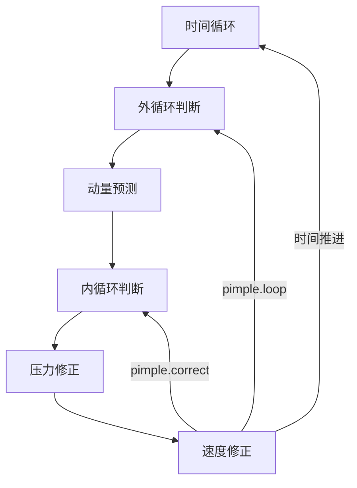

> [!important]
> 访问 https://aerosand.cn 以获取最近更新。


## 0. 前言

前面两篇讨论了主要基于稳态问题的 SIMPLE 算法和基于瞬态问题的 PISO 算法，本文将讨论兼顾了瞬态和计算效率的 PIMPLE 算法。

本文主要讨论

- [ ] PIMPLE 算法


## 1. 控制方程

类似于 `22_piso` 一文的讨论，考虑无重力瞬态不可压缩流动的 NS 方程

连续方程（质量方程）

$$
\nabla\cdot U = 0
$$

描述了粘性力的动量方程

$$
\frac{\partial}{\partial t}(\cancel{\rho} U) + \nabla \cdot (\cancel{\rho} UU) = - \frac{1}{\rho} \nabla p + \frac{1}{\rho} \nabla\cdot\vec{\tau} + \cancel{\rho\vec{g}}
$$

参考前文关于压力项和粘度项的密度处理，最终有

控制方程为

连续方程（质量方程）

$$
\nabla\cdot U = 0
$$

描述了粘性力的动量方程

$$
\frac{\partial U}{\partial t} + \nabla \cdot ( UU) = -  \nabla p + (\nabla\cdot\vec{\tau})
$$


## 2. PIMPLE

在 OpenFOAM 中，PIMPLE 算法结合了 PISO 算法和 SIMPLE 算法。

一般认为 PISO 算法精度高，适合捕捉精细的瞬态流场变化。但是 PISO 算法要求库朗数必须小于 1 。这意味着时间步长必须非常小，导致计算速度慢，尤其对于网格很精细或流速很快的问题来说，计算成本会很高。

一般认为 SIMPLE 算法较为稳健，允许使用较大的松弛因子来保证计算稳定，非常适合稳态问题。但是如果用于瞬态问题，则计算效果不足。

鉴于此，学者们引入了 PIMPLE 算法用以结合 PISO 和 SIMPLE 算法的优点。

### 2.1. 动量预测

我们同样有动量预测。

在某个时间步或者初始时间步，我们由上一步求得的已知速度压力场或者初始已知速度压力场，根据动量方程直接求出一个预测的速度场。

$$
\frac{\partial U}{\partial t} + \nabla \cdot ( UU) = -  \nabla p + (\nabla\cdot\vec{\tau})
$$

约定每个时间迭代步内，【动量预测】求解动量方程得到的预测速度表示为 $U^{pre}$

动量方程简化为

$$
MU^{pre} = -\nabla p^{old}
$$

求解动量方程的步骤被称为【动量预测】（momentum predictor），求得预测速度 $U^{pre}$。

### 2.2. 第一次压力修正

求解连续方程，也即求解压力修正方程

我们有类似于 SIMPLE  算法和 PISO 算法的分析，如下

动量方程

$$
MU = AU - H(U) = -\nabla p
$$

有

$$
U = A^{-1}H(U) -A^{-1}\nabla p
$$

速度还需要满足连续方程

$$
\nabla\cdot U = 0
$$

即有

$$
\nabla\cdot(A^{-1}H(U) -A^{-1}\nabla p) = 0
$$

整理有

$$
\nabla\cdot(A^{-1}\nabla p^{}) = \nabla\cdot(A^{-1}H(U))
$$

其中

$$HbyA(U) = A^{-1}H(U)$$

所谓的压力修正，也就是，用上面得到的预测速度来计算新的压力（修正压力）

$$
\nabla\cdot(A^{-1,pre}\nabla p^{cor1}) = \nabla\cdot(HbyA(U^{pre}))
$$

其中 

$$
HbyA(U^{pre}) = A^{-1,pre}H(U^{pre})
$$

理论上，为了求解得精确压力，我们应该提供精确的 $HbyA(U^{acc})$。

$$
HbyA(U^{acc})=HbyA(U^{pre})+HbyA(U^{'})
$$

实际上，我们只能提供基于预测速度的 $HbyA(U^{pre})$ 参与求解计算。

这样的操作，在实际上是假设忽略 $HbyA(U^{'})$ 对计算的影响并不大。


> [!question]
> 同样会问，这里的忽略到底会产生什么影响呢？


上式中，$A^{-1,pre}$ 基于【动量预测】的预测速度求得，$HbyA(U^{pre})(= A^{-1,pre}H(U^{pre}))$ 同样基于【动量预测】的预测速度求得。

由此，可以求解得到【第一次压力修正】后的第一次修正压力 $p^{cor1}$。

### 2.3. 第一次动量修正

在【第一次压力修正】后，修正速度有

$$
U^{cor1} = HbyA(U^{pre}) -A^{-1,pre}\nabla p^{cor1}
$$

上式中，$A^{-1,pre}$ 基于【动量预测】的预测速度求得，$HbyA(U^{pre})(= A^{-1,pre}H(U^{pre}))$ 同样基于【动量预测】的预测速度求得，$p^{cor1}$ 是【第一次压力修正】后的修正压力。

可以求解得到【第一次动量修正】后的第一次修正速度 $U^{cor1}$ 。

对于稳态问题， SIMPLE 算法只执行一次压力动量修正。如果多次修正的话，因为每次修正都使用旧的$A$，收益不大，效果不如直接进行外循环。

对于瞬态问题，每个时间步的求解场值都对下一个时间步的计算至关重要。对于每个时间步，参与计算的 $H(U)$ 随着速度场更新而变化。多次修正，可以解决为了满足连续性方程时，所产生的偏差。

### 2.4. 第二次压力修正


因为速度得到了修正，

$$
HbyA(U^{cor1}) = A^{-1,pre}H(U^{cor1})
$$

所以此时的 $HbyA(U^{pre})$ 自动更新成了 $HbyA(U^{cor1})$。

> [!note]
> 还记得 $H(U)$ 和 $A$ 不同，$H(U)$ 是关于 $U$ 变化的。

$$
\nabla\cdot(A^{-1,pre}\nabla p^{cor2}) = \nabla\cdot(HbyA(U^{cor1}))
$$

由此，可以求解得到【第二次压力修正】后的第二次修正压力 $p^{cor2}$。

### 2.5. 第二次动量修正

在【第一次压力修正】后，修正速度有

$$
U^{cor2} = HbyA(U^{cor1}) -A^{-1,pre}\nabla p^{cor2}
$$

上式中，$A^{-1,pre}$ 依然是基于【动量预测】的预测速度求得，而 $HbyA(U^{cor1})(= A^{-1,pre}H(U^{cor1}))$ 随着【第一次动量预测】的预测速度变化而发生了更新，$p^{cor2}$ 是【第二次压力修正】后的修正压力。

可以求解得到【第二次动量修正】后的第二次修正速度 $U^{cor2}$ 。

### 2.6. 内循环


压力修正和动量修正可以形成循环迭代，直到修正压力和修正速度满足要求。

类似 PISO 算法，一般来说，压力动量修正两次就可以了，次数再多的收益会很小。可以简单理解为，第一次修正是为了满足连续性方程。第二次修正是为了解决在满足连续性方程时所产生的误差（如忽略邻点速度修正的误差），以及其他误差。

>[!tip] 
>这个过程也被称为 inner loop

由内循环迭代结束时候得到的速度场和压力场，用于外循环计算。

### 2.7. 外循环

因为 PIMPLE 算法是为了用于大库朗数的计算，库朗数定义为

$$
Co = \frac{u\cdot \Delta t}{\Delta x}
$$

即时间步比较大，或者速度比较大。

此时的数值计算会不可避免的面临速度变化大的情况，此时对流项的非线性处理也有有了问题，这也意味着会出现所谓的“大库朗数下的压力速度耦合失稳”的问题。为了避免计算失稳，学者们为整个流程引入类似 SIMPLE 算法的外循环，即在开始下一个时间步之前，再次使用动量方程对速度场进行约束，也就是动量预测。

外循环最后得到的速度场和压力场，参与到下一个时间步的计算。

整理流程可以总结如下



关于 PIMPLE 算法框架，摘抄主要代码如下

```cpp {fileName="pisoFoam",base_url="https://aerosand.cc",linenos=table,linenostart=1}

    while (runTime.loop()) // 时间推进
    {
        Info<< "Time = " << runTime.timeName() << nl << endl;
		
		// --- Pressure-velocity PIMPLE corrector loop
        while (pimple.loop()) // PIMPLE 外循环
        {
			...
			
            #include "UEqn.H" // 动量预测

            // --- Pressure corrector loop
            while (pimple.correct()) // PIMPLE 内循环
            {
                #include "pEqn.H" // 压力速度耦合
            }

			...
        }
		
    }
```

## 3. 小结

我们一起讨论了 PIMPLE 算法。下一篇，我们将基于这里的讨论，在 OpenFOAM 实现一个简单的 PIMPLE 求解器。

本文完成讨论

- [x] PIMPLE 算法


## 支持我们

>[!tip]
>希望这里的分享可以对坚持、热爱又勇敢的您有所帮助。 
>
>如果这里的分享对您有帮助，您的评论、转发和赞助将对本系列以及后续其他系列的更新、勘误、迭代和完善都有很大的意义，这些行动也会为后来的新同学的学习有很大的助益。 
>
>赞助打赏时的信息和留言将用于展示和感谢。


  

