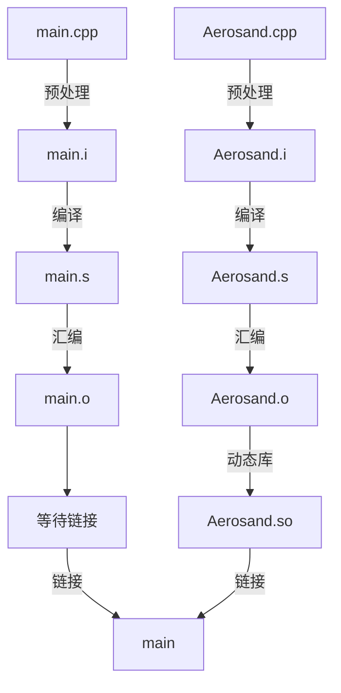

## 0. 前言

本文主要讨论如下

- [ ] 理解 C++ 代码的编译原理
- [ ] 理解动态库
- [ ] 编译运行 helloWorld 项目

## 1. 开始

> [!tip]
> 对于 OpenFOAM 来说，不管是求解器还是算例，放在任何一个文件夹都可以。放在 `$FOAM_RUN` 路径下也只是为了方便管理。

我们约定

- `userPath/`：用户指定路径

该路径下再新建例如 `userPath/ofsp/` 文件夹，`ofsp/` 下再新建各个子项目的文件夹。

例如，

终端输入命令，新建总项目文件夹

```terminal {filename="terminal"}
mkdir /userPath/ofsp  
```

> `ofsp` 即 `OpenFoam sharing programming` 的缩写

我们可以将 `ofsp` 设置为快捷命令，这样子在终端输入 `ofsp` 后可以直接跳转到项目文件夹下。

终端输入命令，打开 `bashrc` 文件

```terminal {filename="terminal"}
gedit ~/.bashrc
```

在 `bashrc` 文件末尾添加以下语句

```bash {fileName="bashrc"}
alias ofsp='cd /userPath/ofsp'
alias ofss='cd /userPath/ofss'
```

终端输入命令，使快捷命令生效

```terminal {fileName="terminal"}
source ~/.bashrc
```

## 2. 项目

通过终端新建本文的子项目的文件夹

终端输入命令

```terminal {fileName="terminal"}
ofsp
mkdir ofsp_02_helloWorld
code ofsp_02_helloWorld
```

通过 vscode 打开项目后，可以使用 `ctrl + ~` 唤出 vscode 的终端控制台，快捷进行命令操作。

终端输入命令，新建项目下文件并空白保存

```terminal {fileName="terminal"}
code main.cpp Aerosand.cpp Aerosand.h
```

终端输入 `tree` 命令，查看文件树状结构

```terminal {fileName="terminal"}
tree
.
├── Aerosand.cpp
├── Aerosand.h
└── main.cpp
```

> [!tip]
> 如果无法使用 `tree` 命令，请按照终端提示安装 `tree` 即可

我们分别写入代码，内容如下

类的声明 Class  `Aerosand.h` 如下

```cpp {fileName="/Aerosand.h",linenos=table,linenostart=1}
#pragma once

class Aerosand
{
public:
    void setLocalTime(double t);
    double getLocalTime() const;


private:
    double localTime_;
};
```

> [!tip]
> 这里尽量贴近 OpenFOAM 的代码风格，比如函数名和变量采用驼峰命名，私有成员变量名称尾缀下划线等。

类的定义 `Aerosand.cpp` 如下

```cpp {fileName="/Aerosand.cpp",linenos=table}
#include "Aerosand.h"

void Aerosand::setLocalTime(double t) {
    localTime_ = t;
}

double Aerosand::getLocalTime() const {
    return localTime_;
}
```

主源码 `main.cpp` 如下

```cpp {fileName="/main.cpp", linenos=table}
#include <iostream>

#include "Aerosand.h"

using namespace std;

int main()
{
    int a = 1;
    double pi = 3.1415926;

    cout << "Hi, OpenFOAM!" << " Here we are." << endl;
    cout << a << " + " << pi << " = " << a + pi << endl;
    cout << a << " * " << pi << " = " << a * pi << endl;


    Aerosand mySolver;
    mySolver.setLocalTime(0.2);
    cout << "\nCurrent time step is : " << mySolver.getLocalTime() << endl;

    return 0;
}
```

虽然我们笼统的把代码到程序的整个过程称为“编译”，实际上，在 Linux 系统下，C++ 程序的“编译”分成四个过程。


>[!warning]
>本文后续讨论的终端指令运行路径均留在 `ofsp/ofsp_02_helloWorld/` 不变


## 3. 代码编译

### 3.1. 预处理

**预处理 Preprocessing** 是编译过程的第一阶段，发生在真实编译（生成目标代码）之前。它由**预处理器 Preprocessor** 负责处理源代码中以 `#` 开头的指令，这些指令也被称为**预处理指令**。

比如，`#include` 将提示把另一个文件的内容插入到当前位置，`#define` 将提示把宏定义替换到此处等等。

生成。

终端输入命令，执行预处理

```terminal {fileName="terminal"}
g++ -E Aerosand.cpp -o Aerosand.i  
g++ -E main.cpp -o main.i
```

其中

- g++ 的 `-E` 标识预处理器进行预处理
- g++ 的 `-o` （小写）标识指定生成的文件

在 Linux 系统下生成两个新文件

- `Aerosand.i` 
- `main.i`

后缀 `.i` 表示**中间预处理输出文件 intermediate preprocessing output**。

### 3.2. 编译

**编译 Compile** 是**编译器 Compiler** 把预处理后的源代码（`.i` 或 `.i` 文件）转换成汇编代码（`.s` 文件）的过程。

编译器将会对已经展开（头文件、宏等）的源代码进行语法分析、语义分析、优化等工作，最终生成会变代码。

终端输入命令，执行编译

```terminal {fileName="terminal"}
g++ -S Aerosand.i -o Aerosand.s
g++ -S main.i -o main.s
```

- g++ 的 `-S` 标识指定编译器进行编译（大写 `S` ）

在 Linux 系统下生成两个新文件

- `Aerosand.s` 
- `main.s`

后缀 `.s`（小写）表示**汇编语言形式的源文件 source code written in assembly**。

### 3.3. 汇编

**汇编 Assemble** 是指**汇编器 Assembler** 将后缀 `.s` 表示的汇编语言形式的源文件转换成**机器指令 Machine code**，输出为**目标文件 Object file**的过程。

汇编器将上一步的文件转换成人类可读的汇编语言，最终生成的与机器平台相关的二进制文件，不能直接运行，需要进一步处理。

终端输入命令，执行汇编

```terminal {fileName="terminal"}
g++ -c Aerosand.s -o Aerosand.o
g++ -c main.s -o main.o
```

- g++ 的 `-c` （小写）标识指定汇编器进行汇编

在 Linux 系统下生成两个新文件

- `Aerosand.o` 
- `main.o`

后缀 `.o`（小写）表示**目标文件 object file**。

### 3.4. 链接

**链接 Link** 是**链接器 Linker** 把多个目标文件和系统库文件组合成一个完整可执行程序的过程。

目标文件虽然包含机器指令，但仍然不是完整程序，链接器将找到其中函数调用涉及到“外部符号”的引用，生成可执行的二进制文件。

终端输入命令，执行直接链接

```terminal {fileName="terminal"}
g++ Aerosand.o main.o -o main.out
```

在 Linux 系统下最终生成一个可执行的新文件

- `main.out`

这里的后缀 `.out` 并不重要。在执行链接的指令中，该执行文件不加任何后缀也可以。

终端输入 `./main.out` 命令，运行该程序

```terminal {fileName="terminal"}
./main.out
Hi, OpenFOAM! Here we are.
1 + 3.14159 = 4.14159
1 * 3.14159 = 3.14159

Current time step is : 0.2
```

可以看到程序已经正常运行，得到了正确的结果。

## 4. 动态库

即使上面已经顺利完成了程序的编译和运行，我们仍然要讨论多一些。

当项目中有大量**类**的时候，我们希望某些**类**能固定下来提供某种“方法”，这种“方法”就形成一个可以重复使用的**库 Library**。由于库本身已经经过了完整的编译流程，当其他项目使用这个库的时候，库本身无需再次“预处理”，“编译”以及“汇编”，仅仅和这个项目链接即可。

因为静态库开销大，浪费空间，更新维护困难，所以 OpenFOAM 大量使用动态库，我们这里也只以动态库为例。

动态库在**程序编译**时并不链接到目标代码，而仅仅在**程序运行**时才被链接载入。不同的程序如果调用相同的库，那么内存里只需要一份该动态库的可**共享**实例，这样就大大减少了空间浪费。此外，因为动态库仅在程序运行时才被链接载入，所以库的单独维护更新也十分方便。

编译器可以对汇编后的 `.o` 目标文件进行整理形成动态库，在 Linux 系统下生成 `.so` 文件。

终端输入命令，执行生成动态库

```terminal {fileName="terminal"}
g++ -shared -fPIC Aerosand.o -o libAerosand.so
```

- g++ 的 `-shared` 标识指定生成动态链接库
- g++ 的 `-fPIC` 标识指定创建与地址无关的编译程序，`f` 即 file，`PIC` 即 position independent code
- 动态库文件以 `lib` 开头

在 Linux 系统下生成一个可链接的动态库文件

- `libAerosand.so`

后缀 `.so` 表示**共享目标 shared object**。

## 5. 链接动态库

我们并不采用上面的 3.4 节的直接链接方式，而是采用链接动态库的方式编译程序。

终端输入指令，删除上一步的编译结果

```terminal {fileName="terminal"}
rm main.out
```

终端输入命令，查看原本动态库链接路径，可以发现并不是项目本地路径。

```terminal {fileName="terminal"}
echo $LD_LIBRARY_PATH
```

终端输入命令，临时指定动态库路径为当前文件夹

```terminal {fileName="terminal"}
export LD_LIBRARY_PATH=.
echo $LD_LIBRARY_PATH
```

>[!tip]
>- 不要担心，临时指定不影响 OpenFOAM 动态库路径的环境配置
>- 如果重启计算机，想要再次运行 `main` 程序，必须要再次指定动态库路径
>- 无论是把新开发库放在本项目路径下，或是其他任何路径下，任何位置的项目都可以链接使用这个动态库，只要指定正确的链接路径即可。这也是动态库“相对独立”“自由链接”的意义所在

终端输入命令，链接动态库生成可执行文件

```terminal {fileName="terminal"}
g++ main.o -L. -lAerosand -o main
```

- g++ 的 `-L` 标识指定的动态库的路径， 使用 `-L.` 表示动态库在当前路径
- g++ 的 `-l` 标识指定的动态库的名称，使用时省略动态库的 `lib` 字段
- 如前所述，可执行程序的后缀在这里并不重要

在 Linux 系统下生成一个可执行程序

- `main`

总结整个过程如下




终端输入 `./main` 命令，运行该程序

```terminal {fileName="terminal"}
./main
Hi, OpenFOAM! Here we are.
1 + 3.14159 = 4.14159
1 * 3.14159 = 3.14159

Current time step is : 0.2
```

可以看到程序已经正常运行，得到了正确的结果。

## 6. 小结

本文完成讨论

- [x] 理解 C++ 代码的编译原理
- [x] 理解动态库
- [x] 编译运行 helloWorld 项目


