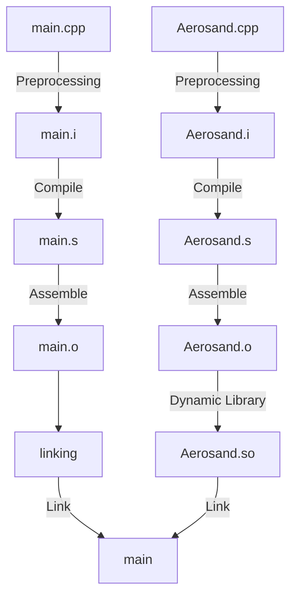

## **0. Preface**

This article discusses the following

- [ ] Understanding how C++ code is compiled
- [ ] Understanding dynamic libraries
- [ ] Running the helloWorld program

## **1. Getting Started**

>[!tip]
>For OpenFOAM, any folder is fine, whether it is a solver or an example. Putting it under the `$FOAM_RUN` path is also just for convenience.

Let's agree on

- `userPath/`: user-specified path

Under this path, we create a new folder, e.g. `userPath/ofsp/`, and under `ofsp/`, we create folders for the sub-projects.

For example

In the terminal, enter the command to create a new master project folder

```
mkdir /userPath/ofsp
```

> ofsp stands for OpenFoam sharing programming.

You can set `ofsp` as a shortcut command, so that you can jump to the project folder directly after typing `ofsp` in the terminal.

Open the `bashrc` file by typing the command in the terminal.

```
gedit ~/.bashrc
```

At the end of the `bashrc` file, add the following statement

```
alias ofsp='cd /userPath/ofsp'
alias ofss='cd /userPath/ofss'
```

Enter the command in the terminal to enable the shortcut command.

```
source ~/.bashrc
```

## **2. Project**

Create a new folder for the subprojects of this article in the terminal

Terminal enter the command

```
ofsp
mkdir ofsp_021_helloWorld
code ofsp_021_helloWorld
```

After you open a project in vscode, you can use `ctrl + ~` to bring up vscode's terminal console for quick command operations.

Input the command to create a new file under the project and save it blank.

```
code main.cpp Aerosand.cpp Aerosand.h
```

Enter `tree` command to view the tree structure of a file.

```
tree
.
├── Aerosand.cpp
├── Aerosand.h
└── main.cpp
```

>[!tip]
>If you can't use the `tree` command, please follow the instructions in the terminal to install `tree`.

Let's write the code as follows

Class declaration Class `Aerosand.h` as follows

```cpp
#pragma once

class Aerosand
{
public:
    void setLocalTime(double t);
    double getLocalTime() const;

private:
    double localTime_;
};
```

> [!tip]
> This is as close as possible to the style of OpenFOAM code, such as the use of camel names for function names and variables, and private member variable names are suffixed with underscores.

The class definition, `Aerosand.cpp`, is as follows

```cpp
#include "Aerosand.h"

void Aerosand::setLocalTime(double t) {
    localTime_ = t;
}

double Aerosand::getLocalTime() const {
    return localTime_;
}
```

The main source code `, main.cpp`, looks like this

```cpp
#include <iostream>

#include "Aerosand.h"

using namespace std;

int main()
{
    int a = 1;
    double pi = 3.1415926;

    cout << "Hi, OpenFOAM!" << " Here we are." << endl;
    cout << a << " + " << pi << " = " << a + pi << endl;
    cout << a << " * " << pi << " = " << a * pi << endl;

    Aerosand mySolver;
    mySolver.setLocalTime(0.2);
    cout << "\\nCurrent time step is : " << mySolver.getLocalTime() << endl;

    return 0;
}
```

Although we generally refer to the entire process of getting code into a program as "compilation", in fact, on Linux, the "compilation" of a C++ program is divided into four processes.


> [!warning]
> The paths to the terminal commands discussed in the rest of this article remain unchanged at `ofsp/ofsp_021_helloWorld/`.

## **3. Code Compilation**

### **3.1 Preprocessing**

**Preprocessing** is the first stage of the compilation process and occurs before the actual compilation (generation of object code). It is the responsibility of **the Preprocessor** to process the directives in the source code that begin with `#`, also known as **preprocessing directives**.

For example, `#include` will prompt to insert the contents of another file into the current location, `#define` will prompt to replace a macro definition here, etc.

Generate.

The terminal executes preprocessing by typing the command

```
g++ -E Aerosand.cpp -o Aerosand.i
g++ -E main.cpp -o main.i
```

where

- `E` of g++ identifies the preprocessor for preprocessing
- The `o` (lowercase) in g++ identifies the file to be generated.

On Linux systems, two new files are generated

- `Aerosand.i`
- `main.i`

The `.i` suffix indicates **intermediate preprocessing output**.

### **3.2. Compile**

**Compile** is the process of converting the preprocessed source code ( `.i` or `.i` files) into assembly code ( `.s` files) by **the compiler Compiler**.

The compiler will perform syntax analysis, semantic analysis, optimization, etc. on the expanded (header files, macros, etc.) source code, and finally generate the transformed code.

To compile, enter the following command in the terminal

```
g++ -S Aerosand.i -o Aerosand.s
g++ -S main.i -o main.s
```

- The `S` symbol in g++ specifies that the compiler compiles (capital `S` ).

Generate two new files on Linux

- `Aerosand.s`
- `main.s`

The `.s` (lowercase) suffix indicates **source code written in assembly**.

### **3.3. Assembly**

**Assemble** is the process by which **the assembler Assembler** converts the `.s` suffixed assembly language source file into **Machine code**, which is output as an **Object file**.

The Assembler converts the files from the previous step into human-readable assembly language, and ultimately produces a binary file that is relevant to the machine platform and cannot be run directly, but requires further processing.

Execute the assembly by typing the command in the terminal

```
g++ -c Aerosand.s -o Aerosand.o
g++ -c main.s -o main.o
```

- The `c` (lowercase) identifier of g++ specifies the assembler to perform the assembly

Generate two new files under Linux

- `Aerosand.o`
- `main.o`

The `.o` (lowercase) suffix indicates the **object file**.

### **3.4. Link**

**Linking** is the process by which **the linker Linker** combines several object files and system library files into a complete executable program.

Although the object file contains machine instructions, it is still not a complete program. The linker will find references to function calls involving "external symbols" and generate an executable binary file.

Entering a command in the terminal to perform a direct link

```
g++ Aerosand.o main.o -o main.out
```

On a Linux system, a new executable file is eventually created

- `main.out`

The `.out` suffix is not important here. It is fine to leave the executable file unsuffixed in the command that executes the link.

In the terminal, enter the `.` `/main.out` to run the program.

```
./main.out
Hi, OpenFOAM! Here we are.
1 + 3.14159 = 4.14159
1 * 3.14159 = 3.14159

Current time step is : 0.2
```

You can see that the program has run correctly and got the right results.

## **4. Dynamic libraries**

Even though the above has been done successfully to compile and run the program, we still have to discuss a little more.

When the project has a large number of **classes**, we hope that some **classes** can be fixed to provide a certain "method", this "method" is the formation of a **library** can be reused **Library**. Because the library itself has been compiled, when other projects use the library, the library itself does not need to be "preprocessed", "compiled" and "assembled" again, it can just be linked to the project.

Because static libraries are expensive, waste space, and are difficult to update and maintain, OpenFOAM makes extensive use of dynamic libraries, and we will only use dynamic libraries as an example here.

Dynamic libraries are not linked to the target code when **the program is compiled**, but only loaded when **the program is run**. If different programs call the same library, then only one **shareable** instance of the dynamic library is needed in memory, which greatly reduces wasted space. In addition, because dynamic libraries are only loaded at runtime, it is easy to maintain and update the libraries individually.

The compiler can organize the assembled `.o` object files to form dynamic libraries and generate `.so` files under Linux.

To generate a dynamic library, enter the following command in the terminal

```
g++ -shared -fPIC Aerosand.o -o libAerosand.so
```

- The `shared` flag of g++ specifies that a dynamic link library is generated.
- The `fPIC` identifier of g++ specifies the creation of an address-independent compilation program. `f` means file, and `PIC` means position independent code.
- Dynamic library files begin with `lib`

Generate a linkable dynamic library file on Linux systems

- `libAerosand.so`

The `.so` suffix indicates a **shared object**.

## **5. Linking Dynamic Libraries**

Instead of using the direct linking method in Section 3.4 above, we will compile the program by linking the dynamic library.

Input a command into the terminal to delete the compilation result of the previous step.

```
rm main.out
```

Input a command to check the original dynamic library link path, and you can find that it is not the local path of the project.

```
echo $LD_LIBRARY_PATH
```

Enter a command in the terminal to temporarily specify the dynamic library path to the current folder.

```
export LD_LIBRARY_PATH=.
echo $LD_LIBRARY_PATH
```

>[!tip]
>- Don't worry, the temporary designation does not affect the environment configuration of OpenFOAM dynamic library path.
>- If you restart your computer and want to run `the main` program again, you have to specify the library path again.
>- Whether you put the new library under this project path or any other path, any project in any location can link to the library, as long as you specify the correct link path. This is also the meaning of dynamic libraries "relatively independent" and "free link"!

Enter a command in the terminal to link the library and generate an executable.

```
g++ main.o -L. -lAerosand -o main
```

- g++'s `L` identifies the path to the specified dynamic library, and the use of `L.` indicates that the dynamic library is in the current path.
- g++'s `L` identifies the name of the specified dynamic library, and the `lib` field of the dynamic library is omitted.
- As mentioned earlier, the suffix of the executable program is not important here.

Generate an executable program on Linux

- `main`

Summarize the process as follows



Run the program by typing `.` `/main` to run the program

```
./main
Hi, OpenFOAM! Here we are.
1 + 3.14159 = 4.14159
1 * 3.14159 = 3.14159

Current time step is : 0.2
```

You can see that the program is running correctly and you get the correct results.

## **6. Summary**

This article completes the discussion of

- [x] Understanding how C++ code is compiled
- [x] Understanding dynamic libraries
- [x] Completing the helloWorld code run
